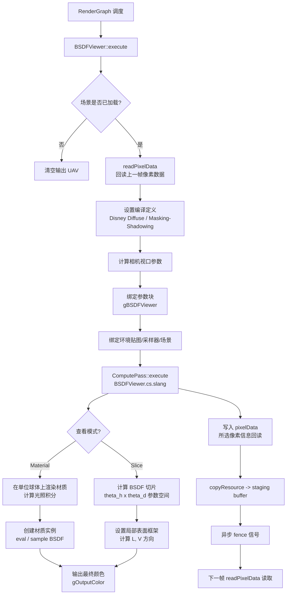

# BSDFViewer -- BSDF 查看器

## 功能概述

BSDFViewer 是 Falcor 中用于检查和可视化 BSDF（双向散射分布函数）的渲染通道插件。该工具支持场景中任意材质的 BSDF 交互式查看，适用于材质开发和调试。

核心特性：
- 两种查看模式：
  - **Material 模式**：在单位球体上渲染材质，使用右手坐标系（xy 朝右/上，+z 朝向观察者）
  - **Slice 模式**：以 theta_h / theta_d 参数空间展示 BSDF 切片（与 Burley 2012/2015 格式一致）
- 支持从场景中选择任意材质并实时切换（左右箭头键快捷切换）
- 支持法线贴图、固定纹理坐标
- BSDF 配置选项：启用/禁用漫反射和镜面反射分量、Disney 漫反射 BRDF、可分离遮蔽-阴影函数
- 重要性采样与显式 PDF 验证模式
- 反照率输出：可分别查看漫反射/镜面反射/漫透射/镜面透射的反照率
- 灵活的光照配置：方向光、全向光、环境贴图
- 支持正交/透视相机
- 像素级数据回读：选定像素的着色信息（TBN 框架、入射/出射方向、BSDF 属性等）
- 集成 PixelDebug 工具用于着色器内打印调试

## 架构图

## 文件清单

| 文件名 | 类型 | 说明 |
|--------|------|------|
| `BSDFViewer.h` | C++ 头文件 | `BSDFViewer` 类声明，包含 UI 状态和像素数据回读逻辑 |
| `BSDFViewer.cpp` | C++ 源文件 | 渲染通道主逻辑：属性解析、场景设置、compute pass 执行、UI 渲染 |
| `BSDFViewer.cs.slang` | Compute Shader | GPU 端 BSDF 可视化计算（Material 模式和 Slice 模式） |
| `BSDFViewerParams.slang` | Shader 公共类型 | 共享参数结构体 `BSDFViewerParams`、像素数据结构体 `PixelData`、枚举定义 |
| `CMakeLists.txt` | 构建文件 | CMake 插件注册与着色器拷贝配置 |

## 依赖关系

### 框架依赖
- `Falcor.h` -- Falcor 核心框架
- `RenderGraph/RenderPass.h` -- 渲染通道基类
- `RenderGraph/RenderPassStandardFlags.h` -- 标准刷新标志

### 功能模块依赖
- `Utils/Sampling/SampleGenerator.h` -- 伪随机数采样器（SAMPLE_GENERATOR_UNIFORM）
- `Utils/Debug/PixelDebug.h` -- 像素调试工具（着色器内 print 支持）
- `Scene/Lights/EnvMap.h` -- 环境贴图加载与绑定
- `Rendering/Materials/BSDFConfig.slangh` -- BSDF 配置（漫反射 BRDF 和遮蔽函数选择）

### 输出通道
| 通道名 | 格式 | 说明 |
|--------|------|------|
| `output` | RGBA32Float | BSDF 可视化输出 |

## 关键类与接口

### `BSDFViewer` 类

继承自 `RenderPass`，通过 `FALCOR_PLUGIN_CLASS` 宏注册为 `"BSDFViewer"` 插件。

**核心方法：**
- `execute(RenderContext*, const RenderData&)` -- 每帧执行 compute pass 并启动像素数据回读
- `setScene(RenderContext*, const ref<Scene>&)` -- 场景加载，创建 compute pass 程序并构建材质列表
- `compile(RenderContext*, const CompileData&)` -- 计算视口尺寸和偏移
- `renderUI(Gui::Widgets&)` -- 渲染查看器 UI（模式选择、材质选择、BSDF 配置、光照配置、相机设置、像素数据）
- `onMouseEvent(const MouseEvent&)` -- 鼠标点击选择像素
- `onKeyEvent(const KeyboardEvent&)` -- 左右箭头键切换材质
- `readPixelData()` -- 从 staging buffer 回读像素着色数据
- `loadEnvMap(const std::filesystem::path&)` -- 加载环境贴图

### `BSDFViewerParams` 结构体

CPU/GPU 共享参数（遵循 HLSL 对齐规则）：

| 参数 | 类型 | 说明 |
|------|------|------|
| `frameDim` | uint2 | 帧缓冲区分辨率 |
| `viewerMode` | BSDFViewerMode | 查看模式（Material / Slice） |
| `materialID` | uint | 当前选中的材质 ID |
| `useNormalMapping` | int | 是否使用法线贴图 |
| `useDisneyDiffuse` | int | 使用 Disney 漫反射 BRDF |
| `useSeparableMaskingShadowing` | int | 使用可分离遮蔽-阴影函数 |
| `useImportanceSampling` | int | 使用 BSDF 重要性采样 |
| `outputAlbedo` | uint | 反照率输出标志（按分量组合） |
| `lightIntensity` | float | 光源强度 |
| `useDirectionalLight` | int | 使用方向光 |
| `orthographicCamera` | int | 使用正交相机 |
| `cameraDistance` | float | 透视模式下相机到原点距离 |

### `PixelData` 结构体

回读的像素级着色信息：
- `texC` -- 纹理坐标
- `T`, `B`, `N` -- TBN 框架向量
- `wi`, `wo` -- 入射方向（视线）和出射方向（光源）
- `output` -- 输出值
- BSDF 属性：`guideNormal`, `emission`, `roughness`, `diffuseReflectionAlbedo`, `specularReflectionAlbedo`, `isTransmissive` 等

### `BSDFViewerMode` 枚举
- `Material` -- 材质渲染视图（在单位球上渲染）
- `Slice` -- BSDF 切片视图（theta_h x theta_d 参数空间）
