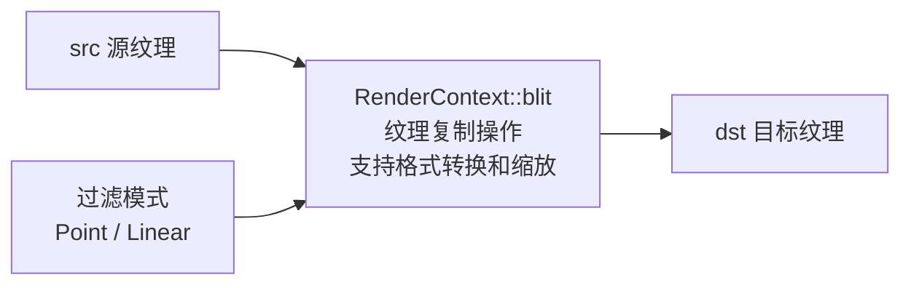

# BlitPass - 位块传输渲染通道

## 功能概述

BlitPass 是 Falcor 中最简单的渲染通道之一，用于将一个输入纹理复制（blit）到输出纹理。该通道主要用于纹理格式转换、分辨率缩放以及在渲染图中建立纹理数据的连接。

主要功能包括：

- **纹理复制**：将源纹理 blit 到目标纹理
- **格式转换**：支持指定输出纹理格式，实现不同资源格式之间的隐式转换
- **过滤模式**：支持 `Point`（点采样）和 `Linear`（线性插值）两种过滤模式
- **尺寸适配**：当源和目标纹理尺寸不同时，自动进行缩放
- **Python 脚本绑定**：过滤模式可通过 Python 脚本控制

### 输入/输出通道

| 方向 | 名称 | 说明 |
|------|------|------|
| 输入 | `src` | 源纹理 |
| 输出 | `dst` | 目标纹理 |

## 架构图



## 文件清单

| 文件名 | 类型 | 说明 |
|--------|------|------|
| `BlitPass.h` | C++ 头文件 | BlitPass 类声明 |
| `BlitPass.cpp` | C++ 实现 | 渲染通道逻辑：blit 执行、属性管理、UI |
| `CMakeLists.txt` | 构建文件 | CMake 插件构建配置 |

## 依赖关系

```
BlitPass
├── Falcor 核心框架
│   ├── Falcor.h
│   └── RenderGraph/RenderPass.h
├── Python 脚本绑定 (pybind11)
└── GPU 资源
    └── RenderContext::blit() (底层纹理复制操作)
```

> **注意**：BlitPass 不使用任何自定义着色器文件，完全依赖 Falcor 内置的 `RenderContext::blit()` 方法。

## 关键类与接口

### `BlitPass` (继承自 `RenderPass`)

渲染通道主类，注册名为 `"BlitPass"`。

| 方法 | 说明 |
|------|------|
| `BlitPass(ref<Device>, const Properties&)` | 构造函数，解析过滤模式和输出格式 |
| `reflect(const CompileData&)` | 声明 `src` 输入和 `dst` 输出，支持自定义输出格式 |
| `execute(RenderContext*, const RenderData&)` | 调用 `pRenderContext->blit()` 执行纹理复制 |
| `renderUI(Gui::Widgets&)` | 过滤模式下拉选择 |

### Python 脚本接口

| 属性 | 类型 | 说明 |
|------|------|------|
| `filter` | `string` | 纹理过滤模式（"Linear" 或 "Point" 等） |

### 配置属性

| 属性 | 默认值 | 说明 |
|------|--------|------|
| `filter` | `Linear` | 纹理过滤模式 (`TextureFilteringMode`) |
| `outputFormat` | `Unknown` | 输出纹理格式 (Unknown 表示由渲染图决定) |

### 关键成员变量

| 变量 | 类型 | 说明 |
|------|------|------|
| `mFilter` | `TextureFilteringMode` | 当前纹理过滤模式 |
| `mOutputFormat` | `ResourceFormat` | 输出纹理格式 |

### 执行流程

`execute()` 方法的实现极为简洁：

1. 获取输入纹理 `src` 的 SRV（Shader Resource View）
2. 获取输出纹理 `dst` 的 RTV（Render Target View）
3. 调用 `pRenderContext->blit(srcSRV, dstRTV, kMaxRect, kMaxRect, mFilter)` 完成复制
4. 若输入或输出缺失，记录警告日志
