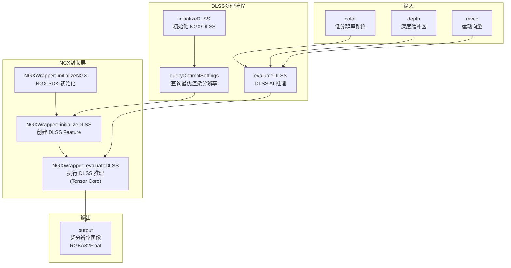

# DLSSPass -- DLSS 深度学习超采样渲染通道

## 功能概述

DLSSPass 集成了 NVIDIA DLSS (Deep Learning Super Sampling) 技术，通过深度学习模型实现高质量的图像超分辨率与抗锯齿。该通道接收低分辨率的渲染图像、深度和运动向量，输出高分辨率的清晰图像，在保持视觉质量的同时显著提升渲染性能。

DLSS 通过 NVIDIA NGX (Neural Graphics Exchange) SDK 实现，底层运行在 Tensor Core 上的 AI 推理模型。

### 核心特性

- **多种性能/质量配置**：MaxPerf（最大性能）、Balanced（平衡）、MaxQuality（最高质量）三档预设
- **HDR 支持**：支持 HDR 和 LDR 输入模式
- **运动向量缩放**：支持绝对像素坐标和相对屏幕空间两种运动向量格式
- **锐度控制**：可调节输出图像锐度
- **曝光控制**：可指定曝光值辅助 DLSS 处理
- **自适应输出尺寸**：根据 DLSS 配置自动计算最优输入/输出分辨率

## 架构图

## 文件清单

| 文件名 | 类型 | 说明 |
|--------|------|------|
| `DLSSPass.h` | C++ 头文件 | DLSSPass 渲染通道类声明，包含 Profile/MotionVectorScale 枚举 |
| `DLSSPass.cpp` | C++ 实现 | 通道主逻辑：输入/输出定义、DLSS 初始化与推理调度、UI 控件 |
| `NGXWrapper.h` | C++ 头文件 | NGX SDK 封装类声明，提供 DLSS 初始化、查询、推理接口 |
| `NGXWrapper.cpp` | C++ 实现 | NGX SDK 封装实现，处理 NGX 生命周期和 DLSS Feature 管理 |
| `CMakeLists.txt` | 构建文件 | CMake 构建配置 |

## 依赖关系

| 依赖模块 | 用途 |
|----------|------|
| `RenderGraph/RenderPass` | 渲染通道基类 |
| `RenderGraph/RenderPassHelpers` | 输出尺寸计算 |
| `NVIDIA NGX SDK (nvsdk_ngx_defs.h)` | NVIDIA Neural Graphics Exchange SDK |
| `DLSS Model Files` | DLSS AI 模型权重文件（通过 featureSearchPath 加载） |
| 上游渲染通道 | 提供低分辨率颜色、深度、运动向量 |

## 关键类与接口

### `DLSSPass` (主类，继承自 `RenderPass`，插件名 `"DLSSPass"`)

| 方法 | 说明 |
|------|------|
| `reflect()` | 声明输入（color, depth, mvec）和输出（output, RGBA32Float） |
| `execute()` | 每帧执行：检查状态 -> 初始化 DLSS（如需要）-> 调用 NGXWrapper 推理 |
| `setScene()` | 设置场景引用 |
| `renderUI()` | 暴露 UI 控件：启用开关、Profile 选择、HDR 模式、锐度/曝光调节 |
| `initializeDLSS()` | 查询最优设置并创建/重建 DLSS Feature |

### `DLSSPass::Profile` (枚举)

| 值 | 说明 |
|----|------|
| `MaxPerf` | 最大性能模式，输入分辨率最低 |
| `Balanced` | 平衡模式 |
| `MaxQuality` | 最高质量模式，输入分辨率最高 |

### `DLSSPass::MotionVectorScale` (枚举)

| 值 | 说明 |
|----|------|
| `Absolute` | 绝对像素坐标（默认） |
| `Relative` | 相对屏幕空间（除以宽/高） |

### `NGXWrapper` (NGX SDK 封装类，命名空间 `Falcor`)

| 方法 | 说明 |
|------|------|
| `NGXWrapper(device, appDataPath, featureSearchPath)` | 构造函数，初始化 NGX SDK |
| `queryOptimalSettings(displaySize, perfQuality)` | 查询给定显示分辨率和性能档位下的最优渲染分辨率 |
| `initializeDLSS(...)` | 创建 DLSS Feature，指定分辨率、HDR、深度反转等选项 |
| `evaluateDLSS(...)` | 执行 DLSS 推理：输入颜色/深度/运动向量 -> 输出超分辨率图像 |
| `releaseDLSS()` | 释放 DLSS Feature |

### `NGXWrapper::OptimalSettings` (最优设置结构体)

- `sharpness` -- 推荐锐度值
- `optimalRenderSize` -- 最优输入渲染分辨率
- `minRenderSize` / `maxRenderSize` -- 支持的输入分辨率范围
