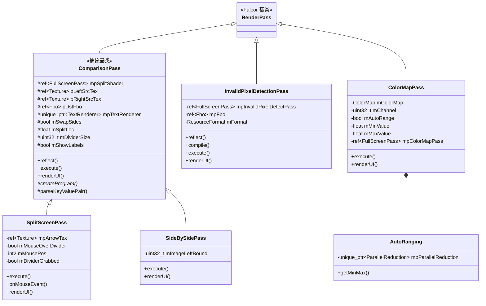

# DebugPasses -- 调试通道集合

## 功能概述

DebugPasses 是一个调试用渲染通道插件集合，包含多个用于图像对比、像素检测和颜色映射的子通道。所有子通道通过 `DebugPasses.cpp` 统一注册到 Falcor 插件系统。该集合提供了丰富的图像调试工具，适用于渲染算法的可视化分析和质量对比。

### 包含的子通道

| 子通道 | 插件名 | 功能 |
|--------|--------|------|
| **SplitScreenPass** | `SplitScreenPass` | 分屏对比，支持鼠标交互拖拽分割线 |
| **SideBySidePass** | `SideBySidePass` | 并排对比，支持视图平移滑块 |
| **InvalidPixelDetectionPass** | `InvalidPixelDetectionPass` | 无效像素检测，NaN 标红、Inf 标绿 |
| **ColorMapPass** | `ColorMapPass` | 颜色映射可视化，支持多种色图和自动范围 |

## 架构图

## 文件清单

| 文件 | 类型 | 说明 |
|------|------|------|
| `DebugPasses.cpp` | C++ 源文件 | 插件注册入口，注册所有 4 个子通道 |
| `ComparisonPass.h` | C++ 头文件 | 对比通道抽象基类声明 |
| `ComparisonPass.cpp` | C++ 源文件 | 对比通道基类实现（属性解析、反射、执行、标签绘制） |
| `Comparison.ps.slang` | Slang 着色器 | 对比通道公共像素着色器（分割逻辑、分割线、箭头绘制） |
| **ColorMapPass/** | | |
| `ColorMapPass/ColorMapPass.h` | C++ 头文件 | 颜色映射通道声明，含 AutoRanging 内部类 |
| `ColorMapPass/ColorMapPass.cpp` | C++ 源文件 | 颜色映射实现（色图选择、自动范围、并行归约求极值） |
| `ColorMapPass/ColorMapPass.ps.slang` | Slang 着色器 | 颜色映射像素着色器（支持 Grey/Jet/Viridis/Plasma/Magma/Inferno） |
| `ColorMapPass/ColorMapParams.slang` | Slang 头文件 | 颜色映射参数结构体和 ColorMap 枚举定义 |
| **InvalidPixelDetectionPass/** | | |
| `InvalidPixelDetectionPass/InvalidPixelDetectionPass.h` | C++ 头文件 | 无效像素检测通道声明 |
| `InvalidPixelDetectionPass/InvalidPixelDetectionPass.cpp` | C++ 源文件 | 无效像素检测实现（NaN/Inf 检测与标记） |
| `InvalidPixelDetectionPass/InvalidPixelDetection.ps.slang` | Slang 着色器 | 无效像素检测像素着色器 |
| **SideBySidePass/** | | |
| `SideBySidePass/SideBySidePass.h` | C++ 头文件 | 并排对比通道声明 |
| `SideBySidePass/SideBySidePass.cpp` | C++ 源文件 | 并排对比实现（继承 ComparisonPass） |
| `SideBySidePass/SideBySide.ps.slang` | Slang 着色器 | 并排对比像素着色器 |
| **SplitScreenPass/** | | |
| `SplitScreenPass/SplitScreenPass.h` | C++ 头文件 | 分屏对比通道声明 |
| `SplitScreenPass/SplitScreenPass.cpp` | C++ 源文件 | 分屏对比实现（鼠标交互、箭头纹理、双击重置） |
| `SplitScreenPass/SplitScreen.ps.slang` | Slang 着色器 | 分屏对比像素着色器 |
| `CMakeLists.txt` | 构建配置 | CMake 插件构建定义 |

## 依赖关系

| 依赖项 | 使用者 | 说明 |
|--------|--------|------|
| `Falcor.h` | 全部 | Falcor 核心框架 |
| `RenderGraph/RenderPass.h` | 全部 | 渲染通道基类 |
| `Core/Pass/FullScreenPass.h` | ComparisonPass, InvalidPixelDetectionPass, ColorMapPass | 全屏渲染通道 |
| `Utils/UI/TextRenderer.h` | ComparisonPass | 文本渲染器（标签显示） |
| `Utils/Timing/CpuTimer.h` | SplitScreenPass | CPU 计时器（双击检测） |
| `Utils/Algorithm/ParallelReduction.h` | ColorMapPass | GPU 并行归约（自动范围计算） |
| `Utils/Color/ColorMap` | ColorMapPass.ps.slang | Slang 颜色映射函数库 |

## 关键类与接口

### `ComparisonPass` (抽象基类，继承自 `RenderPass`)

提供图像对比的公共逻辑：左右输入绑定、分割位置控制、标签显示。

- **输入**：`leftInput`、`rightInput`（ShaderResource）
- **输出**：`output`（RenderTarget）
- **可配置属性**：`splitLocation`、`showTextLabels`、`leftLabel`、`rightLabel`
- **纯虚方法**：`createProgram()` -- 由子类实现具体着色器创建

### `SplitScreenPass` (继承自 `ComparisonPass`)

支持鼠标交互的分屏对比，可拖拽分割线位置，悬停时显示方向箭头，双击重置到中间。

### `SideBySidePass` (继承自 `ComparisonPass`)

并排对比模式，通过滑块控制视图左边界偏移量（`imageLeftBound`）。

### `InvalidPixelDetectionPass` (继承自 `RenderPass`)

检测输入图像中的无效浮点像素，NaN 像素标记为红色，Inf 像素标记为绿色，正常像素为黑色。非浮点格式输入会发出警告。

### `ColorMapPass` (继承自 `RenderPass`)

对输入图像的单通道值进行颜色映射可视化。支持 6 种色图（Grey、Jet、Viridis、Plasma、Magma、Inferno），可选自动范围检测（基于 GPU 并行归约计算极值）。
- **可配置属性**：`colorMap`、`channel`(0-3)、`autoRange`、`minValue`、`maxValue`
