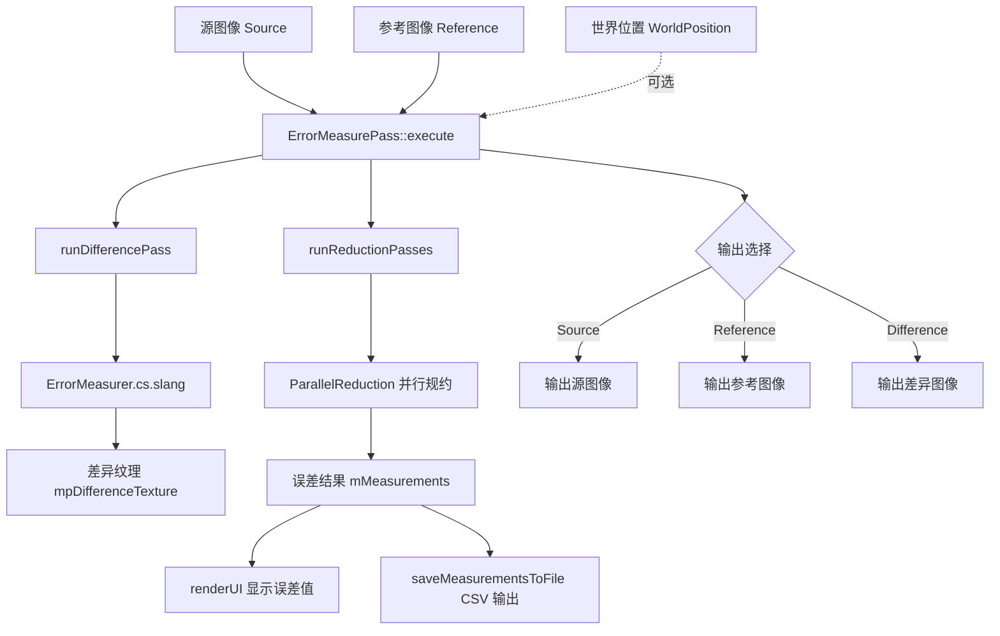

# ErrorMeasurePass - 误差测量

## 功能概述

ErrorMeasurePass 是一个用于测量渲染图像相对于参考图像误差的渲染通道。该通道支持以下核心功能：

- **误差度量方式**：支持 L1 误差（绝对差值）和 L2 误差（均方误差 / MSE）两种模式
- **参考图像来源**：支持从文件加载参考图像（EXR、PFM 格式）或从渲染图输入通道获取
- **背景过滤**：可选忽略背景像素（通过世界坐标 w 分量判断有效几何）
- **RGB 平均**：可选对 RGB 三通道取平均后计算误差
- **指数移动平均（EMA）**：支持报告帧间累积的运行误差，sigma 系数可调
- **输出选择**：可在源图像、参考图像、差异图像之间切换显示
- **CSV 导出**：支持将逐帧误差数据写入 CSV 文件

## 架构图



## 文件清单

| 文件名 | 类型 | 说明 |
|--------|------|------|
| `ErrorMeasurePass.h` | C++ 头文件 | 定义 `ErrorMeasurePass` 类，包含输出选择枚举、测量结果结构和 UI 参数 |
| `ErrorMeasurePass.cpp` | C++ 源文件 | 实现通道逻辑：差异计算、并行规约、参考图像加载、CSV 导出、UI 渲染 |
| `ErrorMeasurer.cs.slang` | Slang 计算着色器 | GPU 端逐像素差异计算，支持 L1/L2 误差和背景过滤 |
| `CMakeLists.txt` | 构建配置 | CMake 构建脚本 |

## 依赖关系

### 框架依赖
- `Falcor.h` - Falcor 核心框架
- `RenderGraph/RenderPass.h` - 渲染通道基类
- `Utils/Algorithm/ParallelReduction.h` - GPU 并行规约算法（用于求和计算平均误差）
- `Core/AssetResolver.h` - 资源路径解析器（用于加载参考图像）

### 输入/输出通道
| 通道名 | 方向 | 必需 | 说明 |
|--------|------|------|------|
| `Source` | 输入 | 是 | 待测量的源图像 |
| `Reference` | 输入 | 否 | 参考图像（可选，也可从文件加载） |
| `WorldPosition` | 输入 | 否 | 世界坐标（用于背景像素过滤） |
| `Output` | 输出 | 是 | 输出图像（RGBA32Float） |

## 关键类与接口

### `ErrorMeasurePass` 类
继承自 `RenderPass`，核心接口：

| 方法 | 说明 |
|------|------|
| `reflect()` | 声明 I/O 通道：Source（必需）、Reference（可选）、WorldPosition（可选）、Output |
| `execute()` | 主执行流程：计算差异 -> 并行规约 -> 选择输出 -> 保存测量值 |
| `renderUI()` | 提供参考图像加载按钮、输出文件设置、误差模式选择、数值显示 |
| `onKeyEvent()` | 按 'O' 键循环切换输出模式（Shift+O 反向） |
| `runDifferencePass()` | 调度计算着色器逐像素计算差异 |
| `runReductionPasses()` | 使用 `ParallelReduction` 对差异图求和，计算平均误差 |

### `OutputId` 枚举
```
Source    - 显示源图像
Reference - 显示参考图像
Difference - 显示差异图像
```

### 计算着色器（`ErrorMeasurer.cs.slang :: main`）
- 线程组大小：`[numthreads(16, 16, 1)]`
- 根据 `gIgnoreBackground` 标志过滤背景像素
- 根据 `gComputeDiffSqr` 选择 L1 或 L2 误差
- 根据 `gComputeAverage` 选择是否对 RGB 取平均

### 可序列化属性
通道支持通过 `Properties` 持久化以下配置：`ReferenceImagePath`、`MeasurementsFilePath`、`IgnoreBackground`、`ComputeSquaredDifference`、`ComputeAverage`、`UseLoadedReference`、`ReportRunningError`、`RunningErrorSigma`、`SelectedOutputId`。
