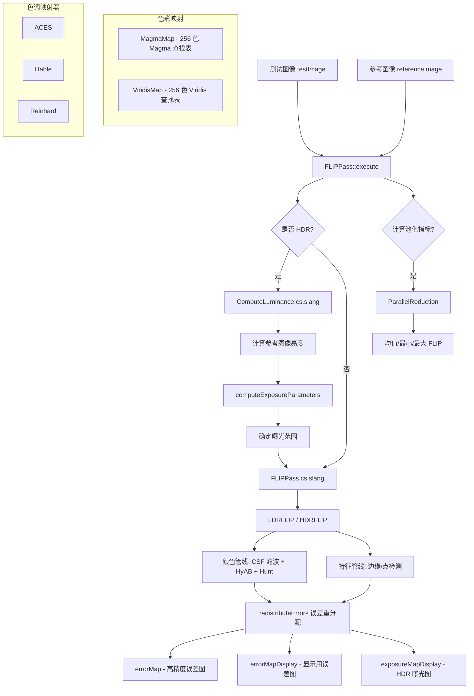

# FLIPPass - FLIP 图像比较

## 功能概述

FLIPPass 实现了 FLIP（A Difference Evaluator for Alternating Images）图像质量度量算法，用于在感知层面比较测试图像与参考图像之间的差异。该通道基于 NVIDIA 发布的 FLIP 论文系列：

- **LDR-FLIP**：针对低动态范围输入，结合颜色管线（CSF 空间滤波 + HyAB 色差 + Hunt 调节）和特征管线（边缘/点检测），最终通过误差重分配得到感知差异值
- **HDR-FLIP**：针对高动态范围输入，在多个曝光补偿级别上计算 LDR-FLIP 并取最大值
- **显示器感知建模**：基于显示器物理参数（分辨率、宽度、观察距离）计算每度像素数（PPD），用于空间滤波核参数化
- **色调映射器选择**：HDR-FLIP 支持 ACES、Hable、Reinhard 三种色调映射器
- **可视化**：支持 Magma 和 Viridis 色彩映射，提供误差图和曝光图显示
- **统计指标**：可选通过并行规约计算全帧 FLIP 均值/最小值/最大值

## 架构图



## 文件清单

| 文件名 | 类型 | 说明 |
|--------|------|------|
| `FLIPPass.h` | C++ 头文件 | 定义 `FLIPPass` 类，包含 LDR/HDR 模式参数、显示器信息、统计指标 |
| `FLIPPass.cpp` | C++ 源文件 | 实现通道逻辑：曝光参数计算、着色器调度、并行规约统计、UI 渲染 |
| `FLIPPass.cs.slang` | Slang 计算着色器 | FLIP 算法核心：CSF 滤波、HyAB 色差、Hunt 调节、特征检测、误差重分配 |
| `ComputeLuminance.cs.slang` | Slang 计算着色器 | HDR-FLIP 辅助：计算参考图像的逐像素亮度 |
| `ToneMappers.slang` | Slang 模块 | 定义 `FLIPToneMapperType` 枚举和 `toneMap()` 函数（ACES/Hable/Reinhard） |
| `flip.hlsli` | HLSL 头文件 | 存储 Magma（256 色）和 Viridis（256 色）色彩映射查找表 |
| `CMakeLists.txt` | 构建配置 | CMake 构建脚本 |

## 依赖关系

### 框架依赖
- `Falcor.h` - Falcor 核心框架
- `RenderGraph/RenderPass.h` - 渲染通道基类
- `Core/Platform/MonitorInfo.h` - 显示器物理信息获取（分辨率、尺寸）
- `Utils/Algorithm/ParallelReduction.h` - GPU 并行规约（Sum、MinMax）
- `Utils/Color/ColorHelpers` - 颜色空间转换（sRGB、CIELab、YCxCz）
- `Utils/Math/MathConstants.slangh` - 数学常量（M_PI 等）
- `Utils/HostDeviceShared.slangh` - CPU/GPU 共享宏

### 输入/输出通道
| 通道名 | 方向 | 格式 | 说明 |
|--------|------|------|------|
| `testImage` | 输入 | ShaderResource | 待比较的测试图像 |
| `referenceImage` | 输入 | ShaderResource | 参考图像 |
| `errorMap` | 输出 | RGBA32Float | 高精度 FLIP 误差图（用于计算，alpha 通道存储原始 FLIP 值） |
| `errorMapDisplay` | 输出 | RGBA8UnormSrgb | 显示用误差图（Magma 映射后） |
| `exposureMapDisplay` | 输出 | RGBA8UnormSrgb | HDR-FLIP 曝光图（Viridis 映射） |

## 关键类与接口

### `FLIPPass` 类
继承自 `RenderPass`，核心接口：

| 方法 | 说明 |
|------|------|
| `reflect()` | 声明 2 个输入（测试/参考图像）和 3 个输出（误差图、显示误差图、曝光图） |
| `execute()` | 执行 FLIP 计算：可选亮度计算 -> FLIP 着色器 -> blit 到 sRGB -> 可选并行规约 |
| `renderUI()` | 提供 LDR/HDR 切换、色调映射器选择、曝光参数、显示器参数、统计指标显示 |
| `updatePrograms()` | 根据色调映射器选择更新着色器 define |
| `computeExposureParameters()` | 根据亮度中值/最大值自动计算 HDR-FLIP 曝光范围 |
| `parseProperties()` | 从属性字典反序列化所有参数 |

### `FLIPToneMapperType` 枚举（定义于 `ToneMappers.slang`）
```
ACES     = 0  - ACES 近似色调映射
Hable    = 1  - Hable/Uncharted 2 色调映射
Reinhard = 2  - Reinhard 色调映射
```

### FLIP 算法核心函数（`FLIPPass.cs.slang`）
| 函数 | 说明 |
|------|------|
| `FLIP()` | 入口：根据 HDR 标志选择 LDRFLIP 或 HDRFLIP |
| `LDRFLIP()` | LDR-FLIP 实现：CSF 空间滤波 + 特征检测 + 误差重分配 |
| `HDRFLIP()` | HDR-FLIP 实现：多曝光级别上取最大 LDRFLIP，记录曝光图 |
| `HyAB()` | 计算 HyAB 色差（亮度用 L1，色度用 L2） |
| `Hunt()` | Hunt 色度调节（亮度依赖的色度缩放） |
| `redistributeErrors()` | 将颜色差异和特征差异合并为最终感知误差 |
| `ppd()` | 计算每度像素数（Pixels Per Degree） |
