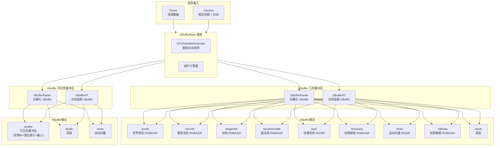

# GBuffer -- 几何缓冲通道

## 功能概述

GBuffer 模块是 Falcor 渲染管线的前端通道，负责将场景几何信息渲染到多个缓冲区中，供下游路径追踪、降噪等通道使用。该模块包含两大类缓冲区实现：

- **GBuffer（几何缓冲区）**：输出完整的几何属性（世界坐标、法线、切线、纹理坐标、运动向量、材质数据等）
- **VBuffer（可见性缓冲区）**：仅输出网格实例 ID、图元索引和重心坐标，延迟着色属性的计算

每类缓冲区均提供**光栅化 (Raster)** 和 **光线追踪 (RT)** 两种实现路径，共注册 4 个渲染通道插件：GBufferRaster、GBufferRT、VBufferRaster、VBufferRT。

### 核心特性

- **双模式渲染**：光栅化（传统管线）与光线追踪（DXR）可灵活选择
- **可配置采样模式**：支持 Center、DirectX、Halton、Stratified 等抖动采样模式用于抗锯齿
- **Alpha 测试与法线调整**：可选启用 Alpha 测试和着色法线调整
- **景深支持**：光线追踪模式下支持景深 (DOF)
- **纹理 LOD**：GBufferRT 支持 Mip0 等纹理 LOD 模式
- **Inline Ray Tracing**：GBufferRT / VBufferRT 支持可选的 TraceRayInline 模式（Compute Shader）

## 架构图

## 文件清单

| 文件名 | 类型 | 说明 |
|--------|------|------|
| **根目录** | | |
| `GBufferBase.h` | C++ 头文件 | GBuffer/VBuffer 公共基类，定义采样模式、Alpha 测试、法线调整等通用选项 |
| `GBufferBase.cpp` | C++ 实现 | 基类通用逻辑：属性解析、采样模式更新、帧尺寸管理；注册全部 4 个插件 |
| `CMakeLists.txt` | 构建文件 | CMake 构建配置 |
| **GBuffer/ 子目录** | | |
| `GBuffer.h` | C++ 头文件 | GBuffer 中间基类，定义 kGBufferChannels（8 通道输出列表） |
| `GBuffer.cpp` | C++ 实现 | GBuffer 通道列表定义（posW, normW, tangentW, faceNormalW, texC, texGrads, mvec, mtlData） |
| `GBufferRaster.h` | C++ 头文件 | 光栅化 GBuffer 渲染通道类声明 |
| `GBufferRaster.cpp` | C++ 实现 | 基于光栅化管线的 GBuffer 生成（深度预通道 + GBuffer 通道） |
| `GBufferRaster.3d.slang` | 像素着色器 | 光栅化模式下的 GBuffer 像素着色器 |
| `GBufferRT.h` | C++ 头文件 | 光线追踪 GBuffer 渲染通道类声明 |
| `GBufferRT.cpp` | C++ 实现 | 基于光线追踪的 GBuffer 生成，支持 RT 和 Compute 两种执行路径 |
| `GBufferRT.rt.slang` | RT 着色器 | DXR 光线追踪 GBuffer 入口点 |
| `GBufferRT.cs.slang` | Compute 着色器 | TraceRayInline 模式的 GBuffer 计算着色器 |
| `GBufferRT.slang` | Slang 共享 | GBufferRT 的共享着色器逻辑 |
| `GBufferHelpers.slang` | Slang 工具 | GBuffer 着色器辅助函数 |
| `DepthPass.3d.slang` | 像素着色器 | 深度预通道着色器 |
| **VBuffer/ 子目录** | | |
| `VBufferRT.h` | C++ 头文件 | 光线追踪 VBuffer 渲染通道类声明 |
| `VBufferRT.cpp` | C++ 实现 | 基于光线追踪的 VBuffer 生成 |
| `VBufferRT.rt.slang` | RT 着色器 | DXR VBuffer 光线追踪入口点 |
| `VBufferRT.cs.slang` | Compute 着色器 | TraceRayInline 模式的 VBuffer 计算着色器 |
| `VBufferRT.slang` | Slang 共享 | VBufferRT 的共享着色器逻辑 |
| `VBufferRaster.h` | C++ 头文件 | 光栅化 VBuffer 渲染通道类声明 |
| `VBufferRaster.cpp` | C++ 实现 | 基于光栅化的 VBuffer 生成 |
| `VBufferRaster.3d.slang` | 像素着色器 | 光栅化模式下的 VBuffer 像素着色器 |

## 依赖关系

| 依赖模块 | 用途 |
|----------|------|
| `RenderGraph/RenderPass` | 渲染通道基类 |
| `RenderGraph/RenderPassHelpers` | 输出尺寸计算、通道列表工具 |
| `RenderGraph/RenderPassStandardFlags` | 标准渲染通道标志位 |
| `Utils/Sampling/SampleGenerator` | GPU 伪随机采样生成器 (RT 模式) |
| `Utils/SampleGenerators/*` | CPU 侧采样模式 (DxSamplePattern, HaltonSamplePattern, StratifiedSamplePattern) |
| `Rendering/Materials/TexLODTypes.slang` | 纹理 LOD 模式定义 (GBufferRT) |
| `Scene` | 场景管理、BVH 加速结构 |

## 关键类与接口

### `GBufferBase` (公共基类，继承自 `RenderPass`)

所有 GBuffer/VBuffer 通道的基类，提供以下通用功能：
- **采样模式** (`SamplePattern`): Center / DirectX / Halton / Stratified
- **Alpha 测试** (`mUseAlphaTest`): 非不透明三角形的 Alpha 测试开关
- **着色法线调整** (`mAdjustShadingNormals`): 调整着色法线以避免自遮挡伪影
- **背面裁剪** (`mCullMode`): 可强制设定裁剪模式

### `GBuffer` (GBuffer 中间基类，继承自 `GBufferBase`)

定义了 8 通道 GBuffer 输出列表 `kGBufferChannels`：posW、normW、tangentW、faceNormalW、texC、texGrads、mvec、mtlData。

### `GBufferRaster` (光栅化 GBuffer，插件名 `"GBufferRaster"`)

使用传统光栅化管线。执行流程：深度预通道 (DepthPass) -> GBuffer 主通道。通过 `GraphicsState` + `ProgramVars` 驱动。

### `GBufferRT` (光线追踪 GBuffer，插件名 `"GBufferRT"`)

使用 DXR 光线追踪或 TraceRayInline。支持景深 (DOF) 和纹理 LOD 模式选择。

### `VBufferRaster` (光栅化 VBuffer，插件名 `"VBufferRaster"`)

使用光栅化管线输出 HitInfo（实例 ID + 图元索引 + 重心坐标），延迟着色属性计算。

### `VBufferRT` (光线追踪 VBuffer，插件名 `"VBufferRT"`)

使用 DXR 光线追踪输出 HitInfo，支持 DOF 和 TraceRayInline 模式。通常作为 PathTracer 的上游通道。
