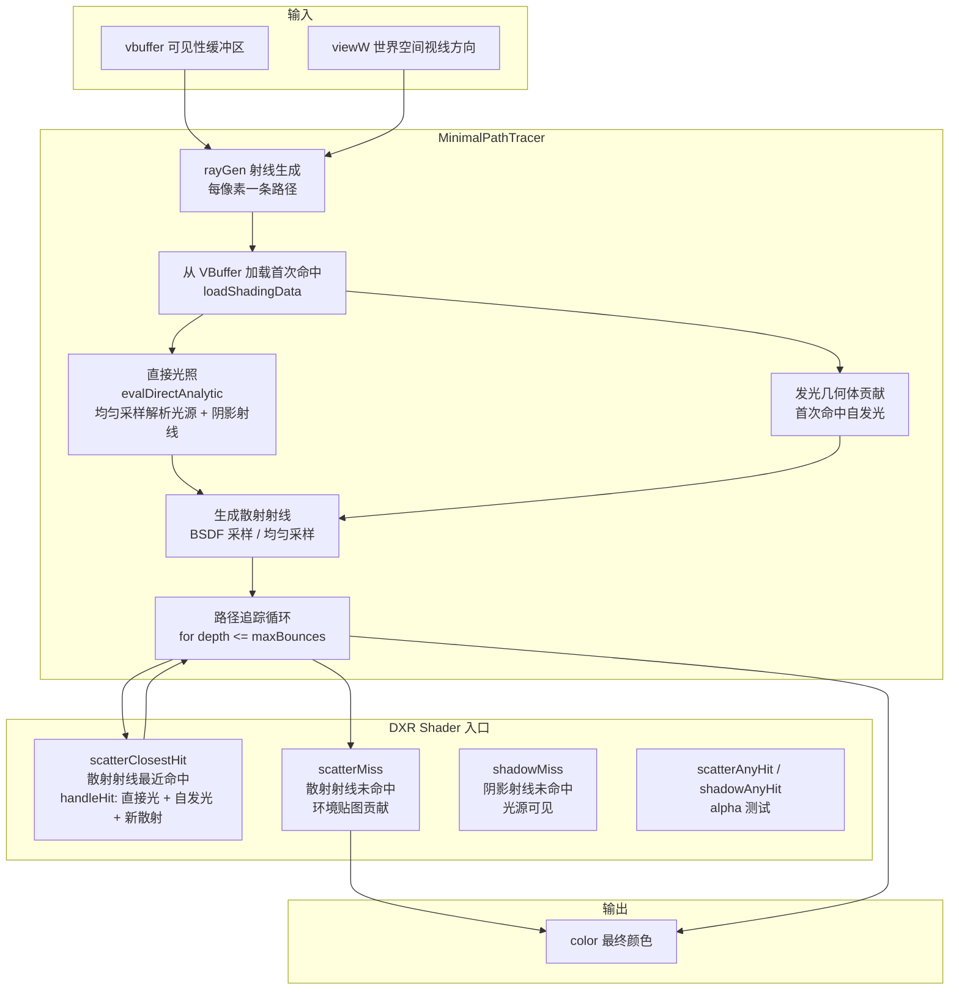

# MinimalPathTracer - 最小路径追踪器

## 功能概述

MinimalPathTracer 是 Falcor 中的一个教学/验证用最小路径追踪渲染通道。该通道实现了一个简洁的蛮力 (brute-force) 路径追踪器，故意不使用任何重要性采样或方差缩减技术（材质采样除外），以产生无偏/一致的 Ground Truth 参考图像，用于验证更复杂的渲染器。

主要功能包括：

- **完整路径追踪**：支持直接光照和多次间接弹射的全局光照
- **多种光源类型**：支持解析光源（点光源、方向光）、发光几何体、环境贴图
- **多种几何类型**：三角网格、位移三角网格、曲线、SDF Grid
- **DXR 硬件光线追踪**：使用完整 DXR API（RayGen / ClosestHit / AnyHit / Miss / Intersection）
- **可选重要性采样**：可开关材质 BSDF 重要性采样
- **VBuffer 输入**：从 GBuffer 传入的可见性缓冲区加载首次命中
- **景深支持**：可选接收世界空间视线方向以支持景深效果
- **Alpha 测试**：非透明几何体的 AnyHit alpha 测试

### 输入/输出通道

| 方向 | 名称 | 说明 | 可选 |
|------|------|------|------|
| 输入 | `vbuffer` | 打包格式的可见性缓冲区 | 否 |
| 输入 | `viewW` | 世界空间视线方向 (float4) | 是 |
| 输出 | `color` | 输出颜色（直接 + 间接光照之和, RGBA32Float） | 否 |

## 架构图



## 文件清单

| 文件名 | 类型 | 说明 |
|--------|------|------|
| `MinimalPathTracer.h` | C++ 头文件 | MinimalPathTracer 类声明，光线追踪程序结构体 |
| `MinimalPathTracer.cpp` | C++ 实现 | 渲染通道逻辑：场景设置、SBT 构建、着色器调度 |
| `MinimalPathTracer.rt.slang` | Ray Tracing Shader | 完整的路径追踪着色器：RayGen、ClosestHit、AnyHit、Miss、Intersection |
| `CMakeLists.txt` | 构建文件 | CMake 插件构建配置 |

## 依赖关系

```
MinimalPathTracer
├── Falcor 核心框架
│   ├── Falcor.h
│   ├── RenderGraph/RenderPass.h
│   ├── RenderGraph/RenderPassHelpers.h
│   └── RenderGraph/RenderPassStandardFlags.h
├── 采样器
│   └── Utils/Sampling/SampleGenerator.h (SAMPLE_GENERATOR_UNIFORM)
├── Shader 依赖
│   ├── Scene/SceneDefines.slangh
│   ├── Utils/Math/MathConstants.slangh
│   ├── Scene.Raytracing (DXR 光线追踪基础设施)
│   ├── Scene.Intersection (各类几何体交叉测试)
│   ├── Utils.Math.MathHelpers
│   ├── Utils.Geometry.GeometryHelpers
│   ├── Utils.Sampling.SampleGenerator
│   └── Rendering.Lights.LightHelpers (解析光源采样)
├── DXR 光线追踪
│   ├── Program / RtBindingTable / RtProgramVars
│   └── kMaxPayloadSizeBytes = 72, kMaxRecursionDepth = 2
└── 需要 GBuffer 通道提供 VBuffer 输入
```

## 关键类与接口

### `MinimalPathTracer` (继承自 `RenderPass`)

渲染通道主类，注册名为 `"MinimalPathTracer"`。

| 方法 | 说明 |
|------|------|
| `MinimalPathTracer(ref<Device>, const Properties&)` | 构造函数，创建均匀采样生成器 |
| `reflect(const CompileData&)` | 声明输入/输出通道 |
| `execute(RenderContext*, const RenderData&)` | 设置 defines -> 准备 vars -> 调度光线追踪 |
| `setScene(RenderContext*, const ref<Scene>&)` | 创建光线追踪程序和 SBT (Shader Binding Table) |
| `renderUI(Gui::Widgets&)` | Max bounces、直接光照开关、重要性采样开关 |

### 配置属性

| 属性 | 默认值 | 说明 |
|------|--------|------|
| `maxBounces` | 3 | 最大间接弹射次数 (0 = 仅直接光) |
| `computeDirect` | true | 是否计算直接光照 |
| `useImportanceSampling` | true | 是否使用材质重要性采样 |

### 光线追踪程序结构体

```
mTracer
├── pProgram        - DXR 光线追踪程序
├── pBindingTable   - SBT 绑定表 (2 ray types x 2 miss shaders)
└── pVars           - 程序变量
```

### DXR Shader 入口点 (`MinimalPathTracer.rt.slang`)

| 入口点 | Shader 类型 | 说明 |
|--------|-------------|------|
| `rayGen` | RayGeneration | 每像素生成一条路径，循环追踪至终止 |
| `scatterTriangleMeshClosestHit` | ClosestHit | 三角网格散射射线命中 |
| `scatterDisplacedTriangleMeshClosestHit` | ClosestHit | 位移三角网格命中 |
| `scatterCurveClosestHit` | ClosestHit | 曲线几何体命中 |
| `scatterSdfGridClosestHit` | ClosestHit | SDF Grid 命中 |
| `scatterTriangleMeshAnyHit` | AnyHit | 非透明三角网格 alpha 测试 |
| `shadowTriangleMeshAnyHit` | AnyHit | 阴影射线 alpha 测试 |
| `scatterMiss` | Miss | 散射射线未命中，添加环境贴图贡献 |
| `shadowMiss` | Miss | 阴影射线未命中，标记光源可见 |
| `displacedTriangleMeshIntersection` | Intersection | 位移三角网格自定义交叉 |
| `curveIntersection` | Intersection | 曲线几何体自定义交叉 |
| `sdfGridIntersection` | Intersection | SDF Grid 自定义交叉 |

### Shader 关键数据结构

- **`ScatterRayData`** (72B payload)：路径状态，包含累积辐亮度 `radiance`、路径吞吐量 `thp`、下一段射线原点/方向、路径长度、采样生成器状态
- **`ShadowRayData`**：阴影射线数据，仅含 `visible` 布尔值

### 关键 Shader 函数

| 函数 | 说明 |
|------|------|
| `tracePath(pixel, frameDim)` | 主路径追踪函数：加载首次命中 -> 直接光 -> 路径循环 |
| `handleHit(hit, rayData)` | 命中点处理：加载着色数据 -> 自发光 -> 直接光 -> 生成散射射线 |
| `evalDirectAnalytic(sd, mi, sg)` | 均匀随机采样一个解析光源，追踪阴影射线评估直接光照 |
| `generateScatterRay(sd, mi, ...)` | BSDF 采样生成下一条散射射线 |
| `traceShadowRay(origin, dir, distance)` | 追踪阴影射线检测光源可见性 |
| `loadShadingData(hit, rayOrigin, rayDir)` | 从 HitInfo 加载顶点数据和材质，构建 ShadingData |
