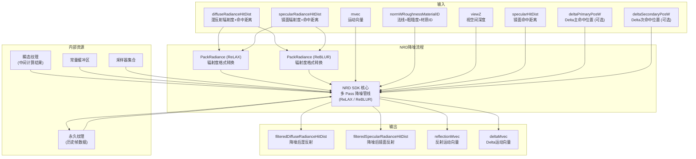

# NRDPass -- NRD 降噪渲染通道

## 功能概述

NRDPass 是 NVIDIA Real-time Denoisers (NRD) SDK 在 Falcor 中的集成封装，提供生产级实时降噪能力。NRD 专为路径追踪设计，要求输入解调（demodulated）后的漫反射和镜面反射辐射度以及命中距离，能够分别对漫反射和镜面反射通道进行高质量降噪。

### 支持的降噪方法

| 方法 | 说明 |
|------|------|
| **ReLAX Diffuse+Specular** | 默认方法，专为实时路径追踪设计的松弛降噪器 |
| **ReLAX Diffuse** | 仅漫反射通道降噪 |
| **ReBLUR Diffuse+Specular** | 基于模糊的替代降噪策略 |
| **SpecularReflectionMv** | 镜面反射运动向量生成 |
| **SpecularDeltaMv** | Delta 镜面运动向量生成 |

### 核心特性

- **漫反射/镜面分离降噪**：独立处理漫反射和镜面反射信号，保持材质特性
- **辐射度打包**：内置 PackRadiance 计算通道，将路径追踪输出转换为 NRD 所需格式
- **世界空间运动向量**：支持世界空间运动向量输入
- **D3D12 原生集成**：直接使用 D3D12 描述符集和根签名与 NRD SDK 交互
- **丰富的可调参数**：暴露 ReLAX/ReBLUR 的大量专业参数供精细调优

## 架构图

## 文件清单

| 文件名 | 类型 | 说明 |
|--------|------|------|
| `NRDPass.h` | C++ 头文件 | NRDPass 渲染通道类声明，包含降噪方法枚举、ReLAX/ReBLUR 参数、D3D12 资源 |
| `NRDPass.cpp` | C++ 实现 | 通道主逻辑：NRD 实例管理、管线创建、纹理资源分配、dispatch 调度 |
| `PackRadiance.cs.slang` | Compute 着色器 | 将路径追踪输出的辐射度和命中距离打包为 NRD 所需的输入格式 |
| `CMakeLists.txt` | 构建文件 | CMake 构建配置 |

## 依赖关系

| 依赖模块 | 用途 |
|----------|------|
| `RenderGraph/RenderPass` | 渲染通道基类 |
| `RenderGraph/RenderPassHelpers` | 输出尺寸计算 |
| `NRD SDK (nrd.h)` | NVIDIA Real-time Denoisers 第三方库 |
| `Core/API/Shared/D3D12DescriptorSet` | D3D12 描述符集管理 |
| `Core/API/Shared/D3D12RootSignature` | D3D12 根签名 |
| `Core/API/Shared/D3D12ConstantBufferView` | D3D12 常量缓冲区视图 |
| `RenderPasses/Shared/Denoising/NRDConstants.slang` | NRD 常量定义 |
| 上游 PathTracer | 提供解调辐射度、命中距离、法线/粗糙度等数据 |

## 关键类与接口

### `NRDPass` (主类，继承自 `RenderPass`，插件名 `"NRD"`)

| 方法 | 说明 |
|------|------|
| `reflect()` | 声明输入（漫反射/镜面辐射度+命中距离、运动向量、法线+粗糙度、视空间深度等）和输出（滤波后漫反射/镜面数据、运动向量） |
| `compile()` | 分辨率变化时重新初始化 NRD 降噪器 |
| `execute()` | 执行 PackRadiance -> NRD SDK dispatch 管线 |
| `setScene()` | 设置场景以获取相机矩阵 |
| `renderUI()` | 暴露降噪方法选择、ReLAX/ReBLUR 参数调节 |

### `NRDPass::DenoisingMethod` (枚举)

- `RelaxDiffuseSpecular` -- ReLAX 漫反射+镜面（默认）
- `RelaxDiffuse` -- 仅 ReLAX 漫反射
- `ReblurDiffuseSpecular` -- ReBLUR 漫反射+镜面
- `SpecularReflectionMv` -- 镜面反射运动向量
- `SpecularDeltaMv` -- Delta 镜面运动向量

### 关键内部流程

1. **reinit()**: 创建/重建 NRD 降噪器实例
2. **createPipelines()**: 根据 NRD SDK 返回的 dispatch 描述创建 D3D12 计算管线
3. **createResources()**: 分配 NRD 所需的永久纹理（历史帧）和瞬态纹理（中间结果）
4. **dispatch()**: 绑定资源并执行单个 NRD 计算通道
