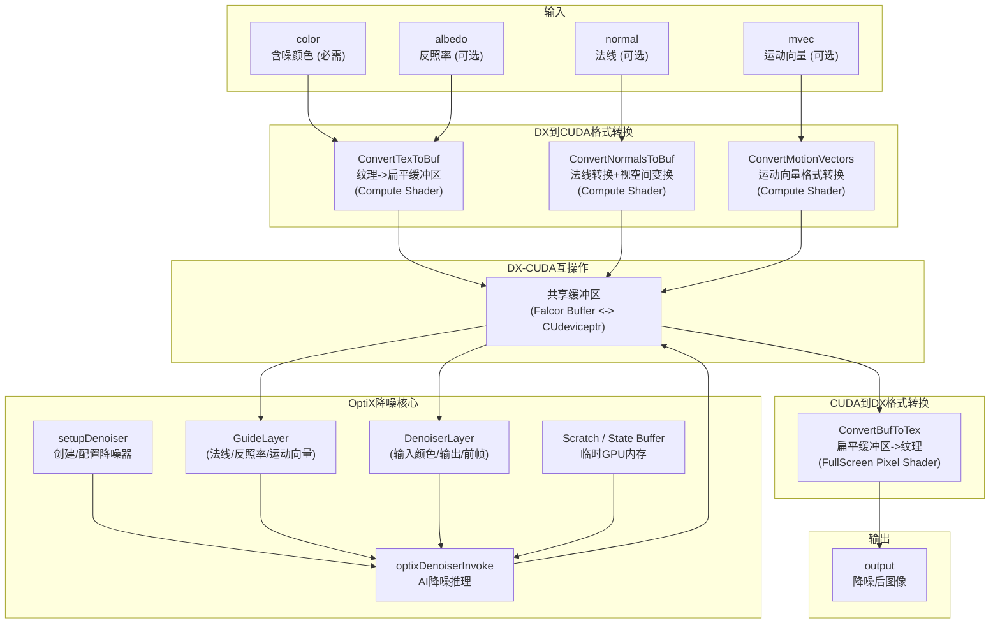

# OptixDenoiser -- OptiX AI 降噪渲染通道

## 功能概述

OptixDenoiser 是 NVIDIA OptiX AI 降噪器在 Falcor 渲染管线中的封装。该通道利用 OptiX SDK 提供的深度学习降噪模型，对路径追踪输出的含噪图像进行高质量降噪。通过 DirectX 12 与 CUDA 的互操作 (interop)，实现了跨 API 的 GPU 数据共享。

### 核心特性

- **多种降噪模型**：支持 LDR、HDR、Temporal（时域）、AOV 等模型
- **可选辅助输入**：反照率 (albedo)、法线 (normal)、运动向量 (mvec) 均为可选输入，连接后可提升降噪质量
- **时域降噪**：连接运动向量后自动启用时域模式，复用前帧信息
- **混合比例控制**：可调节降噪图像与原始图像的混合比例
- **Alpha 通道降噪**：可选对 Alpha 通道进行降噪处理
- **自动模式选择**：根据连接的输入自动选择最佳降噪模型

### 系统要求

- OptiX 7.3 SDK
- NVIDIA 驱动 465.84 或更高版本
- CUDA 运行时支持

## 架构图

## 文件清单

| 文件名 | 类型 | 说明 |
|--------|------|------|
| `OptixDenoiser.h` | C++ 头文件 | OptixDenoiser_ 渲染通道类声明，包含 Interop 结构体、降噪器状态 |
| `OptixDenoiser.cpp` | C++ 实现 | 通道主逻辑：降噪器创建、资源分配、DX-CUDA 互操作、降噪调度 |
| `OptixUtils.h` | C++ 头文件 | CudaBuffer 工具类和 OptiX 上下文初始化函数声明 |
| `OptixUtils.cpp` | C++ 实现 | OptiX 上下文初始化（initOptix）实现 |
| `ConvertTexToBuf.cs.slang` | Compute 着色器 | 将 DX 纹理转换为扁平缓冲区格式（OptiX 要求线性内存布局） |
| `ConvertNormalsToBuf.cs.slang` | Compute 着色器 | 将法线从世界空间转换到视空间并写入缓冲区 |
| `ConvertMotionVectorInputs.cs.slang` | Compute 着色器 | 转换 Falcor 格式的运动向量为 OptiX 所需格式 |
| `ConvertBufToTex.ps.slang` | 像素着色器 | 将降噪后的扁平缓冲区转换回 DX 纹理格式 |
| `README.txt` | 文本文件 | 原始说明文件 |
| `CMakeLists.txt` | 构建文件 | CMake 构建配置 |

## 依赖关系

| 依赖模块 | 用途 |
|----------|------|
| `RenderGraph/RenderPass` | 渲染通道基类 |
| `Core/Pass/FullScreenPass` | 全屏像素着色器通道（缓冲区转纹理） |
| `OptiX SDK (optix.h, optix_stubs.h)` | NVIDIA OptiX 光线追踪 SDK，提供 AI 降噪 API |
| `CUDA Runtime` | CUDA GPU 计算运行时 |
| `Utils/CudaUtils` | Falcor CUDA 工具函数（DX-CUDA 互操作） |
| `Utils/CudaRuntime` | CUDA 运行时封装 |
| 上游 PathTracer | 提供含噪颜色 |
| 上游 GBuffer | 提供反照率、法线、运动向量 |

## 关键类与接口

### `OptixDenoiser_` (主类，继承自 `RenderPass`，插件名 `"OptixDenoiser"`)

注意：类名末尾加下划线 `_` 以避免与 OptiX SDK 中的 `OptixDenoiser` 类型名冲突。

| 方法 | 说明 |
|------|------|
| `reflect()` | 声明输入（color 必需，albedo/normal/mvec 可选）和输出（output） |
| `compile()` | 分辨率变化时标记重建降噪器 |
| `execute()` | 格式转换 -> OptiX 降噪推理 -> 格式回转 |
| `setupDenoiser()` | 创建/重建 OptiX 降噪器实例，配置模型和选项 |
| `renderUI()` | 启用开关、模型选择、混合比例等 |

### `CudaBuffer` (CUDA GPU 缓冲区工具类)

简易 CUDA 设备内存管理封装（allocate / resize / free），用于 OptiX 降噪器的 scratch 和 state 缓冲区。

### `OptixDenoiser_::Interop` (DX-CUDA 互操作结构体)

封装 Falcor Buffer 与 CUdeviceptr 的映射关系，用于在 DirectX 和 CUDA 之间共享 GPU 内存。

### 降噪模型

| 模型 | 说明 |
|------|------|
| `OPTIX_DENOISER_MODEL_KIND_LDR` | LDR 图像降噪 |
| `OPTIX_DENOISER_MODEL_KIND_HDR` | HDR 图像降噪（默认） |
| `OPTIX_DENOISER_MODEL_KIND_TEMPORAL` | 时域降噪（需要运动向量） |
| `OPTIX_DENOISER_MODEL_KIND_AOV` | AOV 降噪（多通道，尚未完全支持） |
