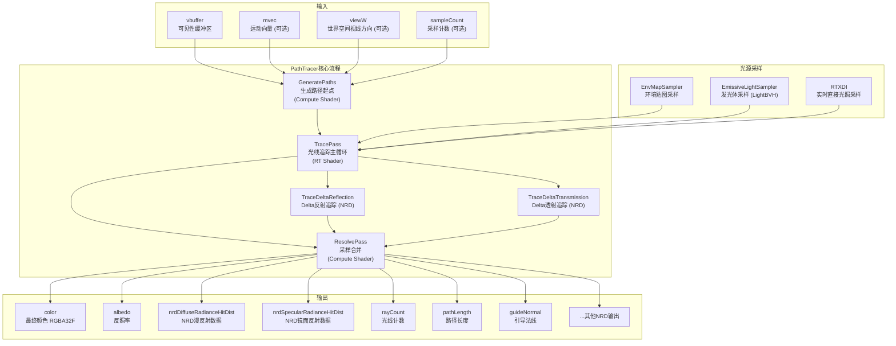

# PathTracer -- 路径追踪器渲染通道

## 功能概述

PathTracer 是 Falcor 中的参考级无偏路径追踪渲染通道，基于 DXR (DirectX Raytracing) 实现。该通道从 VBuffer（可见性缓冲区）出发，生成路径并进行多次反弹的光线追踪，支持漫反射、镜面反射、透射等材质交互，最终输出每像素的颜色及多种辅助缓冲区。

### 核心特性

- **多重反弹路径追踪**：支持可配置的漫反射(默认3次)、镜面反射(默认3次)、透射(默认10次)反弹次数
- **多重重要性采样 (MIS)**：结合 BSDF 采样与下一事件估计 (NEE) 进行光源采样
- **多种光源采样器**：支持 LightBVH、EmissivePower、EmissiveUniform 等发光体采样策略
- **RTXDI 集成**：可选启用 RTXDI 进行高效直接光照采样
- **NRD 数据输出**：可输出 NVIDIA Real-time Denoisers 所需的解调漫反射/镜面反射辐射度与命中距离
- **SER 支持**：支持 Shader Execution Reordering 提升光追着色器调度效率
- **俄罗斯轮盘赌**：可选启用路径终止策略以提升性能
- **景深 (DOF)**：通过 VBuffer 支持景深效果

## 架构图

## 文件清单

| 文件名 | 类型 | 说明 |
|--------|------|------|
| `PathTracer.h` | C++ 头文件 | PathTracer 渲染通道主类声明，包含 StaticParams 和 TracePass 内部类 |
| `PathTracer.cpp` | C++ 实现 | 渲染通道主逻辑：输入/输出定义、路径生成、追踪调度、采样解析 |
| `PathTracer.slang` | Slang 着色器 | 路径追踪核心算法：光线-场景交互、BSDF 采样、NEE、MIS |
| `TracePass.rt.slang` | RT 着色器 | DXR 光线追踪入口点（raygen / closesthit / anyhit / miss） |
| `GeneratePaths.cs.slang` | Compute 着色器 | 从 VBuffer 主命中点生成初始路径 |
| `ResolvePass.cs.slang` | Compute 着色器 | 合并多采样结果到最终输出纹理 |
| `ReflectTypes.cs.slang` | Compute 着色器 | 辅助着色器，用于反射结构化缓冲区类型 |
| `PathState.slang` | Slang 数据结构 | 路径状态定义（throughput、origin、direction 等） |
| `Params.slang` | Slang 参数 | 运行时路径追踪参数定义 (PathTracerParams) |
| `StaticParams.slang` | Slang 参数 | 编译期静态参数（反弹次数、采样策略等宏定义） |
| `ColorType.slang` | Slang 工具 | 颜色格式定义（LogLuvHDR 等内部颜色编码） |
| `LoadShadingData.slang` | Slang 工具 | 从 VBuffer 命中信息加载着色数据 |
| `NRDHelpers.slang` | Slang 工具 | NRD 降噪器辅助函数（解调辐射度输出） |
| `PathTracerNRD.slang` | Slang 工具 | NRD 数据写入逻辑（漫反射/镜面/Delta 路径） |
| `GuideData.slang` | Slang 数据结构 | 降噪引导数据结构（法线、反照率等） |
| `CMakeLists.txt` | 构建文件 | CMake 构建配置 |

## 依赖关系

| 依赖模块 | 用途 |
|----------|------|
| `RenderGraph/RenderPass` | 渲染通道基类 |
| `RenderGraph/RenderPassHelpers` | 输入/输出通道辅助工具 |
| `Rendering/Lights/LightBVHSampler` | 基于 BVH 的发光体重要性采样 |
| `Rendering/Lights/EmissivePowerSampler` | 基于功率的发光体采样 |
| `Rendering/Lights/EnvMapSampler` | 环境贴图采样 |
| `Rendering/RTXDI/RTXDI` | NVIDIA RTXDI 直接光照采样库 |
| `Rendering/Utils/PixelStats` | 像素级统计信息收集 |
| `Utils/Debug/PixelDebug` | 着色器像素调试 (print) |
| `Utils/Sampling/SampleGenerator` | GPU 伪随机采样生成器 |
| `GBuffer / VBuffer` | 上游通道，提供可见性缓冲区输入 |

## 关键类与接口

### `PathTracer` (主类，继承自 `RenderPass`)

| 方法 | 说明 |
|------|------|
| `reflect()` | 声明输入(vbuffer, mvec, viewW, sampleCount)与输出(color, albedo, NRD数据等) |
| `execute()` | 每帧执行：beginFrame -> generatePaths -> tracePass -> resolvePass -> endFrame |
| `setScene()` | 设置场景，初始化采样器（环境贴图、发光体、RTXDI） |
| `renderUI()` | 渲染 GUI 控件（反弹次数、MIS 参数、采样器选择等） |
| `reset()` | 重置累积状态 |

### `PathTracer::TracePass` (内部类)

封装一个 DXR 光线追踪 Pass 的程序、绑定表和变量。主追踪使用 `mpTracePass`，NRD Delta 路径追踪使用 `mpTraceDeltaReflectionPass` / `mpTraceDeltaTransmissionPass`。

### `PathTracer::StaticParams` (内部结构体)

编译期常量配置，修改后需要重新编译着色器：
- `samplesPerPixel` -- 每像素采样数
- `maxSurfaceBounces` / `maxDiffuseBounces` / `maxSpecularBounces` / `maxTransmissionBounces` -- 反弹次数上限
- `useNEE` / `useMIS` / `useBSDFSampling` / `useRussianRoulette` -- 采样策略开关
- `useRTXDI` -- RTXDI 直接光照开关
- `useSER` -- Shader Execution Reordering 开关
- `colorFormat` -- 内部颜色编码格式 (LogLuvHDR)
- `useNRDDemodulation` -- NRD 颜色解调开关
