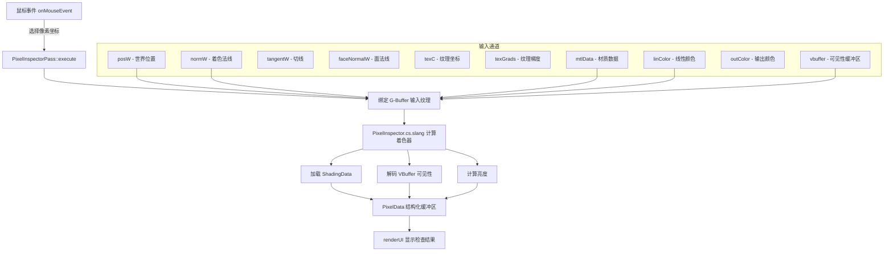

# PixelInspectorPass - 像素检查器

## 功能概述

PixelInspectorPass 是一个用于检查指定像素处几何属性和材质属性的渲染通道。用户可以通过鼠标左键点击选择一个像素，该通道会从多个 G-Buffer 输入中提取该像素的详细信息，包括：

- **输出数据**：线性颜色、色调映射后颜色、亮度值（cd/m2）
- **几何数据**：世界坐标位置、着色法线、切线、副切线、面法线、视线方向、纹理坐标、是否正面朝向
- **材质数据**：材质 ID、双面标志、不透明度、折射率（IoR）、自发光、粗糙度、引导法线、漫反射/镜面反射/透射反照率、镜面反射率、是否透射
- **可见性数据**：命中类型（三角形/曲线）、实例 ID、图元索引、重心坐标、变换矩阵

支持连续拾取模式和输入分辨率缩放，可将不同分辨率的输入映射到窗口坐标。

## 架构图

## 文件清单

| 文件名 | 类型 | 说明 |
|--------|------|------|
| `PixelInspectorPass.h` | C++ 头文件 | 定义 `PixelInspectorPass` 类，声明渲染通道接口和内部状态 |
| `PixelInspectorPass.cpp` | C++ 源文件 | 实现通道的反射、执行、UI 渲染、场景绑定和鼠标事件处理 |
| `PixelInspector.cs.slang` | Slang 计算着色器 | GPU 端主逻辑：加载 G-Buffer 数据、准备着色数据、解码可见性缓冲区、写入 PixelData |
| `PixelInspectorData.slang` | Slang 数据定义 | 定义 `PixelData` 结构体，在 CPU/GPU 之间共享的像素检查数据格式 |
| `CMakeLists.txt` | 构建配置 | CMake 构建脚本 |

## 依赖关系

### 框架依赖
- `Falcor.h` - Falcor 核心框架
- `RenderGraph/RenderPass.h` - 渲染通道基类
- `RenderGraph/RenderPassHelpers.h` - 渲染通道辅助工具（通道定义宏）

### 着色器依赖
- `Scene.Shading` - 场景着色数据和材质求值
- `Scene.Camera.Camera` - 相机射线计算（针孔模型）
- `Utils.Color.ColorHelpers` - 颜色工具函数（亮度计算）
- `Scene.HitInfoType` - 命中信息类型定义
- `Utils/HostDeviceShared.slangh` - CPU/GPU 共享宏

### 输入通道依赖
需要来自 G-Buffer 渲染通道的输出（大部分为可选输入）：
- 必需：`posW`（世界位置）、`mtlData`（材质数据）
- 可选：`normW`、`tangentW`、`faceNormalW`、`texC`、`texGrads`、`linColor`、`outColor`、`vbuffer`

## 关键类与接口

### `PixelInspectorPass` 类
继承自 `RenderPass`，实现以下核心接口：

| 方法 | 说明 |
|------|------|
| `reflect()` | 声明输入通道（10 个 G-Buffer 通道，多数可选） |
| `execute()` | 调度单线程计算着色器，提取选中像素的所有属性数据 |
| `renderUI()` | 在 GUI 面板中分组显示输出数据、几何数据、材质数据、可见性数据 |
| `setScene()` | 绑定场景，触发着色器重编译 |
| `onMouseEvent()` | 捕获鼠标点击和移动事件以更新选中像素坐标 |
| `recreatePrograms()` | 重置着色器程序和缓冲区，用于场景变更后的重编译 |

### `PixelData` 结构体（定义于 `PixelInspectorData.slang`）
CPU/GPU 共享的数据结构，包含：
- 几何字段：`posW`、`normal`、`tangent`、`bitangent`、`faceNormal`、`view`、`texCoord`、`frontFacing`
- 材质字段：`materialID`、`doubleSided`、`opacity`、`IoR`、`emission`、`roughness` 等
- 输出字段：`linearColor`、`outputColor`、`luminance`
- 可见性字段：`hitType`、`instanceID`、`primitiveIndex`、`barycentrics`

### 计算着色器入口（`PixelInspector.cs.slang :: main`）
- 线程组大小：`[numthreads(1, 1, 1)]`（单像素调度）
- 通过 `loadShadingData()` 从 G-Buffer 重建完整的 `ShadingData`
- 通过材质系统求值 BSDF 属性（反照率、粗糙度等）
- 解码 `PackedHitInfo` 获取可见性信息
