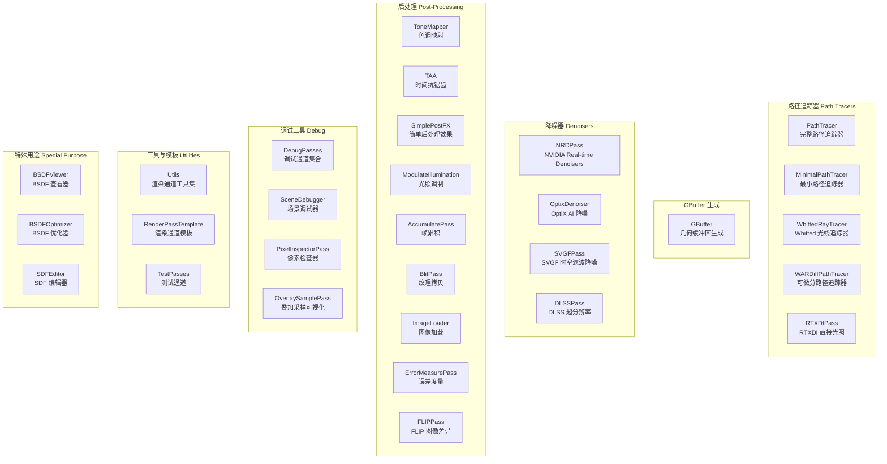

# RenderPasses -- Falcor 渲染通道插件索引

## 功能概述

`Source/RenderPasses/` 是 Falcor 8.0 框架中所有渲染通道插件的根目录。每个子目录对应一个独立的渲染通道插件（动态库），通过 Falcor 的插件系统注册并在渲染图（Render Graph）中使用。本目录共包含 **28 个子目录**，提供了路径追踪、GBuffer 生成、降噪、后处理、调试工具、实用工具和测试等完整的渲染管线功能。

## 渲染通道分类图



## 全部渲染通道列表

| # | 目录名 | 分类 | 简要说明 |
|---|--------|------|----------|
| 1 | [AccumulatePass](AccumulatePass/) | 后处理 | 帧累积通道，将多帧渲染结果进行平均以实现渐进式渲染 |
| 2 | [BlitPass](BlitPass/) | 后处理 | 纹理拷贝通道，将源纹理拷贝到目标纹理 |
| 3 | [BSDFOptimizer](BSDFOptimizer/) | 特殊用途 | BSDF 参数优化器，用于拟合材质参数 |
| 4 | [BSDFViewer](BSDFViewer/) | 特殊用途 | BSDF 交互式查看器，可视化材质的散射分布函数 |
| 5 | [DebugPasses](DebugPasses/) | 调试 | 调试通道集合，含 SplitScreen/SideBySide/InvalidPixelDetection/ColorMap |
| 6 | [DLSSPass](DLSSPass/) | 降噪 | NVIDIA DLSS 超分辨率与抗锯齿通道 |
| 7 | [ErrorMeasurePass](ErrorMeasurePass/) | 后处理 | 图像误差度量通道（PSNR、MSE 等） |
| 8 | [FLIPPass](FLIPPass/) | 后处理 | FLIP 图像差异度量通道，用于感知质量对比 |
| 9 | [GBuffer](GBuffer/) | GBuffer | 几何缓冲区生成（光栅化/光线追踪两种模式） |
| 10 | [ImageLoader](ImageLoader/) | 后处理 | 图像加载通道，从文件加载纹理作为渲染图输入 |
| 11 | [MinimalPathTracer](MinimalPathTracer/) | 路径追踪 | 最小化路径追踪器，用于教学和基准测试 |
| 12 | [ModulateIllumination](ModulateIllumination/) | 后处理 | 光照调制通道，将降噪后的光照分量与反照率合成 |
| 13 | [NRDPass](NRDPass/) | 降噪 | NVIDIA Real-time Denoisers (NRD) 集成通道 |
| 14 | [OptixDenoiser](OptixDenoiser/) | 降噪 | NVIDIA OptiX AI 降噪器集成通道 |
| 15 | [OverlaySamplePass](OverlaySamplePass/) | 调试 | 叠加采样可视化，演示 ImGui 叠加绘制各类 2D 图元 |
| 16 | [PathTracer](PathTracer/) | 路径追踪 | 完整路径追踪器，支持 MIS、NEE、体积渲染等高级功能 |
| 17 | [PixelInspectorPass](PixelInspectorPass/) | 调试 | 像素检查器，交互式查看指定像素的详细渲染数据 |
| 18 | [RenderPassTemplate](RenderPassTemplate/) | 工具 | 渲染通道开发模板，提供标准骨架代码 |
| 19 | [RTXDIPass](RTXDIPass/) | 路径追踪 | RTXDI 直接光照采样通道（ReSTIR DI） |
| 20 | [SceneDebugger](SceneDebugger/) | 调试 | 场景调试器，可视化场景的各类属性（法线、UV、ID 等） |
| 21 | [SDFEditor](SDFEditor/) | 特殊用途 | SDF（有符号距离场）交互式编辑器 |
| 22 | [SimplePostFX](SimplePostFX/) | 后处理 | 简单后处理效果集合（bloom、vignette 等） |
| 23 | [SVGFPass](SVGFPass/) | 降噪 | SVGF 时空方差引导滤波降噪器 |
| 24 | [TAA](TAA/) | 后处理 | 时间抗锯齿（Temporal Anti-Aliasing）通道 |
| 25 | [TestPasses](TestPasses/) | 工具 | 测试通道集合，含 TestRtProgram 和 TestPyTorchPass |
| 26 | [ToneMapper](ToneMapper/) | 后处理 | 色调映射通道，支持多种色调映射算子 |
| 27 | [Utils](Utils/) | 工具 | 渲染通道工具集，含 Composite/CrossFade/GaussianBlur |
| 28 | [WARDiffPathTracer](WARDiffPathTracer/) | 路径追踪 | WAR 可微分路径追踪器，支持梯度计算 |
| 29 | [WhittedRayTracer](WhittedRayTracer/) | 路径追踪 | 经典 Whitted 风格光线追踪器 |

## 构建系统

所有渲染通道通过根目录的 `CMakeLists.txt` 以 `add_subdirectory()` 方式引入。每个子目录使用 `add_plugin()` 宏创建独立的动态库插件。

## 插件注册机制

每个插件通过导出函数 `registerPlugin(Falcor::PluginRegistry&)` 进行注册：

```cpp
extern "C" FALCOR_API_EXPORT void registerPlugin(Falcor::PluginRegistry& registry)
{
    registry.registerClass<RenderPass, YourPass>();
}
```

一个插件动态库可以注册多个渲染通道（如 DebugPasses 注册了 4 个，Utils 注册了 3 个，TestPasses 注册了 2 个）。
