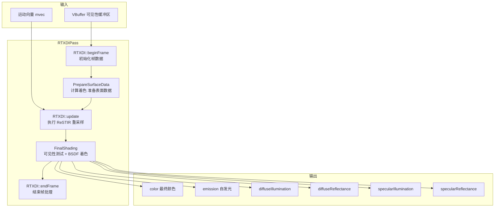

# RTXDIPass - RTXDI 实时直接光照渲染通道

## 功能概述

RTXDIPass 是基于 NVIDIA RTXDI (Real-Time Direct Illumination) 技术的实时直接光照渲染通道。该通道利用 ReSTIR (Reservoir-based Spatio-Temporal Importance Resampling) 算法，对场景中的直接光照进行高效采样，从而实现高质量的实时直接光照效果。

主要功能包括：

- **ReSTIR 重要性重采样**：通过时空重采样技术，在大量光源场景中高效选择光照样本
- **表面数据准备**：从 VBuffer 中提取表面属性（漫反射反照率、镜面反射率、粗糙度等），供 RTXDI 重采样使用
- **最终着色**：获取 RTXDI 最终采样结果，执行可见性检测并使用完整材质 BSDF 进行着色
- **漫反射/镜面反射分离输出**：支持将漫反射光照、镜面反射光照、反照率等分通道输出，便于后续降噪处理
- **运动向量支持**：可选接收运动向量用于时间重采样

### 输入/输出通道

| 方向 | 名称 | 说明 | 可选 |
|------|------|------|------|
| 输入 | `vbuffer` | 打包格式的可见性缓冲区 | 否 |
| 输入 | `texGrads` | 纹理梯度 | 是 |
| 输入 | `mvec` | 屏幕空间运动向量 (float) | 是 |
| 输出 | `color` | 最终颜色 (RGBA32Float) | 是 |
| 输出 | `emission` | 自发光颜色 | 是 |
| 输出 | `diffuseIllumination` | 漫反射光照 | 是 |
| 输出 | `diffuseReflectance` | 漫反射反照率 | 是 |
| 输出 | `specularIllumination` | 镜面反射光照 | 是 |
| 输出 | `specularReflectance` | 镜面反射率 | 是 |

## 架构图



## 文件清单

| 文件名 | 类型 | 说明 |
|--------|------|------|
| `RTXDIPass.h` | C++ 头文件 | RTXDIPass 类声明，继承自 RenderPass |
| `RTXDIPass.cpp` | C++ 实现 | 渲染通道主逻辑：初始化、执行、UI 等 |
| `PrepareSurfaceData.cs.slang` | Compute Shader | 从 VBuffer 加载表面数据并传递给 RTXDI |
| `FinalShading.cs.slang` | Compute Shader | 获取 RTXDI 采样结果，执行阴影测试和 BSDF 着色 |
| `LoadShadingData.slang` | Shader 辅助模块 | 从 VBuffer 加载 ShadingData 的公共辅助函数 |
| `CMakeLists.txt` | 构建文件 | CMake 插件构建配置 |
| `README.txt` | 说明文件 | RTXDI SDK 安装和使用说明 |

## 依赖关系

```
RTXDIPass
├── Falcor 核心框架
│   ├── Falcor.h
│   ├── RenderGraph/RenderPass.h
│   ├── RenderGraph/RenderPassHelpers.h
│   └── RenderGraph/RenderPassStandardFlags.h
├── RTXDI 模块 (外部 SDK)
│   └── Rendering/RTXDI/RTXDI.h
├── Shader 依赖
│   ├── Scene.Scene / Scene.Shading / Scene.HitInfo
│   ├── Scene.RaytracingInline (DXR 1.1 inline ray tracing)
│   ├── Scene.Material.ShadingUtils
│   ├── Rendering.Materials.IsotropicGGX
│   ├── Utils.Color.ColorHelpers
│   ├── Utils.Math.MathHelpers
│   └── Utils.Sampling.TinyUniformSampleGenerator
└── 需要 GBuffer 通道提供 VBuffer 输入
```

> **注意**：RTXDI SDK 不随 Falcor 公开发行版分发，需要在 [NVIDIA 开发者网站](https://developer.nvidia.com/rtxdi) 注册后从 [GitHub 仓库](https://github.com/NVIDIAGameWorks/RTXDI) 获取。

## 关键类与接口

### `RTXDIPass` (继承自 `RenderPass`)

渲染通道主类，注册名为 `"RTXDIPass"`。

| 方法 | 说明 |
|------|------|
| `RTXDIPass(ref<Device>, const Properties&)` | 构造函数，解析配置属性 |
| `reflect(const CompileData&)` | 声明输入/输出通道 |
| `compile(RenderContext*, const CompileData&)` | 获取帧尺寸 |
| `execute(RenderContext*, const RenderData&)` | 执行渲染：准备表面 -> RTXDI 更新 -> 最终着色 |
| `setScene(RenderContext*, const ref<Scene>&)` | 设置场景，创建 RTXDI 实例 |
| `renderUI(Gui::Widgets&)` | 显示 RTXDI 模块 GUI |
| `onMouseEvent(const MouseEvent&)` | 转发鼠标事件到 RTXDI 像素调试 |

### 关键私有方法

| 方法 | 说明 |
|------|------|
| `prepareSurfaceData(...)` | 调度 `PrepareSurfaceData.cs.slang`，将表面属性写入 RTXDI |
| `finalShading(...)` | 调度 `FinalShading.cs.slang`，执行最终着色并写入输出纹理 |
| `recreatePrograms()` | 当场景变更时重建着色器程序 |

### 关键成员变量

| 变量 | 类型 | 说明 |
|------|------|------|
| `mpRTXDI` | `unique_ptr<RTXDI>` | RTXDI 模块实例 |
| `mOptions` | `RTXDI::Options` | RTXDI 配置选项 |
| `mpPrepareSurfaceDataPass` | `ref<ComputePass>` | 表面数据准备计算通道 |
| `mpFinalShadingPass` | `ref<ComputePass>` | 最终着色计算通道 |
| `mFrameDim` | `uint2` | 当前帧分辨率 |

### Shader 结构体

- **`PrepareSurfaceData`** (`PrepareSurfaceData.cs.slang`)：从 VBuffer 加载表面数据，调用 `gRTXDI.setSurfaceData()` 设置漫反射反照率、镜面反射率、粗糙度等
- **`FinalShading`** (`FinalShading.cs.slang`)：调用 `gRTXDI.getFinalSample()` 获取光照方向和辐亮度，使用 DXR 1.1 inline ray tracing 进行可见性测试，分别计算漫反射和镜面反射分量
- **`loadShadingData()`** (`LoadShadingData.slang`)：从 VBuffer 中的 PackedHitInfo 恢复三角形命中信息，构建 ShadingData 结构体
