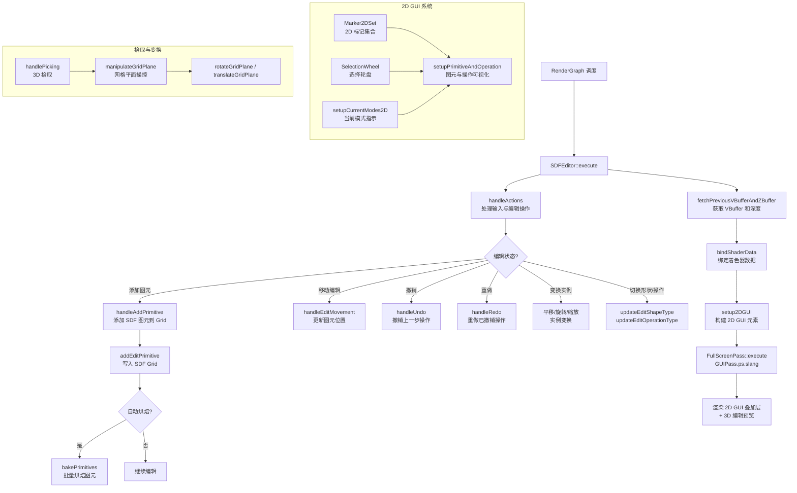

# SDFEditor -- 有符号距离场编辑器

## 功能概述

SDFEditor 是 Falcor 中用于交互式编辑有符号距离场（Signed Distance Field, SDF）几何体的渲染通道插件。该编辑器提供直观的 2D GUI 和 3D 操作界面，支持在场景中实时添加、修改、变换 SDF 图元，适用于程序化建模和 SDF 场景构建。

核心特性：
- 交互式 SDF 图元编辑：支持球体等多种 3D 形状的添加和布尔运算（并集、差集、交集、平滑并集等）
- 2D GUI 叠加层：基于 SDF 的 2D 标记系统，显示当前编辑模式、操作类型和选中状态
- 选择轮盘（Selection Wheel）：快捷切换编辑形状和操作类型的径向菜单
- 三种变换模式：平移（Translation）、旋转（Rotation）、缩放（Scaling），支持轴约束
- 网格平面（Grid Plane）：可旋转和平移的参考网格平面，辅助 3D 空间定位
- 对称编辑：支持对称平面镜像操作
- 撤销/重做系统：完整的编辑历史管理
- 自动烘焙（Auto Baking）：将 SDF 图元批量烘焙到 SDF Grid 中以提升性能
- 实时预览：在编辑过程中实时显示 SDF 图元效果
- 支持在不同 SDF Grid 实例上编辑
- 通过拾取（Picking）机制支持在 3D 场景中选择编辑位置

## 架构图

## 文件清单

| 文件名 | 类型 | 说明 |
|--------|------|------|
| `SDFEditor.h` | C++ 头文件 | `SDFEditor` 类声明，包含编辑状态、变换状态、撤销/重做系统 |
| `SDFEditor.cpp` | C++ 源文件 | 渲染通道主逻辑：输入处理、图元编辑、变换操作、GUI 构建、拾取机制 |
| `GUIPass.ps.slang` | Pixel Shader | 全屏 GUI 叠加渲染：2D 标记绘制、3D 编辑预览、网格平面、包围盒 |
| `Marker2DSet.h` | C++ 头文件 | `Marker2DSet` 类：管理 2D SDF 标记集合 |
| `Marker2DSet.cpp` | C++ 源文件 | 2D 标记的添加和 GPU 缓冲区管理 |
| `Marker2DSet.slang` | Shader 模块 | 2D SDF 标记的 GPU 端渲染逻辑 |
| `Marker2DTypes.slang` | Shader 公共类型 | 2D 标记数据结构和 SDF 形状/操作类型枚举 |
| `SelectionWheel.h` | C++ 头文件 | `SelectionWheel` 类：径向选择菜单 |
| `SelectionWheel.cpp` | C++ 源文件 | 选择轮盘的更新和交互逻辑 |
| `SDFEditorTypes.slang` | Shader 公共类型 | 编辑器相关类型：`SDFGridPlane`、`SDFEditingData`、`SDFPickingInfo`、轴/渲染模式枚举 |
| `CMakeLists.txt` | 构建文件 | CMake 插件注册与着色器拷贝配置 |

## 依赖关系

### 框架依赖
- `Falcor.h` -- Falcor 核心框架
- `Core/Pass/FullScreenPass.h` -- 全屏渲染通道（用于 GUI 叠加）
- `RenderGraph/RenderPass.h` -- 渲染通道基类
- `RenderGraph/RenderPassHelpers.h` -- 渲染通道辅助工具

### 场景依赖
- `Scene/SDFs/SDF3DPrimitiveCommon.slang` -- SDF 3D 图元定义（形状类型、操作类型）
- `Scene/SDFs/SDFGrid` -- SDF Grid 管理接口
- `Scene/HitInfoType.slang` -- 命中类型定义
- `Utils/Math/AABB.h` -- 轴对齐包围盒

### 输入/输出通道
| 方向 | 通道名 | 格式 | 说明 |
|------|--------|------|------|
| 输入 | `inputColor` | RGBA32Float | 输入颜色纹理（原始渲染结果） |
| 输入 | `vbuffer` | RGBA32Uint | 可见性缓冲区 |
| 输入 | `linearZ` | RG32Float | 线性深度缓冲区 |
| 输出 | `output` | RGBA32Float | 叠加 GUI 后的输出 |

## 关键类与接口

### `SDFEditor` 类

继承自 `RenderPass`，通过 `FALCOR_PLUGIN_CLASS` 宏注册为 `"SDFEditor"` 插件。

**核心方法：**
- `execute(RenderContext*, const RenderData&)` -- 每帧执行：处理输入、更新编辑状态、渲染 GUI
- `setScene(RenderContext*, const ref<Scene>&)` -- 场景加载，初始化 GUI pass 和 SDF Grid 实例映射
- `onMouseEvent(const MouseEvent&)` -- 鼠标事件处理（左键编辑、右键 GUI、中键变换、滚轮缩放）
- `onKeyEvent(const KeyboardEvent&)` -- 键盘事件处理（撤销/重做、对称/编辑切换、轴约束）
- `renderUI(RenderContext*, Gui::Widgets&)` -- 渲染 UI 面板
- `handleActions()` -- 综合处理所有输入动作
- `addEditPrimitive(bool addToCurrentEdit, bool addToHistory)` -- 将当前图元添加到 SDF Grid
- `bakePrimitives()` -- 批量烘焙图元到 SDF Grid
- `handlePicking(const float2&, float3&)` -- 3D 空间拾取
- `handleUndo()` / `handleRedo()` -- 撤销/重做操作

### `TransformationState` 枚举

| 状态 | 说明 |
|------|------|
| `None` | 无变换 |
| `Translating` | 平移中 |
| `Rotating` | 旋转中 |
| `Scaling` | 缩放中 |

### `Marker2DSet` 类

管理 2D SDF 标记的集合，用于 GUI 叠加渲染。

**主要方法：**
- `addSimpleMarker(type, size, pos, rotation, color)` -- 添加简单形状标记
- `addRoundedLine(posA, posB, lineWidth, color)` -- 添加圆角线段
- `addTriangle(posA, posB, posC, color)` -- 添加三角形
- `addRoundedBox(pos, halfSides, radius, rotation, color)` -- 添加圆角矩形
- `addMarkerOpMarker(op, typeA, posA, sizeA, typeB, posB, sizeB, color, dimmedColor)` -- 添加带布尔运算的双标记
- `addArrowFromTwoTris(...)` -- 添加箭头标记
- `addCircleSector(...)` -- 添加圆弧扇形
- `addVector(...)` -- 添加向量箭头
- `bindShaderData(var)` -- 绑定到着色器变量
- `clear()` -- 清空标记列表

### `SelectionWheel` 类

径向选择菜单，用于快捷切换编辑形状和操作类型。

**主要方法：**
- `update(mousePos, description)` -- 根据鼠标位置更新选择状态
- `isMouseOnSector(mousePos, groupIndex, sectorIndex)` -- 检测鼠标是否在指定扇区上
- `getCenterPositionOfSector(groupIndex, sectorIndex)` -- 获取扇区中心位置

### `SDFGridPlane` 结构体

可配置的网格参考平面：
- `position` / `normal` / `rightVector` -- 平面位置、法线、右向量
- `gridLineWidth` / `gridScale` / `planeSize` -- 网格线宽、网格比例、平面大小
- `color` / `active` -- 颜色和激活状态
- `intersect(rayOrigin, rayDir)` -- 光线-平面相交测试

### `SDFEditingData` 结构体

GPU 端编辑状态数据：
- `editing` -- 是否正在编辑
- `previewEnabled` -- 是否启用预览
- `instanceID` -- 当前编辑的实例 ID
- `primitive` / `symmetryPrimitive` -- 当前编辑的图元和对称图元
- `primitiveBB` / `symmetryPrimitiveBB` -- 图元包围盒

### `SDFEditorAxis` 枚举

| 轴 | 说明 |
|----|------|
| `X` / `Y` / `Z` | 单轴约束 |
| `OpSmoothing` | 操作平滑参数轴 |
| `All` | 所有轴（无约束） |
