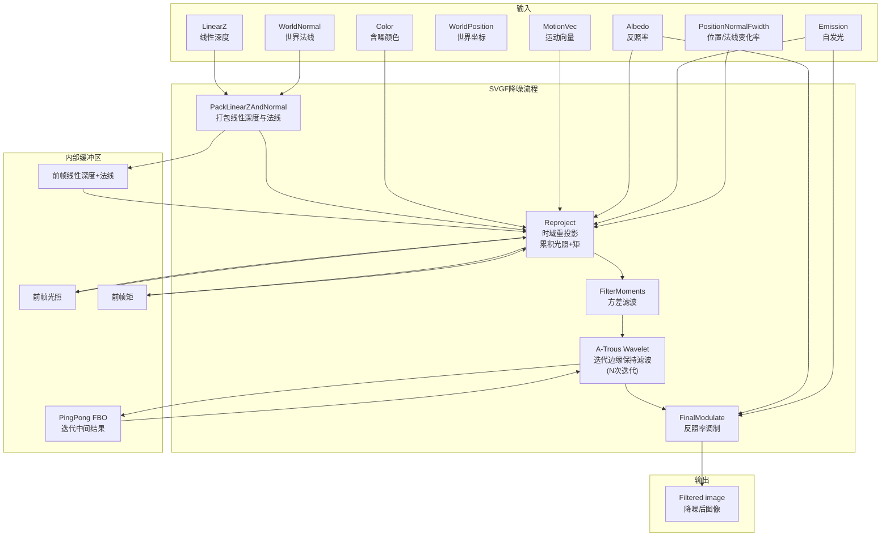

# SVGFPass -- SVGF 降噪渲染通道

## 功能概述

SVGFPass 实现了 Spatiotemporal Variance-Guided Filtering (SVGF) 降噪算法，是一种基于时空方差引导的实时降噪器。该通道接收路径追踪器输出的含噪声颜色图像及 GBuffer 辅助信息，通过时域重投影、方差估计和多迭代 A-Trous 小波滤波来消除蒙特卡洛噪声，最终输出降噪后的图像。

SVGF 是一种经典的屏幕空间降噪方法，特别适合实时路径追踪中单采样或低采样数的降噪场景。

### 核心特性

- **时域重投影**：利用运动向量复用前帧降噪结果，实现时域累积
- **方差估计与滤波**：基于时域累积的一阶和二阶矩估计方差，并对方差进行空间滤波
- **A-Trous 小波分解**：多迭代边缘保持滤波（默认 4 次迭代），基于颜色、法线、深度的边缘停止函数
- **反馈机制**：可选择将中间迭代结果反馈到时域累积中
- **调制/解调**：最终通过反照率调制恢复完整颜色

## 架构图

## 文件清单

| 文件名 | 类型 | 说明 |
|--------|------|------|
| `SVGFPass.h` | C++ 头文件 | SVGFPass 渲染通道类声明，包含滤波参数和各 Pass 指针 |
| `SVGFPass.cpp` | C++ 实现 | 通道主逻辑：输入/输出定义、各阶段调度、FBO 管理、UI 控件 |
| `SVGFCommon.slang` | Slang 共享 | SVGF 着色器公共工具函数（亮度计算、边缘停止权重等） |
| `SVGFPackLinearZAndNormal.ps.slang` | 像素着色器 | 将线性深度与法线打包到单个纹理 |
| `SVGFReproject.ps.slang` | 像素着色器 | 时域重投影：运动向量追踪、双线性采样前帧、一致性检验、矩累积 |
| `SVGFFilterMoments.ps.slang` | 像素着色器 | 基于空间邻域滤波方差（矩），估计每像素方差 |
| `SVGFAtrous.ps.slang` | 像素着色器 | A-Trous 小波分解滤波，基于颜色/法线/深度的边缘停止函数 |
| `SVGFFinalModulate.ps.slang` | 像素着色器 | 最终调制：将滤波后的光照乘以反照率并加上自发光 |
| `CMakeLists.txt` | 构建文件 | CMake 构建配置 |

## 依赖关系

| 依赖模块 | 用途 |
|----------|------|
| `RenderGraph/RenderPass` | 渲染通道基类 |
| `Core/Pass/FullScreenPass` | 全屏像素着色器通道封装 |
| `Core/API/Fbo` | 帧缓冲对象管理（PingPong、中间结果存储） |
| 上游 PathTracer | 提供含噪颜色 (Color)、自发光 (Emission) |
| 上游 GBuffer | 提供反照率 (Albedo)、世界坐标、法线、深度、运动向量 |

## 关键类与接口

### `SVGFPass` (主类，继承自 `RenderPass`，插件名 `"SVGFPass"`)

| 方法 | 说明 |
|------|------|
| `reflect()` | 声明 8 个输入（Albedo, Color, Emission, WorldPosition, WorldNormal, PositionNormalFwidth, LinearZ, MotionVec）和 1 个输出（Filtered image） |
| `execute()` | 执行完整降噪流程：clearBuffers -> packLinearZAndNormal -> reproject -> filterMoments -> atrousDecomposition -> finalModulate |
| `compile()` | 分辨率变化时重新分配 FBO |
| `renderUI()` | 暴露 UI 参数：启用开关、迭代次数、反馈采样点、PhiColor/PhiNormal 等 |

### 关键参数

| 参数 | 默认值 | 说明 |
|------|--------|------|
| `mFilterEnabled` | true | 降噪开关 |
| `mFilterIterations` | 4 | A-Trous 迭代次数 |
| `mFeedbackTap` | 1 | 反馈采样点索引 |
| `mPhiColor` | 10.0 | 颜色边缘停止函数灵敏度 |
| `mPhiNormal` | 128.0 | 法线边缘停止函数灵敏度 |
| `mAlpha` | 0.05 | 时域混合系数（越小越倾向历史帧） |
| `mMomentsAlpha` | 0.2 | 矩累积的时域混合系数 |
