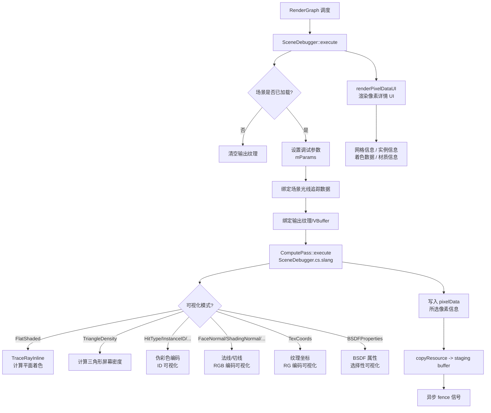

# SceneDebugger -- 场景调试器

## 功能概述

SceneDebugger 是 Falcor 中用于识别场景资产问题（如错误法线、材质配置异常等）的调试渲染通道插件。该通道通过多种可视化模式展示场景的几何属性、着色数据和材质属性，帮助开发者快速定位渲染问题。

核心特性：
- 18 种可视化模式，覆盖几何、着色、材质三大类信息：
  - **几何信息**：平面着色、三角形密度、命中类型、实例 ID、材质 ID、图元 ID、几何 ID、BLAS ID、实例化几何体、材质类型
  - **着色数据**：面法线、着色法线、着色切线/副切线、正面/背面标记、背面着色法线检测、纹理坐标
  - **材质属性**：BSDF 属性（发射、粗糙度、引导法线、漫/镜反射反照率、透射反照率等）
- 支持可选的 V-Buffer 输入（使用 `TraceRayInline` 或 V-Buffer 两种路径）
- 像素级数据回读：点击任意像素查看详细的网格信息、实例信息、着色数据、材质信息
- 支持体积渲染可视化（密度缩放控制）
- 集成性能分析功能：可追踪次级光线并测量命中信息加载开销
- 集成 PixelDebug 工具
- 支持 Python 脚本绑定控制可视化模式
- 要求 Shader Model 6.5 和 Raytracing Tier 1.1

## 架构图

## 文件清单

| 文件名 | 类型 | 说明 |
|--------|------|------|
| `SceneDebugger.h` | C++ 头文件 | `SceneDebugger` 类声明 |
| `SceneDebugger.cpp` | C++ 源文件 | 渲染通道主逻辑：场景设置、compute pass 执行、像素数据 UI 渲染 |
| `SceneDebugger.cs.slang` | Compute Shader | GPU 端场景调试可视化计算 |
| `SharedTypes.slang` | Shader 公共类型 | 共享枚举和结构体：`SceneDebuggerMode`、`SceneDebuggerBSDFProperty`、`SceneDebuggerParams`、`PixelData`、`InstanceInfo` |
| `CMakeLists.txt` | 构建文件 | CMake 插件注册与着色器拷贝配置 |

## 依赖关系

### 框架依赖
- `Falcor.h` -- Falcor 核心框架
- `RenderGraph/RenderPass.h` -- 渲染通道基类

### 功能模块依赖
- `Utils/Debug/PixelDebug.h` -- 像素调试工具
- `Utils/Sampling/SampleGenerator.h` -- 采样器（SAMPLE_GENERATOR_TINY_UNIFORM）
- `Scene/HitInfoType.slang` -- 命中类型定义（Triangle, Curve, SDFGrid 等）

### 硬件要求
- Shader Model 6.5
- Raytracing Tier 1.1

### 输入/输出通道
| 方向 | 通道名 | 格式 | 可选 | 说明 |
|------|--------|------|------|------|
| 输入 | `vbuffer` | RGBA32Uint | 是 | 可见性缓冲区（打包格式） |
| 输出 | `output` | RGBA32Float | 否 | 调试可视化输出 |

## 关键类与接口

### `SceneDebugger` 类

继承自 `RenderPass`，通过 `FALCOR_PLUGIN_CLASS` 宏注册为 `"SceneDebugger"` 插件。

**核心方法：**
- `execute(RenderContext*, const RenderData&)` -- 每帧执行 compute pass，绑定场景和参数，分发计算
- `setScene(RenderContext*, const ref<Scene>&)` -- 场景加载，创建 compute pass，构建 Mesh -> BLAS ID 查找表和实例元数据
- `compile(RenderContext*, const CompileData&)` -- 获取帧尺寸和 V-Buffer 连接状态
- `renderUI(Gui::Widgets&)` -- 渲染调试 UI（模式选择、显示选项、像素数据面板、性能分析选项）
- `renderPixelDataUI(Gui::Widgets&)` -- 渲染所选像素的详细信息（网格/实例/着色/材质）
- `onMouseEvent(const MouseEvent&)` -- 左键点击选择像素
- `initInstanceInfo()` -- 初始化实例元数据（标记哪些几何体是实例化的）

**Python 绑定属性：**
- `mode` (读写) -- 获取/设置可视化模式（字符串枚举）

### `SceneDebuggerMode` 枚举

| 模式 | 说明 |
|------|------|
| `FlatShaded` | 平面着色 |
| `TriangleDensity` | 三角形密度热力图 |
| `HitType` | 命中类型伪彩色 |
| `InstanceID` | 实例 ID 伪彩色 |
| `MaterialID` | 材质 ID 伪彩色 |
| `GeometryID` | 几何 ID 伪彩色 |
| `BlasID` | BLAS ID 伪彩色 |
| `PrimitiveID` | 图元 ID 伪彩色 |
| `InstancedGeometry` | 实例化几何体（绿色=实例化，红色=非实例化） |
| `MaterialType` | 材质类型伪彩色 |
| `FaceNormal` | 面法线 RGB |
| `ShadingNormal` | 着色法线 RGB |
| `ShadingTangent` | 着色切线 RGB |
| `ShadingBitangent` | 着色副切线 RGB |
| `FrontFacingFlag` | 正面/背面标记（绿色/红色） |
| `BackfacingShadingNormal` | 着色法线背面高亮 |
| `TexCoords` | 纹理坐标 RG（wrap 到 [0,1]） |
| `BSDFProperties` | BSDF 属性可视化 |

### `SceneDebuggerParams` 结构体

| 参数 | 类型 | 说明 |
|------|------|------|
| `mode` | uint | 当前可视化模式 |
| `frameDim` | uint2 | 帧尺寸 |
| `selectedPixel` | uint2 | 当前选中像素坐标 |
| `flipSign` | int | 翻转符号 |
| `remapRange` | int | 重映射 [-1,1] -> [0,1] |
| `clamp` | int | 钳制到 [0,1] |
| `showVolumes` | int | 显示体积 |
| `useVBuffer` | int | 使用 V-Buffer 输入 |
| `profileSecondaryRays` | int | 追踪次级光线（性能分析用） |

### `PixelData` 结构体

回读的像素级数据：
- 几何信息：`hitType`, `instanceID`, `materialID`, `geometryID`, `blasID`
- 着色数据：`posW`, `V`, `N`, `T`, `B`, `uv`, `faceN`, `tangentW`, `frontFacing`, `curveRadius`
