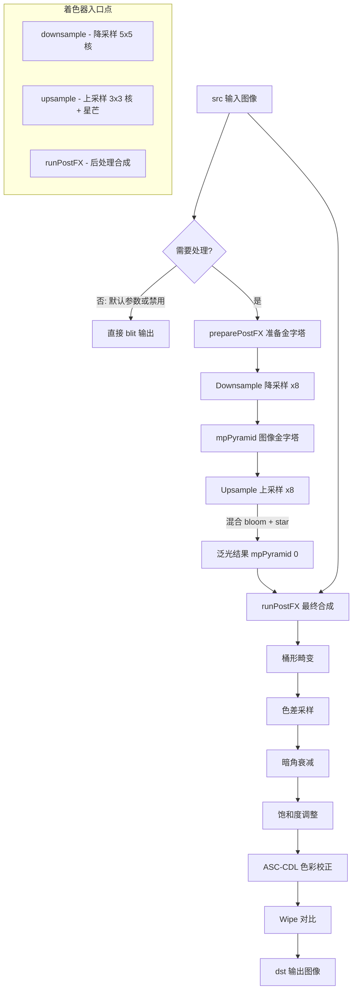

# SimplePostFX - 简单后处理特效

## 功能概述

SimplePostFX 是一个集成多种常见后处理特效的渲染通道，在单个 pass 中提供以下效果：

### 镜头特效（Lens FX）
- **Bloom（泛光）**：基于图像金字塔的能量守恒高斯泛光，使用 10x10 二项式核（通过 5x5 双线性采样实现），经过 8 级降采样后逐级上采样混合，最终核为多级方差递增的高斯混合
- **Star（星芒）**：可选 6 射线星芒效果，通过暴力线采样在中间层级添加
- **Vignette（暗角）**：基于径向距离的圆形暗角衰减
- **Chromatic Aberration（色差）**：径向色差，对 RGB 三通道分别以不同缩放采样
- **Barrel Distortion（桶形畸变）**：基于径向距离的桶形镜头畸变校正

### 色彩调整
- **Saturation（饱和度）**：对阴影/中间调/高光分别控制饱和度，通过二次曲线拟合
- **ASC-CDL 色彩校正**：Offset/Power/Scale 三段式色彩分级（兼容 ASC-CDL 标准）
  - Color Offset - 阴影色调偏移
  - Color Power - 中间调 Gamma 调整
  - Color Scale - 高光缩放
  - 同时提供亮度标量控制

### 工具功能
- **Wipe（对比滑块）**：水平滑块对比原图与处理后效果
- **全局启用/禁用**：当所有参数为默认值时自动跳过处理，直接 blit 源图像
- **Python 脚本绑定**：所有参数支持通过 pybind11 脚本控制

## 架构图



## 文件清单

| 文件名 | 类型 | 说明 |
|--------|------|------|
| `SimplePostFX.h` | C++ 头文件 | 定义 `SimplePostFX` 类，包含 8 级金字塔、所有特效参数的 getter/setter |
| `SimplePostFX.cpp` | C++ 源文件 | 实现三阶段渲染流水线（降采样-上采样-合成）、UI 面板、Python 绑定注册 |
| `SimplePostFX.cs.slang` | Slang 计算着色器 | 三个入口点：`downsample`（金字塔降采样）、`upsample`（泛光上采样+星芒）、`runPostFX`（后处理合成） |
| `CMakeLists.txt` | 构建配置 | CMake 构建脚本 |

## 依赖关系

### 框架依赖
- `Falcor.h` - Falcor 核心框架
- `RenderGraph/RenderPass.h` - 渲染通道基类
- `RenderGraph/RenderPassHelpers.h` - I/O 尺寸计算辅助工具
- `Utils/Color/ColorHelpers.slang` - 颜色工具（`luminance()` 亮度计算）
- pybind11 - Python 脚本绑定

### 输入/输出通道
| 通道名 | 方向 | 格式 | 说明 |
|--------|------|------|------|
| `src` | 输入 | ShaderResource | 源图像 |
| `dst` | 输出 | RGBA32Float | 后处理输出（需要 RenderTarget + ShaderResource + UAV 绑定） |

### 内部资源
- `mpPyramid[0..8]`：9 级图像金字塔（RGBA16Float），每级尺寸减半，仅在 bloom 启用时分配
- `mpLinearSampler`：线性采样器（Border 寻址模式）

## 关键类与接口

### `SimplePostFX` 类
继承自 `RenderPass`，核心接口：

| 方法 | 说明 |
|------|------|
| `reflect()` | 声明 `src` 输入和 `dst` 输出，支持可配置输出尺寸 |
| `execute()` | 三阶段流水线：降采样金字塔 -> 上采样混合泛光/星芒 -> 最终后处理合成 |
| `renderUI()` | 分组 UI 面板：Lens FX、Saturation、Offset/Power/Scale（亮度+颜色），每组提供 reset 按钮 |
| `preparePostFX()` | 分配或重新分配图像金字塔纹理 |
| `getProperties()` | 序列化全部 15+ 参数 |

### 计算着色器入口点（`SimplePostFX.cs.slang`）

| 入口点 | 线程组 | 说明 |
|--------|--------|------|
| `downsample` | 16x16 | 使用 `blurFilter5x5` 进行 10x10 二项式核降采样（5x5 双线性采样点） |
| `upsample` | 16x16 | 使用 `blurFilter3x3` 上采样，按 `bloomAmount` 混合，可选星芒采样（6 方向各 41 个采样点） |
| `runPostFX` | 16x16 | 桶形畸变 -> 色差 -> 暗角 -> 饱和度 -> ASC-CDL -> Wipe 对比 |

### 滤波核函数
| 函数 | 有效足迹 | 采样点数 | 用途 |
|------|----------|----------|------|
| `blurFilter2x2()` | 4x4 | 4 | 轻量模糊（未使用） |
| `blurFilter3x3()` | 6x6 | 9 | 上采样混合 |
| `blurFilter5x5()` | 10x10 | 25 | 降采样抗锯齿 |

### Python 脚本接口
所有特效参数均通过 `pybind11` 注册为可读写属性，可在 Python 脚本中直接控制，例如：
```python
pass.enabled = True
pass.bloomAmount = 0.5
pass.vignetteAmount = 0.3
```
