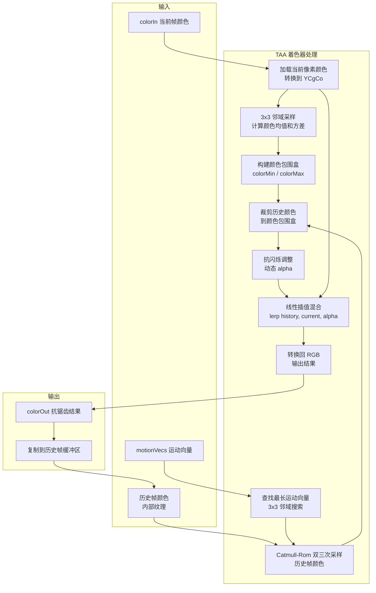

# TAA - 时间抗锯齿渲染通道

## 功能概述

TAA (Temporal Anti-Aliasing) 是 Falcor 中的时间抗锯齿后处理渲染通道。该通道通过混合当前帧与历史帧颜色来消除锯齿和时间闪烁，是实时渲染中广泛使用的抗锯齿技术。

主要功能包括：

- **时间混合**：使用可配置的 alpha 混合因子在当前帧和历史帧之间插值
- **颜色空间转换**：在 YCgCo 颜色空间中进行操作，避免色彩偏移
- **邻域裁剪**：基于 3x3 邻域颜色统计构建颜色包围盒，对历史颜色进行裁剪以减少鬼影
- **运动向量重投影**：使用屏幕空间运动向量查找历史帧中对应像素位置
- **Catmull-Rom 插值**：使用高质量 Catmull-Rom 双三次采样历史帧颜色
- **抗闪烁**：基于 Brian Karis (Siggraph 2014) 的方法，当历史颜色接近裁剪边界时降低混合因子
- **最长运动向量选择**：从 3x3 邻域中选取最长的运动向量以改善边缘处理

### 输入/输出通道

| 方向 | 名称 | 说明 |
|------|------|------|
| 输入 | `motionVecs` | 屏幕空间运动向量 |
| 输入 | `colorIn` | 当前帧颜色缓冲区 |
| 输出 | `colorOut` | 抗锯齿后的颜色缓冲区 |

## 架构图



## 文件清单

| 文件名 | 类型 | 说明 |
|--------|------|------|
| `TAA.h` | C++ 头文件 | TAA 类声明，包含控制参数和历史缓冲区 |
| `TAA.cpp` | C++ 实现 | 渲染通道主逻辑：初始化、执行、UI、历史缓冲区管理 |
| `TAA.ps.slang` | Pixel Shader | TAA 核心算法实现：颜色空间转换、邻域裁剪、时间混合 |
| `CMakeLists.txt` | 构建文件 | CMake 插件构建配置 |

## 依赖关系

```
TAA
├── Falcor 核心框架
│   ├── Falcor.h
│   ├── Core/Pass/FullScreenPass.h
│   └── RenderGraph/RenderPass.h
├── Shader 依赖
│   └── Utils.Color.ColorHelpers (RGBToYCgCo / YCgCoToRGB 颜色空间转换)
├── Python 脚本绑定 (pybind11)
└── GPU 资源
    ├── FullScreenPass (全屏像素着色器)
    ├── Fbo (帧缓冲对象)
    ├── Sampler (线性纹理采样)
    └── Texture (历史帧颜色纹理 mpPrevColor)
```

## 关键类与接口

### `TAA` (继承自 `RenderPass`)

渲染通道主类，注册名为 `"TAA"`。

| 方法 | 说明 |
|------|------|
| `TAA(ref<Device>, const Properties&)` | 构造函数，创建全屏着色器通道和线性采样器 |
| `reflect(const CompileData&)` | 声明 `motionVecs`、`colorIn` 输入和 `colorOut` 输出 |
| `execute(RenderContext*, const RenderData&)` | 设置 Shader 参数，执行 TAA 通道，复制输出到历史缓冲区 |
| `renderUI(Gui::Widgets&)` | Alpha、Sigma、抗闪烁开关的 UI 控制 |

### Python 脚本接口

| 属性 | 类型 | 说明 |
|------|------|------|
| `alpha` | `float` | 混合因子 (0~1, 默认 0.1)，值越小历史帧权重越大 |
| `sigma` | `float` | 颜色包围盒 sigma 倍数 (0~15, 默认 1.0) |
| `antiFlicker` | `bool` | 抗闪烁开关 (默认 true) |

### 控制参数

| 参数 | 默认值 | 说明 |
|------|--------|------|
| `alpha` | 0.1 | 当前帧的混合权重，越小表示更依赖历史帧 |
| `colorBoxSigma` | 1.0 | 颜色包围盒扩展范围的标准差倍数 |
| `antiFlicker` | true | 启用时根据历史颜色到裁剪边界的距离动态调整 alpha |

### 关键私有成员

| 变量 | 类型 | 说明 |
|------|------|------|
| `mpPass` | `ref<FullScreenPass>` | TAA 全屏像素着色器通道 |
| `mpPrevColor` | `ref<Texture>` | 历史帧颜色纹理，每帧从输出 blit 得到 |
| `mpLinearSampler` | `ref<Sampler>` | 线性纹理采样器，用于 Catmull-Rom 插值 |

### Shader 关键函数 (`TAA.ps.slang`)

| 函数 | 说明 |
|------|------|
| `bicubicSampleCatmullRom(...)` | Catmull-Rom 双三次插值采样，以更少的纹理读取实现高质量历史帧采样 |
| `main(float2 texC)` | 主入口：邻域统计 -> 颜色包围盒 -> 运动向量选择 -> 历史采样 -> 裁剪 -> 混合 |
