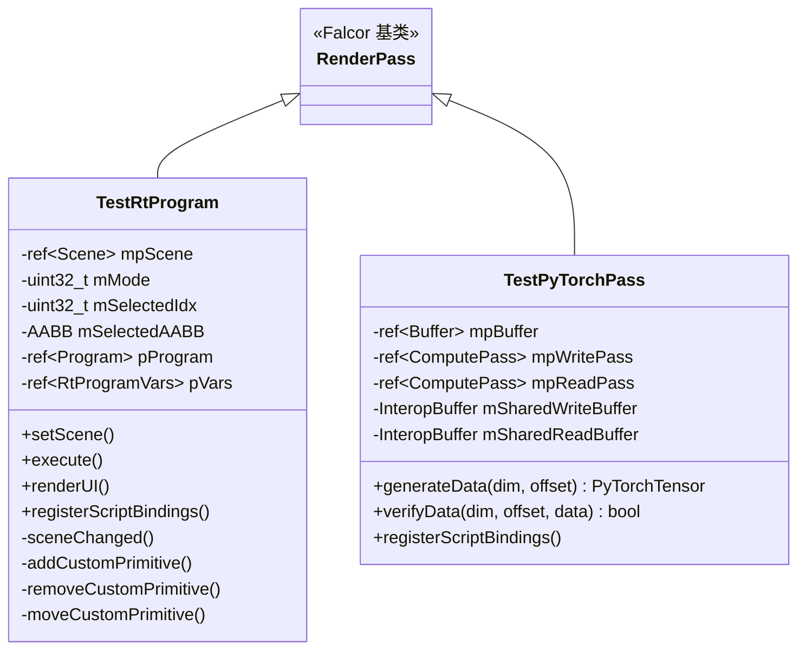

# TestPasses -- 测试通道

## 功能概述

TestPasses 是一个测试用渲染通道插件集合，包含两个用于验证 Falcor 框架功能的测试通道：光线追踪程序测试（TestRtProgram）和 PyTorch 张量互操作测试（TestPyTorchPass）。这些通道主要用于框架的自动化测试和功能验证，而非生产渲染。

### 包含的子通道

| 子通道 | 插件名 | 功能 |
|--------|--------|------|
| **TestRtProgram** | `TestRtProgram` | 测试 RtProgram 的光线追踪着色器绑定表（SBT）配置 |
| **TestPyTorchPass** | `TestPyTorchPass` | 测试 Falcor 与 PyTorch 之间的 CUDA 张量数据互操作 |

## 架构图

## 文件清单

| 文件 | 类型 | 说明 |
|------|------|------|
| `TestPasses.cpp` | C++ 源文件 | 插件注册入口，注册 TestRtProgram 和 TestPyTorchPass |
| `TestRtProgram.h` | C++ 头文件 | 光线追踪程序测试通道声明 |
| `TestRtProgram.cpp` | C++ 源文件 | 光线追踪程序测试实现（SBT 配置、自定义图元管理） |
| `TestRtProgram.rt.slang` | Slang 着色器 | 光线追踪着色器（raygen、miss、hit group 等） |
| `TestPyTorchPass.h` | C++ 头文件 | PyTorch 互操作测试通道声明 |
| `TestPyTorchPass.cpp` | C++ 源文件 | PyTorch 互操作实现（数据生成与验证） |
| `TestPyTorchPass.cs.slang` | Slang 着色器 | 数据生成/读取计算着色器 |
| `CMakeLists.txt` | 构建配置 | CMake 插件构建定义 |

## 依赖关系

| 依赖项 | 使用者 | 说明 |
|--------|--------|------|
| `Falcor.h` | 全部 | Falcor 核心框架 |
| `RenderGraph/RenderPass.h` | 全部 | 渲染通道基类 |
| `Utils/Scripting/ndarray.h` | TestPyTorchPass | pybind11 ndarray 支持（PyTorch 张量互操作） |
| `Utils/CudaUtils.h` | TestPyTorchPass | CUDA 工具函数（条件编译 `FALCOR_HAS_CUDA`） |
| `pybind11` | 全部 | Python 绑定（脚本方法暴露） |

## 关键类与接口

### `TestRtProgram` (继承自 `RenderPass`)

测试 Falcor 的 RtProgram 和着色器绑定表（SBT）功能。

- **输出**：`output`（RGBA32Float，UnorderedAccess）
- **两种测试模式**（通过 `mode` 属性选择）：
  - **Mode 0**：测试多种光线类型与自定义图元（交叉着色器、默认/覆盖 hit group）
  - **Mode 1**：测试基于类型一致性（TypeConformance）的 hit group 特化
- **Python 脚本方法**：
  - `addCustomPrimitive()` -- 随机添加自定义图元
  - `removeCustomPrimitive(index)` -- 移除指定图元
  - `moveCustomPrimitive()` -- 随机移动一个图元
- **UI**：支持选择/添加/删除/移动自定义图元，编辑 AABB 边界

### `TestPyTorchPass` (继承自 `RenderPass`)

测试 Falcor 与 PyTorch 之间通过 CUDA 共享缓冲区的数据互操作。

- **无输入/输出资源**（纯功能测试通道）
- **Python 脚本方法**：
  - `generateData(dim, offset)` -- 在 GPU 上生成 3D 数据并返回 PyTorch CUDA 张量
  - `verifyData(dim, offset, data)` -- 验证 PyTorch 张量数据的正确性
- **数据流**：
  - 生成：ComputePass 写入 Buffer --> 拷贝到 CUDA 共享缓冲区 --> 封装为 PyTorch 张量
  - 验证：PyTorch 张量 --> CUDA memcpy 到共享缓冲区 --> ComputePass 读取验证 --> 返回结果
- **条件编译**：依赖 `FALCOR_HAS_CUDA` 宏，无 CUDA 时抛出异常
