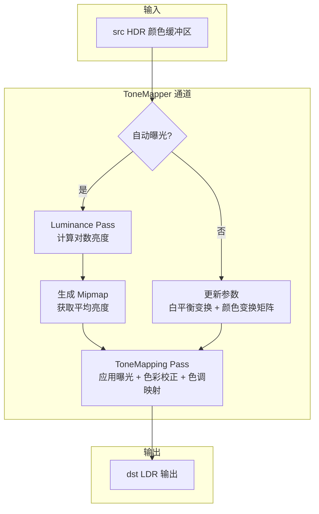

# ToneMapper - 色调映射渲染通道

## 功能概述

ToneMapper 是 Falcor 中的色调映射后处理渲染通道，负责将 HDR (高动态范围) 颜色缓冲区映射到 [0, 1] 的 LDR 范围。该通道支持多种色调映射算子、自动曝光、眼适应以及白平衡色彩校正。

主要功能包括：

- **6 种色调映射算子**：
  - `Linear` - 线性映射（不做压缩）
  - `Reinhard` - 经典 Reinhard 算子
  - `ReinhardModified` - 带最大白亮度参数的 Reinhard 变体
  - `HejiHableAlu` - John Hable 对 Jim Heji 胶片算子的 ALU 近似
  - `HableUc2` - Uncharted 2 中使用的胶片色调映射
  - `Aces` - ACES 胶片色调映射曲线
- **曝光控制**：支持手动曝光（EV、光圈、快门、ISO）和自动曝光（基于亮度直方图）
- **曝光模式**：光圈优先 (AperturePriority) 和快门优先 (ShutterPriority)
- **白平衡**：基于色温（开尔文）的白平衡变换（Rec.709 色彩空间）
- **曝光补偿**：在 -12 到 +12 F-stops 范围内调节
- **场景元数据**：可从场景文件读取 ISO、光圈、快门速度等参数
- **输出裁剪**：可选将输出钳制到 [0, 1] 范围
- **Python 脚本绑定**：所有参数均可通过 Python 脚本控制

### 输入/输出通道

| 方向 | 名称 | 说明 |
|------|------|------|
| 输入 | `src` | 源 HDR 颜色纹理 |
| 输出 | `dst` | 色调映射后的 LDR 输出纹理 |

## 架构图



## 文件清单

| 文件名 | 类型 | 说明 |
|--------|------|------|
| `ToneMapper.h` | C++ 头文件 | ToneMapper 类声明，包含所有参数成员和接口 |
| `ToneMapper.cpp` | C++ 实现 | 渲染通道主逻辑：参数解析、曝光计算、着色器创建、UI 等 |
| `ToneMapperParams.slang` | Shader 参数 | 主机与设备共享的参数结构体和色调映射算子枚举 |
| `ToneMapping.ps.slang` | Pixel Shader | 主色调映射着色器，包含 6 种算子的实现 |
| `Luminance.ps.slang` | Pixel Shader | 亮度计算着色器，输出对数亮度值 |
| `CMakeLists.txt` | 构建文件 | CMake 插件构建配置 |

## 依赖关系

```
ToneMapper
├── Falcor 核心框架
│   ├── Falcor.h
│   ├── Core/Enum.h
│   ├── Core/Pass/FullScreenPass.h
│   ├── RenderGraph/RenderPass.h
│   └── RenderGraph/RenderPassHelpers.h
├── 颜色工具
│   └── Utils/Color/ColorUtils.h (白平衡变换计算)
├── Shader 依赖
│   └── RenderPasses.ToneMapper.ToneMapperParams (共享参数)
├── Python 脚本绑定 (pybind11)
└── GPU 资源
    ├── FullScreenPass (全屏像素着色器)
    ├── Fbo (帧缓冲对象)
    └── Sampler (点采样 + 线性采样)
```

## 关键类与接口

### `ToneMapper` (继承自 `RenderPass`)

渲染通道主类，注册名为 `"ToneMapper"`。

| 方法 | 说明 |
|------|------|
| `ToneMapper(ref<Device>, const Properties&)` | 构造函数，解析属性并创建着色器通道和采样器 |
| `reflect(const CompileData&)` | 声明 `src` 输入和 `dst` 输出，支持自定义输出尺寸和格式 |
| `execute(RenderContext*, const RenderData&)` | 执行色调映射：可选亮度计算 -> 参数更新 -> 色调映射 |
| `setScene(RenderContext*, const ref<Scene>&)` | 从场景元数据读取 ISO、光圈、快门参数 |
| `renderUI(Gui::Widgets&)` | 曝光、色彩校正、色调映射算子的 UI 控制面板 |

### 曝光控制接口 (Python 可调用)

| 方法 | 说明 |
|------|------|
| `setExposureCompensation(float)` | 设置曝光补偿 (F-stops, -12~+12) |
| `setAutoExposure(bool)` | 启用/禁用自动曝光 |
| `setExposureValue(float)` | 设置曝光值 EV |
| `setFilmSpeed(float)` | 设置 ISO 感光度 (1~6400) |
| `setFNumber(float)` | 设置光圈 F 值 (0.1~100) |
| `setShutter(float)` | 设置快门速度倒数 (0.1~10000) |
| `setExposureMode(ExposureMode)` | 设置曝光模式（光圈优先/快门优先） |
| `setOperator(Operator)` | 设置色调映射算子 |
| `setWhiteBalance(bool)` / `setWhitePoint(float)` | 白平衡开关和色温设置 (1905K~25000K) |

### 枚举类型

- **`ToneMapperOperator`**：`Linear`, `Reinhard`, `ReinhardModified`, `HejiHableAlu`, `HableUc2`, `Aces`
- **`ExposureMode`**：`AperturePriority`（光圈优先）, `ShutterPriority`（快门优先）

### `ToneMapperParams` (主机-设备共享结构体)

| 字段 | 类型 | 说明 |
|------|------|------|
| `whiteScale` | `float` | HableUc2 算子的线性白参数 |
| `whiteMaxLuminance` | `float` | ReinhardModified 算子的最大白亮度 |
| `colorTransform` | `float3x4` | 最终颜色变换矩阵（包含曝光和白平衡） |

### 关键私有成员

| 变量 | 类型 | 说明 |
|------|------|------|
| `mpToneMapPass` | `ref<FullScreenPass>` | 主色调映射全屏通道 |
| `mpLuminancePass` | `ref<FullScreenPass>` | 亮度计算全屏通道 |
| `mpLuminanceFbo` | `ref<Fbo>` | 亮度 FBO（支持 mipmap 生成平均亮度） |
| `mColorTransform` | `float3x3` | 最终颜色变换矩阵（曝光 x 白平衡） |
| `mWhiteBalanceTransform` | `float3x3` | 白平衡颜色空间变换矩阵 |
