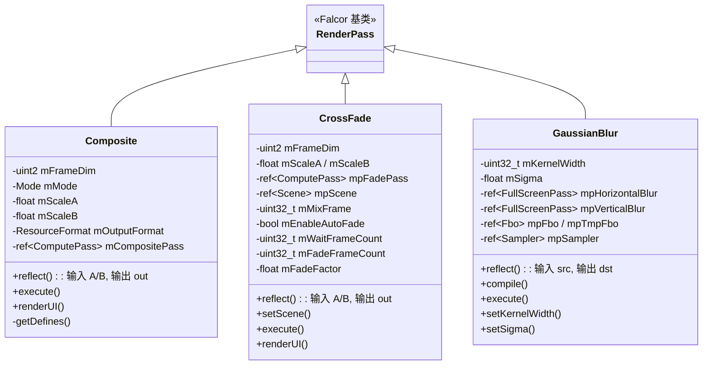

# Utils -- 渲染通道工具集

## 功能概述

Utils 是一个渲染通道工具插件集合，提供常用的图像处理与混合功能。包含三个子通道：图像合成（Composite）、交叉淡入淡出（CrossFade）和高斯模糊（GaussianBlur）。所有子通道通过 `Utils.cpp` 统一注册到 Falcor 插件系统。

### 包含的子通道

| 子通道 | 插件名 | 功能 |
|--------|--------|------|
| **Composite** | `Composite` | 双缓冲区合成，支持加法和乘法混合模式 |
| **CrossFade** | `CrossFade` | 基于时间的交叉淡入淡出，支持自动淡入与手动控制 |
| **GaussianBlur** | `GaussianBlur` | 可分离高斯模糊，支持可配置核宽度和标准差 |

## 架构图

## 文件清单

| 文件 | 类型 | 说明 |
|------|------|------|
| `Utils.cpp` | C++ 源文件 | 插件注册入口，注册 CrossFade、Composite、GaussianBlur |
| `CMakeLists.txt` | 构建配置 | CMake 插件构建定义 |
| **Composite/** | | |
| `Composite/Composite.h` | C++ 头文件 | 合成通道声明，含 Mode 枚举（Add/Multiply） |
| `Composite/Composite.cpp` | C++ 源文件 | 合成通道实现（属性解析、Compute Pass 调度） |
| `Composite/Composite.cs.slang` | Slang 着色器 | 合成计算着色器 |
| `Composite/CompositeMode.slangh` | Slang 头文件 | 合成模式和输出格式宏定义（主机/设备共享） |
| **CrossFade/** | | |
| `CrossFade/CrossFade.h` | C++ 头文件 | 交叉淡入淡出通道声明 |
| `CrossFade/CrossFade.cpp` | C++ 源文件 | 交叉淡入淡出实现（场景变化重置、自动/手动混合） |
| `CrossFade/CrossFade.cs.slang` | Slang 着色器 | 交叉淡入淡出计算着色器 |
| **GaussianBlur/** | | |
| `GaussianBlur/GaussianBlur.h` | C++ 头文件 | 高斯模糊通道声明 |
| `GaussianBlur/GaussianBlur.cpp` | C++ 源文件 | 高斯模糊实现（可分离两遍、核计算、Python 绑定） |
| `GaussianBlur/GaussianBlur.ps.slang` | Slang 着色器 | 高斯模糊像素着色器（水平/垂直分离） |

## 依赖关系

| 依赖项 | 使用者 | 说明 |
|--------|--------|------|
| `Falcor.h` | 全部 | Falcor 核心框架 |
| `RenderGraph/RenderPass.h` | 全部 | 渲染通道基类 |
| `Core/Enum.h` | Composite | 枚举注册宏 |
| `Core/Pass/FullScreenPass.h` | GaussianBlur | 全屏像素着色器通道 |
| `RenderGraph/RenderPassStandardFlags.h` | CrossFade | 标准渲染通道刷新标志位 |
| `pybind11` | GaussianBlur | Python 绑定（`kernelWidth`/`sigma` 属性暴露） |

## 关键类与接口

### `Composite` (继承自 `RenderPass`)

双缓冲区合成通道，将输入 A 和 B 按指定模式合成到输出。

- **输入**：`A`（可选）、`B`（可选），ShaderResource
- **输出**：`out`，UnorderedAccess，格式可配置（默认 RGBA32Float）
- **混合模式** (`Mode` 枚举)：`Add`（C = scaleA*A + scaleB*B）、`Multiply`（C = scaleA*A * scaleB*B）
- **可配置属性**：`mode`、`scaleA`、`scaleB`、`outputFormat`
- **实现**：使用 ComputePass，通过宏定义切换合成模式和输出格式（Float/Uint/Sint）

### `CrossFade` (继承自 `RenderPass`)

基于时间的交叉淡入淡出通道，支持场景变化自动重置。

- **输入**：`A`（可选）、`B`（可选），ShaderResource
- **输出**：`out`，UnorderedAccess
- **自动淡入模式**：等待 `waitFrameCount` 帧后，在 `fadeFrameCount` 帧内从 A 线性过渡到 B
- **手动模式**：使用固定 `fadeFactor`（0=纯A，1=纯B）
- **场景感知**：检测场景更新（相机移动、几何体变化等）自动重置淡入计时
- **可配置属性**：`outputFormat`、`enableAutoFade`、`waitFrameCount`、`fadeFrameCount`、`fadeFactor`

### `GaussianBlur` (继承自 `RenderPass`)

可分离两遍高斯模糊，支持纹理数组。

- **输入**：`src`（图像）
- **输出**：`dst`（模糊后图像，格式与输入一致）
- **实现**：水平遍 + 垂直遍，共享权重缓冲区
- **可配置属性**：`kernelWidth`（1-15，奇数）、`sigma`（高斯标准差）
- **Python 绑定**：通过 pybind11 暴露 `kernelWidth` 和 `sigma` 属性
