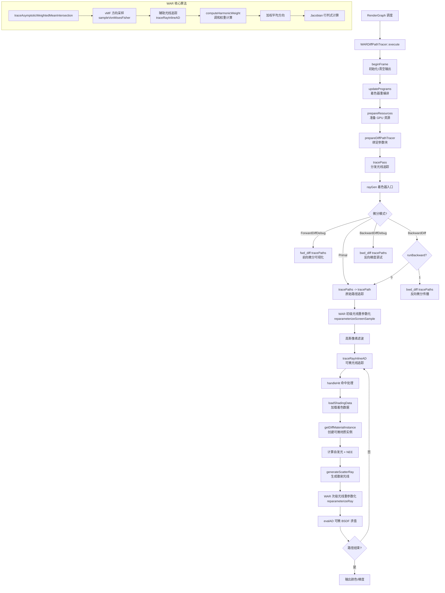

# WARDiffPathTracer -- WAR 可微路径追踪器

## 功能概述

WARDiffPathTracer 是基于翘曲区域重参数化（Warped-Area Reparameterization, WAR）的可微路径追踪渲染通道。该通道利用 DXR 1.1 的 `TraceRayInline` 实现了可微分渲染，能够处理几何不连续性（如物体边缘的阴影和遮挡边界），适用于逆向渲染和基于梯度的场景优化。

核心特性：
- 支持四种微分模式：`Primal`（原始渲染）、`BackwardDiff`（反向自动微分）、`ForwardDiffDebug`（前向梯度可视化）、`BackwardDiffDebug`（反向梯度可视化）
- 采用 Warped-Area Reparameterization 处理几何不连续性，支持初级光线和次级光线的重参数化
- 使用 von Mises-Fisher (vMF) 分布进行辅助方向采样，可配置集中度参数
- 支持 BSDF 重要性采样、下一事件估计（NEE）、多重重要性采样（MIS）
- 支持反义采样（Antithetic Sampling）以降低梯度估计方差
- 使用高斯像素滤波器
- 通过 Python 绑定提供梯度缓冲区访问接口，支持与外部优化器集成
- 支持场景梯度（`SceneGradients`）的材质和几何变换微分

## 架构图

## 文件清单

| 文件名 | 类型 | 说明 |
|--------|------|------|
| `WARDiffPathTracer.h` | C++ 头文件 | `WARDiffPathTracer` 类声明，包含 `TracePass` 内部结构体和静态参数 |
| `WARDiffPathTracer.cpp` | C++ 源文件 | 渲染通道主逻辑：参数解析、程序更新、光线追踪分发、Python 绑定 |
| `WARDiffPathTracer.rt.slang` | RT Shader | 光线追踪主着色器，包含 `rayGen` 入口和四种微分模式分支 |
| `WarpedAreaReparam.slang` | Shader 模块 | WAR 核心算法实现：辅助光线采样、调和权重、Jacobian 计算 |
| `PTUtils.slang` | Shader 模块 | 路径追踪工具函数：命中处理、NEE、散射光线生成、MIS |
| `Params.slang` | Shader 公共类型 | `WARDiffPathTracerParams` 运行时参数结构体定义 |
| `StaticParams.slang` | Shader 公共类型 | 编译期静态常量定义（采样数、弹射次数、微分模式等） |
| `CMakeLists.txt` | 构建文件 | CMake 插件注册与着色器拷贝配置 |

## 依赖关系

### 框架依赖
- `Falcor.h` -- Falcor 核心框架
- `RenderGraph/RenderPass.h` -- 渲染通道基类
- `RenderGraph/RenderPassHelpers.h` -- 渲染通道辅助工具
- `RenderGraph/RenderPassStandardFlags.h` -- 标准刷新标志

### 可微渲染依赖
- `DiffRendering/SceneGradients.h` -- 场景梯度管理（材质/几何梯度缓冲区）
- `DiffRendering/SharedTypes.slang` -- 可微渲染共享类型（`DiffMode`, `DiffVariableType`, `DiffDebugParams`）
- `DiffRendering/DiffSceneIO` -- 可微场景 I/O 接口
- `DiffRendering/DiffSceneQuery` -- 可微场景查询（`SceneQueryAD`），封装可微光线追踪操作
- `DiffRendering/DiffDebugParams` -- 微分调试参数
- `DiffRendering/InverseOptimizationParams` -- 逆优化参数

### 功能模块依赖
- `Utils/Sampling/SampleGenerator.h` -- 伪随机数采样器
- `Utils/Debug/PixelDebug.h` -- 像素调试工具
- `Rendering/Lights/EmissiveUniformSampler.h` -- 均匀自发光采样器
- `Scene/RaytracingInline` -- DXR 1.1 内联光线追踪

### 输入/输出通道
| 方向 | 通道名 | 格式 | 说明 |
|------|--------|------|------|
| 输出 | `color` | RGBA32Float | 输出颜色（直接 + 间接光照之和） |
| 输出 | `dColor` | RGBA32Float | 自动微分计算的输出导数 |

## 关键类与接口

### `WARDiffPathTracer` 类

继承自 `RenderPass`，通过 `FALCOR_PLUGIN_CLASS` 宏注册。

**核心方法：**
- `execute(RenderContext*, const RenderData&)` -- 每帧执行：更新程序、准备资源、分发追踪
- `setScene(RenderContext*, const ref<Scene>&)` -- 场景设置，重建追踪通道
- `tracePass(RenderContext*, const RenderData&, TracePass&)` -- 绑定全局资源并分发光线追踪
- `updatePrograms()` -- 根据静态参数重新编译着色器
- `prepareDiffPathTracer(const RenderData&)` -- 创建并绑定可微路径追踪参数块
- `prepareLighting(RenderContext*)` -- 更新自发光采样器

**Python 绑定属性/方法：**
- `scene_gradients` -- 获取/设置 `SceneGradients` 对象
- `run_backward` -- 控制是否执行反向传播
- `dL_dI` -- 获取/设置损失函数对图像像素的导数缓冲区
- `set_mesh_to_optimize(meshID)` -- 设置待优化的网格 ID

### `StaticParams` 结构体

编译期静态参数，修改后需重新编译着色器：

| 参数 | 默认值 | 说明 |
|------|--------|------|
| `samplesPerPixel` | 1 | 每像素采样数（路径数） |
| `maxBounces` | 0 | 最大间接弹射次数 |
| `diffMode` | ForwardDiffDebug | 微分模式 |
| `useBSDFSampling` | true | 使用 BSDF 重要性采样 |
| `useNEE` | true | 使用下一事件估计 |
| `useMIS` | true | 使用多重重要性采样 |
| `useWAR` | true | 启用翘曲区域重参数化 |
| `auxSampleCount` | 16 | 每个主采样点的辅助采样数 |
| `log10vMFConcentration` | 5.0 | vMF 分布集中度参数（log10） |
| `useAntitheticSampling` | true | 启用反义采样 |

### 着色器关键函数

| 函数 | 标注 | 说明 |
|------|------|------|
| `tracePaths` | `[Differentiable]` | 路径追踪主循环，支持反义采样 |
| `tracePath` | `[Differentiable]` | 单条路径追踪，包含 WAR 重参数化和高斯滤波 |
| `handleHit` | `[Differentiable]` | 命中处理：着色、NEE、散射光线生成 |
| `reparameterizeRay` | `[Differentiable]` | 次级光线 WAR 重参数化，计算 Jacobian 行列式 |
| `reparameterizeScreenSample` | `[Differentiable]` | 初级光线屏幕空间 WAR 重参数化 |
| `computeHarmonicWeight` | `[Differentiable]` | 调和权重计算（含手写前向导数） |
| `traceAsymptoticWeightedMeanIntersection` | `[Differentiable]` | 渐近加权平均交点计算 |
