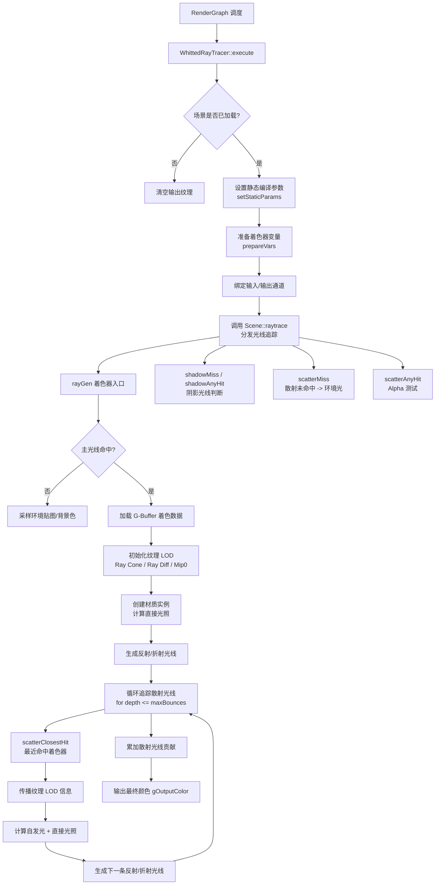

# WhittedRayTracer -- Whitted 光线追踪器

## 功能概述

WhittedRayTracer 是 Falcor 中一个经典的 Whitted 风格光线追踪渲染通道插件。该通道实现了最简单的 Whitted 光线追踪器，主要用作纹理 LOD（Level-of-Detail）技术的基准测试平台。

核心特性：
- 支持多种纹理 LOD 模式：Mip0（固定级别）、Ray Cones（光线锥）、Ray Differentials（光线微分）
- 支持理想镜面反射与折射，可覆盖场景材质以添加理想高光反射/折射分量
- 支持多种光源类型：解析光源（点光、方向光）、自发光几何体、环境贴图
- 可配置最大反弹次数（0~10 次间接弹射）
- 支持 Fresnel 项作为 BRDF、粗糙度到方差的映射、表面散射角可视化
- 提供 Ray Cone 的各向同性/各向异性滤波模式以及 Ray Differential 的对应滤波模式
- 通过 Python 脚本绑定进行参数控制

> 注意：该渲染通道不追求无偏渲染，主要为教学和纹理 LOD 方法对比目的而设计。

## 架构图

## 文件清单

| 文件名 | 类型 | 说明 |
|--------|------|------|
| `WhittedRayTracer.h` | C++ 头文件 | `WhittedRayTracer` 类声明，继承自 `RenderPass` |
| `WhittedRayTracer.cpp` | C++ 源文件 | 渲染通道主逻辑：属性解析、场景设置、光线追踪分发、UI 渲染 |
| `WhittedRayTracer.rt.slang` | RT Shader | 光线追踪着色器入口（rayGen、closestHit、anyHit、miss） |
| `WhittedRayTracerTypes.slang` | Shader 公共类型 | 定义 `RayFootprintFilterMode` 枚举（各向同性/各向异性/折射时各向异性） |
| `CMakeLists.txt` | 构建文件 | CMake 插件注册与着色器拷贝配置 |

## 依赖关系

### 框架依赖
- `Falcor.h` -- Falcor 核心框架
- `RenderGraph/RenderPass.h` -- 渲染通道基类
- `RenderGraph/RenderPassHelpers.h` -- 渲染通道辅助工具（通道描述、有效资源宏定义）
- `RenderGraph/RenderPassStandardFlags.h` -- 标准渲染通道刷新标志

### 功能模块依赖
- `Utils/Sampling/SampleGenerator.h` -- GPU 伪随机数采样器
- `Rendering/Materials/TexLODTypes.slang` -- 纹理 LOD 模式枚举（Mip0, RayCones, RayDiffs）
- `Rendering/Materials/TexLODHelpers` -- 纹理 LOD 计算辅助函数
- `Rendering/Materials/Fresnel` -- Fresnel 项计算
- `Rendering/Lights/LightHelpers` -- 光源采样辅助函数
- `Scene/Raytracing` -- DXR 光线追踪场景接口

### 输入通道
| 通道名 | 格式 | 说明 |
|--------|------|------|
| `posW` | float4 | 世界空间位置 (xyz) + 前景标记 (w) |
| `normalW` | float4 | 世界空间着色法线 |
| `tangentW` | float4 | 世界空间着色切线 (xyz) + 符号 (w) |
| `faceNormalW` | float4 | 世界空间面法线 |
| `texC` | float2 | 纹理坐标 |
| `texGrads` | float4 | 纹理梯度（可选） |
| `mtlData` | uint4 | 材质数据 |
| `vbuffer` | PackedHitInfo | V-Buffer 打包格式 |

### 输出通道
| 通道名 | 格式 | 说明 |
|--------|------|------|
| `color` | RGBA32Float | 输出颜色（直接光照 + 间接光照之和） |

## 关键类与接口

### `WhittedRayTracer` 类

继承自 `RenderPass`，通过 `FALCOR_PLUGIN_CLASS` 宏注册为 Falcor 插件。

**核心方法：**
- `execute(RenderContext*, const RenderData&)` -- 每帧执行入口，设置参数并分发光线追踪
- `setScene(RenderContext*, const ref<Scene>&)` -- 场景加载回调，创建 RT 程序和绑定表（SBT）
- `renderUI(Gui::Widgets&)` -- 渲染 UI 控件（弹射次数、纹理 LOD 模式、光线锥变体等）
- `reflect(const CompileData&)` -- 声明输入/输出通道
- `prepareVars()` -- 创建程序变量并绑定采样器
- `setStaticParams(Program*)` -- 设置编译期常量定义（MAX_BOUNCES, TEX_LOD_MODE 等）

**关键成员：**
- `mMaxBounces` (uint) -- 最大间接弹射次数，默认 3
- `mTexLODMode` (TexLODMode) -- 纹理 LOD 模式，默认 Mip0
- `mRayConeMode` (RayConeMode) -- Ray Cone 变体（Combo / Unified）
- `mRayConeFilterMode` / `mRayDiffFilterMode` (RayFootprintFilterMode) -- 滤波模式
- `mTracer` (struct) -- 包含 RT 程序 (`pProgram`)、绑定表 (`pBindingTable`)、程序变量 (`pVars`)

### 着色器关键结构

- `ScatterRayData` -- 散射光线载荷（128~164 字节），携带辐射度、吞吐量、路径长度、Ray Cone/Ray Diff 状态
- `ShadowRayData` -- 阴影光线载荷，仅包含可见性标志
- `RayFootprintFilterMode` 枚举 -- 定义光线足迹滤波策略：`Isotropic`、`Anisotropic`、`AnisotropicWhenRefraction`

### 着色器入口点

| 入口点 | 类型 | 功能 |
|--------|------|------|
| `rayGen` | Ray Generation | 主入口，生成初始光线并循环追踪散射路径 |
| `scatterClosestHit` | Closest Hit | 散射光线命中处理：计算直接光照、纹理 LOD 传播、生成反射/折射光线 |
| `scatterAnyHit` | Any Hit | 非透明几何体的 Alpha 测试 |
| `scatterMiss` | Miss | 散射未命中时采样环境贴图 |
| `shadowMiss` | Miss | 阴影光线未命中，标记为可见 |
| `shadowAnyHit` | Any Hit | 阴影光线 Alpha 测试 |
