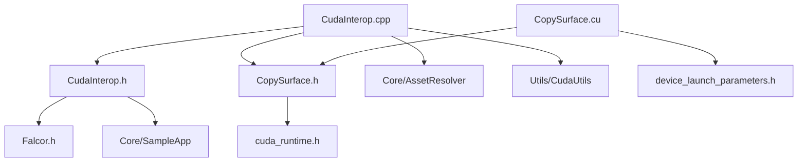

# CudaInterop -- CUDA互操作示例

## 功能概述

本示例演示了 Falcor 渲染框架与 NVIDIA CUDA 之间的互操作能力。程序在启动时初始化 CUDA 设备，将一张输入纹理（`smoke_puff.png`）映射为 CUDA Surface 对象，然后在每一帧中通过 CUDA 内核将输入 Surface 的像素数据逐像素复制到输出 Surface，最终将输出纹理 blit 到屏幕帧缓冲区上显示。

核心流程：
1. 调用 `Device::initCudaDevice()` 初始化 CUDA 设备。
2. 加载输入纹理并创建同尺寸的输出纹理，两者均使用 `ResourceBindFlags::Shared` 以支持跨 API 共享。
3. 通过 `cuda_utils::mapTextureToSurface()` 将 Falcor 纹理映射为 `cudaSurfaceObject_t`。
4. 每帧调用 CUDA 内核 `copySurface` 完成像素拷贝，根据纹理格式类型（Float/Unsigned）选择模板参数。
5. 使用 `RenderContext::blit()` 将输出纹理呈现到屏幕。

该示例仅在编译环境启用 CUDA 支持（`FALCOR_HAS_CUDA`）时才会构建。

## 文件清单

| 文件名 | 类型 | 说明 |
|---|---|---|
| `CudaInterop.cpp` | C++ 源文件 | 应用主逻辑，继承 `SampleApp`，负责初始化 CUDA 设备、加载纹理、每帧调用 CUDA 内核并显示结果 |
| `CudaInterop.h` | C++ 头文件 | `CudaInterop` 类声明，包含输入/输出纹理及 CUDA Surface 对象成员 |
| `CopySurface.cu` | CUDA 源文件 | 包含模板化的 CUDA 内核 `copySurface` 及其启动包装函数 `launchCopySurface` |
| `CopySurface.h` | C++ 头文件 | 声明 `launchCopySurface` 函数接口，供 C++ 侧调用 |
| `CMakeLists.txt` | 构建脚本 | CMake 配置，条件编译（需 `FALCOR_HAS_CUDA`），启用 CUDA 可分离编译 |

## 依赖关系

