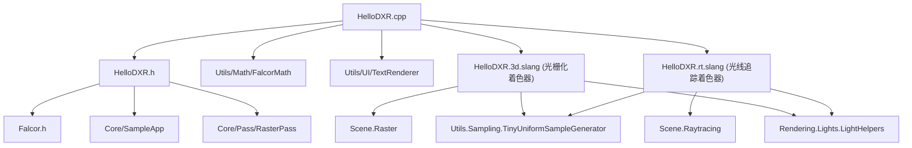

# HelloDXR -- DXR光线追踪入门示例

## 功能概述

本示例是 Falcor 框架中使用 DirectX Raytracing (DXR) 进行实时光线追踪的入门教程。程序加载一个 3D 场景（默认为 `Arcade/Arcade.pyscene`），支持在光栅化渲染与光线追踪渲染之间切换（按空格键），并提供景深（Depth of Field）效果的开关。

光栅化路径使用标准的顶点/像素着色器管线（`HelloDXR.3d.slang`）。光线追踪路径（`HelloDXR.rt.slang`）实现了：
- **Ray Generation**：从相机发射主光线，支持针孔模型和薄透镜模型（景深）。
- **Closest Hit**：在命中点进行材质着色，包括直接光照（遍历所有解析光源并投射阴影光线）和反射光线。
- **Any Hit**：对非不透明几何体执行 Alpha 测试。
- **Miss**：返回背景颜色。

光线追踪管线配置最大递归深度为 3（主光线 -> 反射光线 -> 阴影光线），最大 Payload 大小为 24 字节。程序通过 `RtBindingTable` 将着色器绑定到场景几何体，使用 Falcor 的材质系统（Shader Modules 和 Type Conformances）来支持多种材质类型。

## 文件清单

| 文件名 | 类型 | 说明 |
|---|---|---|
| `HelloDXR.cpp` | C++ 源文件 | 应用主逻辑，负责场景加载、光栅化/光线追踪渲染路径切换、GUI 交互、Shader Binding Table 配置 |
| `HelloDXR.h` | C++ 头文件 | `HelloDXR` 类声明，包含场景、相机、光栅化 Pass、光线追踪 Program/Vars 等成员 |
| `HelloDXR.rt.slang` | Slang 着色器 | 光线追踪着色器，定义 Ray Generation、Closest Hit、Any Hit、Miss 着色器入口 |
| `HelloDXR.3d.slang` | Slang 着色器 | 光栅化着色器，实现顶点变换和基于材质的像素着色（直接光照） |
| `CMakeLists.txt` | 构建脚本 | CMake 配置，注册着色器拷贝目标 |

## 依赖关系

