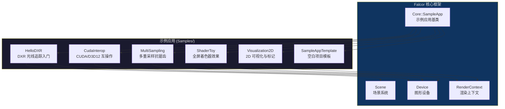

# Samples -- Falcor 示例程序索引

> 源码路径: `Source/Samples/`

## 功能概述

Samples 目录包含一组基于 Falcor 框架构建的示例 (Sample) 应用程序，展示了框架的各种核心能力。每个示例都是一个独立的可执行程序，继承自 `SampleApp` 基类，涵盖了光线追踪、CUDA 互操作、多重采样、Shader 编程和 2D 可视化等主题。这些示例可作为学习 Falcor API 的参考，也可作为新项目的起始模板。

## 架构图

## 示例目录索引

| 示例 | 目录 | 说明 | 关键技术 |
|------|------|------|----------|
| **HelloDXR** | `HelloDXR/` | DXR 光线追踪入门示例。支持光栅化和光线追踪两种渲染模式的实时切换，演示了场景加载、光线追踪管线搭建、景深效果 | 光线追踪 (DXR)、`RtBindingTable`、`RtProgramVars`、光栅化 |
| **CudaInterop** | `CudaInterop/` | CUDA 与 D3D12 互操作示例。将 Falcor 纹理映射为 CUDA Surface，通过 CUDA kernel 进行图像处理 | CUDA 互操作、共享纹理、Surface 映射 |
| **MultiSampling** | `MultiSampling/` | 多重采样 (MSAA) 示例。创建 8x MSAA 帧缓冲区渲染圆盘几何体，展示 MSAA resolve 和直接 blit 两种方式 | MSAA、`Texture2DMS`、手动几何体构建、VAO |
| **ShaderToy** | `ShaderToy/` | 类 ShaderToy 全屏着色器示例。使用 `FullScreenPass` 运行像素着色器，传入分辨率和时间参数实现动态效果 | 全屏 Pass、Slang 像素着色器、实时动画 |
| **Visualization2D** | `Visualization2D/` | 2D 可视化示例。提供标记演示 (Marker Demo) 和体素法线 (Voxel Normals) 两个场景，支持鼠标交互 | 全屏 Pass、鼠标交互、多场景切换 |
| **SampleAppTemplate** | `SampleAppTemplate/` | 空白项目模板。实现了 `SampleApp` 所有虚函数的最小骨架代码，作为新项目的起始点 | 项目模板、应用生命周期回调 |

## 各示例详细说明

### HelloDXR

DXR (DirectX Raytracing) 光线追踪入门示例，是学习 Falcor 光线追踪 API 的最佳起点。

- 默认加载 `Arcade/Arcade.pyscene` 场景
- 按空格键在光栅化和光线追踪模式之间切换
- 光线追踪管线配置: 最大递归深度 3（主光线 -> 反射 -> 阴影），最大 payload 24 字节
- 使用 2 种光线类型: 主光线 (primary) 和阴影光线 (shadow)
- 支持景深 (DOF) 效果
- Shader 文件: `HelloDXR.3d.slang` (光栅化), `HelloDXR.rt.slang` (光线追踪)

### CudaInterop

展示 Falcor 与 CUDA 的互操作能力。

- 初始化 CUDA 设备后，将 D3D12 纹理映射为 CUDA Surface
- 通过 CUDA kernel (`launchCopySurface`) 将输入纹理拷贝到输出纹理
- 使用 `ResourceBindFlags::Shared` 创建共享纹理资源
- 依赖 `Utils/CudaUtils` 工具模块
- CUDA kernel 实现在 `CopySurface.cu` 中

### MultiSampling

多重采样抗锯齿示例。

- 程序化生成 16 个三角形组成的圆盘几何体
- 使用 8x MSAA 的 128x128 帧缓冲区渲染
- 偶数帧: 先 resolve MSAA 纹理再 blit 到屏幕
- 奇数帧: 直接 blit MSAA 纹理到屏幕（用于对比效果）
- 手动创建顶点缓冲区、顶点布局和 VAO

### ShaderToy

类似 Shadertoy 网站的全屏像素着色器效果。

- 使用 `FullScreenPass` 执行全屏后处理着色器
- 向着色器传递 `iResolution` (分辨率) 和 `iGlobalTime` (全局时间) uniform
- 着色器代码在 `Toy.ps.slang` 中
- 默认分辨率 1280x720，启用 VSync

### Visualization2D

2D 图形可视化示例，包含两个可切换的演示场景。

- **Marker Demo**: 鼠标驱动的标记绘制演示
- **Voxel Normals**: 体素法线可视化，提供多个显示选项（法线场、包围盒、对角线、边界线等）
- 通过下拉菜单切换场景，动态重建渲染 Pass
- 默认分辨率 1400x1000，启用 VSync

### SampleAppTemplate

最小化的项目模板，实现了 `SampleApp` 的完整回调接口:

- `onLoad()` / `onShutdown()` -- 加载与关闭
- `onFrameRender()` -- 帧渲染（仅清屏）
- `onResize()` -- 窗口大小变更
- `onGuiRender()` -- GUI 渲染（带一个示例按钮）
- `onKeyEvent()` / `onMouseEvent()` -- 输入处理
- `onHotReload()` -- 热重载通知

## 子目录文件清单

### HelloDXR/

| 文件 | 说明 |
|------|------|
| `HelloDXR.h` | 示例类声明 |
| `HelloDXR.cpp` | 主逻辑：场景加载、光栅化/光追管线创建与渲染 |
| `HelloDXR.3d.slang` | 光栅化着色器 (VS + PS) |
| `HelloDXR.rt.slang` | 光线追踪着色器 (RayGen + Miss + Hit) |
| `CMakeLists.txt` | 构建配置 |

### CudaInterop/

| 文件 | 说明 |
|------|------|
| `CudaInterop.h` | 示例类声明 |
| `CudaInterop.cpp` | 主逻辑：CUDA 设备初始化、纹理映射、帧渲染 |
| `CopySurface.cu` | CUDA kernel 实现 |
| `CopySurface.h` | CUDA kernel 头文件 |
| `CMakeLists.txt` | 构建配置 |

### MultiSampling/

| 文件 | 说明 |
|------|------|
| `MultiSampling.h` | 示例类声明 |
| `MultiSampling.cpp` | 主逻辑：几何体生成、MSAA FBO 创建、渲染与 resolve |
| `MultiSampling.3d.slang` | 光栅化着色器 |
| `CMakeLists.txt` | 构建配置 |

### SampleAppTemplate/

| 文件 | 说明 |
|------|------|
| `SampleAppTemplate.h` | 示例类声明 |
| `SampleAppTemplate.cpp` | 最小骨架实现 |
| `CMakeLists.txt` | 构建配置 |

### ShaderToy/

| 文件 | 说明 |
|------|------|
| `ShaderToy.h` | 示例类声明 |
| `ShaderToy.cpp` | 主逻辑：全屏 Pass 创建、uniform 传递 |
| `Toy.ps.slang` | 像素着色器效果代码 |
| `CMakeLists.txt` | 构建配置 |

### Visualization2D/

| 文件 | 说明 |
|------|------|
| `Visualization2D.h` | 示例类声明 |
| `Visualization2D.cpp` | 主逻辑：场景切换、鼠标交互、uniform 传递 |
| `Visualization2d.ps.slang` | 标记演示像素着色器 |
| `VoxelNormals.ps.slang` | 体素法线可视化像素着色器 |
| `CMakeLists.txt` | 构建配置 |

## 依赖关系

### 所有示例的共同依赖

| 依赖模块 | 用途 |
|----------|------|
| `Core/SampleApp` | 应用基类，提供窗口管理、设备创建、帧循环、GUI |
| `Core/Device` | 图形设备抽象 (D3D12/Vulkan) |
| `Core/RenderContext` | 渲染命令提交与资源操作 |
| `Core/Texture` / `Core/Fbo` | 纹理与帧缓冲区对象 |
| D3D12 Agility SDK | DirectX 12 运行时 |

### 各示例特有依赖

| 示例 | 特有依赖 |
|------|----------|
| HelloDXR | `Scene`, `Camera`, `RasterPass`, `Program`, `RtBindingTable`, `RtProgramVars`, `TextRenderer` |
| CudaInterop | `CudaUtils`, CUDA Toolkit, `AssetResolver` |
| MultiSampling | `RasterPass`, `Vao`, `VertexLayout`, `Texture2DMS` |
| ShaderToy | `FullScreenPass`, `Sampler`, `RasterizerState`, `DepthStencilState`, `BlendState` |
| Visualization2D | `FullScreenPass` |
| SampleAppTemplate | 无特有依赖（最小化示例） |
