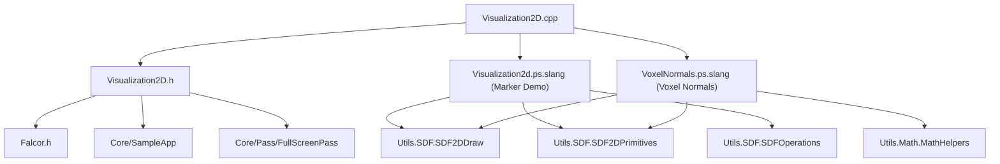

# Visualization2D -- 2D可视化示例

## 功能概述

本示例演示了 Falcor 框架中 2D 有符号距离场（SDF）图元的绘制能力，提供两个可切换的可视化场景：

### 场景一：Marker Demo（图元演示）
使用 Falcor 内置的 SDF 2D 图元库，在屏幕上绘制多种 2D 图形：
- 基础图元：圆形、正方形、菱形、心形（带动画旋转）、V 字形、环形、标签、十字、星号、无穷符号、图钉、箭头。
- 复合图元：向量（带箭头的线段）、圆角线段、圆角矩形、任意三角形（顶点动画）。
- SDF 布尔运算：平滑并集、平滑差集的组合效果。
- 鼠标交互：点击位置显示标记点、向量和线段。

### 场景二：Voxel Normals（体素法线可视化）
展示二维体素网格上的 SDF 法线计算和可视化：
- 左侧显示规则网格，右侧显示变形（warped）网格，两者共享相同的 SDF 值。
- 在鼠标位置计算双线性插值 SDF 法线，并分别在两个网格上显示法线向量。
- GUI 控件可切换：法线场颜色映射、网格线、对角线、边界线、鼠标周围包围盒等可视化选项。

## 文件清单

| 文件名 | 类型 | 说明 |
|---|---|---|
| `Visualization2D.cpp` | C++ 源文件 | 应用主逻辑，管理场景切换、GUI 控件、鼠标交互和 FullScreenPass 参数传递 |
| `Visualization2D.h` | C++ 头文件 | `Visualization2D` 类及 `VoxelNormalsGUI` 结构体声明 |
| `Visualization2d.ps.slang` | Slang 着色器 | Marker Demo 场景的像素着色器，调用 SDF 图元库绘制各种 2D 图形 |
| `VoxelNormals.ps.slang` | Slang 着色器 | Voxel Normals 场景的像素着色器，实现体素网格 SDF 法线计算与可视化 |
| `CMakeLists.txt` | 构建脚本 | CMake 配置 |

## 依赖关系

