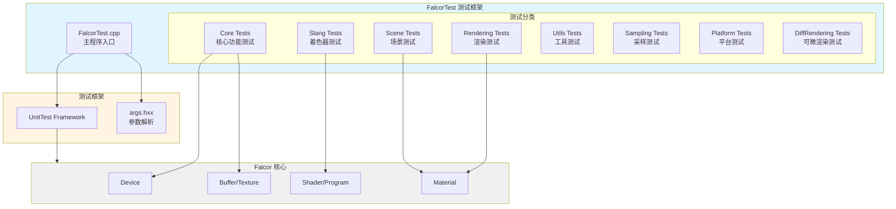

# FalcorTest - 单元测试框架

## 功能概述

FalcorTest 是 Falcor 渲染引擎的自动化单元测试框架，用于验证引擎各个模块的功能正确性。该工具支持 GPU 和 CPU 测试、着色器测试、并行执行等功能，是保证代码质量的重要工具。

## 主要功能

- **全面的测试覆盖**: 涵盖核心模块、渲染、场景、采样、工具等各个方面
- **GPU 测试支持**: 可以在 D3D12 和 Vulkan 后端上运行测试
- **着色器测试**: 支持 Slang 着色器语言的单元测试
- **灵活的过滤**: 支持按测试套件、测试用例、标签过滤
- **并行执行**: 实验性支持多线程并行测试
- **XML 报告**: 可生成 XML 格式的测试报告
- **调试支持**: 支持启用调试层和 Aftermath GPU 崩溃转储

## 架构图



## 文件清单

### 主程序
- `FalcorTest.cpp` - 测试框架主入口
- `CMakeLists.txt` - 构建配置

### 测试用例目录

#### Core Tests (核心测试)
- `Tests/Core/AftermathTests.cpp` - Aftermath GPU 崩溃诊断测试
- `Tests/Core/BufferTests.cpp` - 缓冲区测试
- `Tests/Core/TextureTests.cpp` - 纹理测试
- `Tests/Core/ConstantBufferTests.cpp` - 常量缓冲区测试
- `Tests/Core/BlitTests.cpp` - Blit 操作测试
- `Tests/Core/DDSReadTests.cpp` - DDS 纹理读取测试
- `Tests/Core/ParamBlockCB.cpp` - 参数块测试
- `Tests/Core/PluginTests.cpp` - 插件系统测试
- `Tests/Core/ResourceAliasing.cpp` - 资源别名测试

#### Slang Tests (着色器测试)
- `Tests/Slang/Float16Tests.cpp` - 半精度浮点测试
- `Tests/Slang/Float64Tests.cpp` - 双精度浮点测试
- `Tests/Slang/Int64Tests.cpp` - 64位整数测试
- `Tests/Slang/Atomics.cpp` - 原子操作测试
- `Tests/Slang/SlangGenerics.cpp` - 泛型测试
- `Tests/Slang/SlangInheritance.cpp` - 继承测试
- `Tests/Slang/WaveOps.cpp` - Wave 操作测试
- `Tests/Slang/TraceRayInline.cpp` - 内联光线追踪测试

#### Rendering Tests (渲染测试)
- `Tests/Rendering/Materials/BSDFIntegratorTests.cpp` - BSDF 积分器测试
- `Tests/Rendering/Materials/MicrofacetTests.cpp` - 微表面模型测试
- `Tests/Rendering/Materials/RGLAcquisitionTests.cpp` - RGL 数据采集测试

#### Scene Tests (场景测试)
- `Tests/Scene/EnvMapTests.cpp` - 环境贴图测试
- `Tests/Scene/Material/BSDFTests.cpp` - BSDF 材质测试
- `Tests/Scene/Material/HairChiang16Tests.cpp` - 头发材质测试
- `Tests/Scene/Material/MERLFileTests.cpp` - MERL 材质文件测试

#### Sampling Tests (采样测试)
- `Tests/Sampling/AliasTableTests.cpp` - 别名表采样测试
- `Tests/Sampling/LowDiscrepancyTests.cpp` - 低差异序列测试
- `Tests/Sampling/PseudorandomTests.cpp` - 伪随机数测试
- `Tests/Sampling/SampleGeneratorTests.cpp` - 采样生成器测试

#### Utils Tests (工具测试)
- `Tests/Utils/MathHelpersTests.cpp` - 数学辅助函数测试
- `Tests/Utils/HashUtilsTests.cpp` - 哈希工具测试
- `Tests/Utils/GeometryHelpersTests.cpp` - 几何辅助函数测试
- `Tests/Utils/ColorUtilsTests.cpp` - 颜色工具测试
- `Tests/Utils/Image/BitmapTests.cpp` - 位图测试

#### Platform Tests (平台测试)
- `Tests/Platform/OSTests.cpp` - 操作系统接口测试
- `Tests/Platform/LockFileTests.cpp` - 文件锁测试
- `Tests/Platform/MemoryMappedFileTests.cpp` - 内存映射文件测试

#### DiffRendering Tests (可微渲染测试)
- `Tests/DiffRendering/SceneGradientsTest.cpp` - 场景梯度测试
- `Tests/DiffRendering/Material/DiffMaterialTests.cpp` - 可微材质测试

## 依赖关系

### 核心依赖
- **Falcor Core**: 渲染引擎核心库
- **args.hxx**: 命令行参数解析
- **Testing/UnitTest**: 单元测试框架

### 模块依赖
- Core API (Device, Buffer, Texture, Shader)
- Scene (Material, Mesh, Camera)
- Rendering (BSDF, Sampling)
- Utils (Math, Image, Color)

## 使用说明

### 基本用法

```bash
# 运行所有测试
FalcorTest

# 列出所有测试套件
FalcorTest --list-test-suites

# 列出所有测试用例
FalcorTest --list-test-cases

# 列出所有标签
FalcorTest --list-tags
```

### 过滤测试

```bash
# 按测试套件过滤
FalcorTest --test-suite "Core"

# 按测试用例过滤（正则表达式）
FalcorTest --test-case "Buffer.*"

# 按标签过滤
FalcorTest --tags "gpu,fast"
```

### GPU 选择

```bash
# 列出可用 GPU
FalcorTest --list-gpus

# 选择特定 GPU
FalcorTest --gpu 0

# 选择设备类型
FalcorTest --device-type d3d12
FalcorTest --device-type vulkan
```

### 高级选项

```bash
# 并行执行（实验性）
FalcorTest --parallel 4

# 重复执行测试
FalcorTest --repeat 10

# 生成 XML 报告
FalcorTest --xml-report report.xml

# 启用调试层
FalcorTest --enable-debug-layer

# 启用 Aftermath GPU 崩溃转储
FalcorTest --enable-aftermath
```

## 命令行参数

| 参数 | 说明 |
|------|------|
| `-h, --help` | 显示帮助信息 |
| `-d, --device-type` | 图形设备类型 (d3d12/vulkan) |
| `--list-gpus` | 列出可用 GPU |
| `--gpu` | 选择特定 GPU (索引) |
| `--list-test-suites` | 列出测试套件 |
| `--list-test-cases` | 列出测试用例 |
| `--list-tags` | 列出标签 |
| `-s, --test-suite` | 过滤测试套件 (正则表达式) |
| `-f, --test-case` | 过滤测试用例 (正则表达式) |
| `-t, --tags` | 按标签过滤测试用例 |
| `-x, --xml-report` | XML 报告输出路径 |
| `-r, --repeat` | 重复执行次数 |
| `-p, --parallel` | 并行工作线程数 (实验性) |
| `--enable-debug-layer` | 启用调试层 |
| `--enable-aftermath` | 启用 Aftermath GPU 崩溃转储 |

## 开发指南

### 添加新测试

1. 在相应的 `Tests/` 子目录下创建 `.cpp` 文件
2. 使用 `GPU_TEST` 或 `CPU_TEST` 宏定义测试
3. 在 `CMakeLists.txt` 中添加源文件
4. 如需着色器，创建对应的 `.slang` 文件

### 测试宏

```cpp
// GPU 测试
GPU_TEST(TestSuiteName, TestCaseName)
{
    // 测试代码
    EXPECT_EQ(actual, expected);
}

// CPU 测试
CPU_TEST(TestSuiteName, TestCaseName)
{
    // 测试代码
    EXPECT_TRUE(condition);
}
```

### 断言宏

- `EXPECT_EQ(a, b)` - 期望相等
- `EXPECT_NE(a, b)` - 期望不相等
- `EXPECT_TRUE(cond)` - 期望为真
- `EXPECT_FALSE(cond)` - 期望为假
- `EXPECT_LT(a, b)` - 期望小于
- `EXPECT_LE(a, b)` - 期望小于等于
- `EXPECT_GT(a, b)` - 期望大于
- `EXPECT_GE(a, b)` - 期望大于等于

## 测试覆盖范围

- **核心功能**: 设备、缓冲区、纹理、着色器、参数块
- **渲染**: 材质、BSDF、光照、采样
- **场景**: 网格、相机、动画、材质绑定
- **着色器**: Slang 语言特性、数据类型、操作符
- **工具**: 数学、图像处理、哈希、几何
- **平台**: 文件系统、内存管理、操作系统接口

## 相关文档

- [Falcor 核心文档](../../../Core/README.md)
- [测试框架文档](../../../Testing/README.md)
- [Slang 着色器文档](https://shader-slang.com/)
