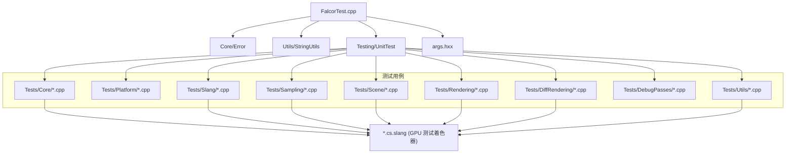

# FalcorTest/Tests -- 测试用例集

## 功能概述

本目录包含 Falcor 渲染框架的全部单元测试和 GPU 测试用例。测试通过 `FalcorTest` 可执行程序运行，该程序基于 Falcor 内置的 `unittest` 测试框架，支持按测试套件、测试用例名称和标签进行过滤，支持 D3D12 和 Vulkan 两种图形后端，支持并行执行和 XML 报告输出。

测试用例按功能领域组织为 9 个子目录，每个子目录对应一组测试套件。许多测试既包含 C++ 测试驱动文件（`.cpp`），也包含配套的 Slang 计算着色器（`.cs.slang`），用于在 GPU 上执行验证逻辑。

## 文件清单

### 测试子目录概览

| 子目录 | 测试领域 | C++ 文件数 | Slang 文件数 | 说明 |
|---|---|---|---|---|
| `Core/` | 核心图形 API | 17 | 15 | Buffer、Texture、ConstantBuffer、Blit、DDS 读取、参数块、资源别名、Root Buffer、插件系统、枚举、对象系统等 |
| `DebugPasses/` | 调试渲染通道 | 1 | 0 | 无效像素检测测试 |
| `DiffRendering/` | 可微渲染 | 2 | 2 | 场景梯度计算测试、可微材质测试 |
| `Platform/` | 平台功能 | 4 | 0 | 文件锁、内存映射文件、显示器信息、操作系统接口测试（纯 CPU 测试） |
| `Rendering/Materials/` | 渲染/材质 | 3 | 1 | BSDF 积分器测试、微表面模型测试、RGL 采集测试 |
| `Sampling/` | 采样算法 | 5 | 5 | 别名表、低差异序列、点集、伪随机数、采样生成器测试 |
| `Scene/` | 场景系统 | 4 | 2 | 环境贴图测试、BSDF 测试、Hair Chiang16 模型测试、MERL 文件测试 |
| `Slang/` | Slang 语言特性 | 18 | 25 | 原子操作、Float16/Float64/Int64 类型、继承、泛型、可变操作、重解释转换、Shader Model、Shader String、结构化缓冲区矩阵、模板化加载、光线追踪标志、内联光线追踪、Wave 操作、无界描述符数组等 |
| `Utils/` | 工具库 | 22 | 10 | AABB、位操作、颜色工具、加密工具、几何辅助、半精度浮点、哈希工具、图像处理、相交辅助、数学辅助、矩阵、打包格式、并行归约、前缀和、属性系统、四元数、矩形、设置系统、分割缓冲区、字符串工具、纹理分析器、Union-Find、向量、位图、纹理管理器、采样光谱、光谱工具、Warp 分析器等 |

### 测试入口

| 文件名 | 说明 |
|---|---|
| `../FalcorTest.cpp` | 测试程序主入口，解析命令行参数，枚举和运行测试用例 |
| `../CMakeLists.txt` | 构建配置，注册所有测试源文件，链接 `args` 命令行解析库 |

## 依赖关系

