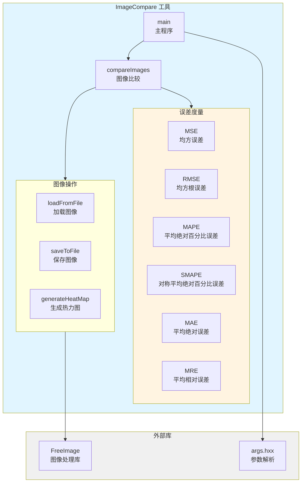

# ImageCompare - 图像比较工具

## 功能概述

ImageCompare 是一个命令行图像比较工具，用于验证渲染结果的正确性和一致性。该工具支持多种误差度量算法，可以生成热力图来可视化图像差异，广泛应用于回归测试和渲染验证。

## 主要功能

- **多种误差度量**: 支持 MSE、RMSE、MAPE、SMAPE、MAE、MRE 等多种误差计算方法
- **热力图生成**: 可视化图像差异，便于定位问题区域
- **Alpha 通道支持**: 可选择是否比较 Alpha 通道
- **阈值判断**: 支持设置误差阈值，自动判断测试通过/失败
- **多格式支持**: 支持常见图像格式（PNG、EXR、HDR、PFM 等）
- **浮点和整数**: 支持 HDR 浮点图像和 LDR 整数图像

## 架构图



## 文件清单

- `ImageCompare.cpp` - 主程序源文件（包含所有功能实现）
- `CMakeLists.txt` - 构建配置文件

## 依赖关系

### 外部依赖
- **FreeImage**: 图像加载、保存和格式转换
- **args.hxx**: 命令行参数解析

### 内部组件
- `Image` 类: 图像数据容器（RGBA32F 格式）
- `ErrorMetric` 结构: 误差度量定义
- 误差计算函数: 各种度量算法的实现

## 使用说明

### 基本用法

```bash
# 比较两张图像（使用默认 MSE 度量）
ImageCompare image1.png image2.png

# 使用特定误差度量
ImageCompare image1.png image2.png --metric RMSE

# 设置误差阈值
ImageCompare image1.png image2.png --threshold 0.01

# 生成热力图
ImageCompare image1.png image2.png --heatmap diff.png

# 比较 Alpha 通道
ImageCompare image1.png image2.png --alpha true
```

### 列出可用度量

```bash
ImageCompare --list-metrics
```

输出：
```
Available error metrics:
  MSE    - Mean squared error
  RMSE   - Root mean squared error
  MAPE   - Mean absolute percentage error
  SMAPE  - Symmetric mean absolute percentage error
  MAE    - Mean absolute error
  MRE    - Mean relative error
```

## 命令行参数

| 参数 | 类型 | 说明 |
|------|------|------|
| `image1` | 必需 | 第一张图像路径 |
| `image2` | 必需 | 第二张图像路径 |
| `-m, --metric` | 可选 | 误差度量方法（默认: MSE） |
| `-t, --threshold` | 可选 | 误差阈值（默认: 0.0） |
| `--alpha` | 可选 | 是否比较 Alpha 通道（默认: false） |
| `--heatmap` | 可选 | 热力图输出路径 |
| `--list-metrics` | 标志 | 列出所有可用的误差度量 |
| `-h, --help` | 标志 | 显示帮助信息 |

## 误差度量详解

### MSE (Mean Squared Error) - 均方误差
```
MSE = mean((I1 - I2)²)
```
- 范围: [0, ∞)
- 值越小表示图像越相似
- 对大误差敏感

### RMSE (Root Mean Squared Error) - 均方根误差
```
RMSE = sqrt(mean((I1 - I2)²))
```
- 范围: [0, ∞)
- MSE 的平方根，单位与原图像一致

### MAPE (Mean Absolute Percentage Error) - 平均绝对百分比误差
```
MAPE = mean(|I1 - I2| / (|I2| + ε)) × 100%
```
- 范围: [0, ∞)
- 相对误差，适合不同亮度范围的图像

### SMAPE (Symmetric Mean Absolute Percentage Error) - 对称平均绝对百分比误差
```
SMAPE = mean(|I1 - I2| / (|I1| + |I2| + ε)) × 100%
```
- 范围: [0, 100%]
- 对称版本的 MAPE，避免分母为零

### MAE (Mean Absolute Error) - 平均绝对误差
```
MAE = mean(|I1 - I2|)
```
- 范围: [0, ∞)
- 对所有误差一视同仁

### MRE (Mean Relative Error) - 平均相对误差
```
MRE = mean(|I1 - I2| / (|I2| + ε))
```
- 范围: [0, ∞)
- 相对误差的非百分比版本

## 热力图说明

热力图使用颜色编码显示图像差异：
- **蓝色**: 差异很小（接近 0）
- **绿色**: 中等差异
- **黄色**: 较大差异
- **红色**: 很大差异

热力图的颜色映射基于误差的百分位数，自动调整以突出显示差异区域。

## 支持的图像格式

### 输入格式
- PNG (.png)
- JPEG (.jpg, .jpeg)
- EXR (.exr) - HDR 格式
- HDR (.hdr) - Radiance HDR
- PFM (.pfm) - Portable Float Map
- TIFF (.tif, .tiff)
- BMP (.bmp)

### 输出格式（热力图）
- PNG (.png) - 推荐用于 LDR
- EXR (.exr) - 推荐用于 HDR

## 返回值

- **0**: 图像比较通过（误差 ≤ 阈值）
- **1**: 图像比较失败（误差 > 阈值或发生错误）

## 使用示例

### 回归测试

```bash
#!/bin/bash
# 渲染测试脚本

# 渲染参考图像
./Renderer --scene test.scene --output reference.png

# 渲染当前图像
./Renderer --scene test.scene --output current.png

# 比较图像
if ImageCompare reference.png current.png --metric RMSE --threshold 0.01; then
    echo "Test PASSED"
else
    echo "Test FAILED"
    # 生成热力图用于调试
    ImageCompare reference.png current.png --heatmap diff.png
    exit 1
fi
```

### 批量比较

```bash
#!/bin/bash
# 批量图像比较

for ref in reference/*.png; do
    name=$(basename "$ref")
    current="current/$name"

    echo "Comparing $name..."
    if ! ImageCompare "$ref" "$current" --threshold 0.01 --heatmap "diff/$name"; then
        echo "  FAILED: $name"
    fi
done
```

## 注意事项

1. **图像尺寸**: 两张图像必须具有相同的分辨率
2. **颜色空间**: 图像会自动转换为 RGBA32F 格式进行比较
3. **Alpha 通道**: 默认不比较 Alpha 通道，需要显式启用
4. **浮点精度**: 使用单精度浮点数进行计算
5. **内存使用**: 大图像会占用较多内存（每像素 16 字节）

## 性能考虑

- 图像加载和格式转换是主要开销
- 误差计算本身很快（单线程）
- 热力图生成需要额外的计算和 I/O

## 相关文档

- [FalcorTest 文档](../FalcorTest/README.md)
- [FreeImage 文档](http://freeimage.sourceforge.net/)
