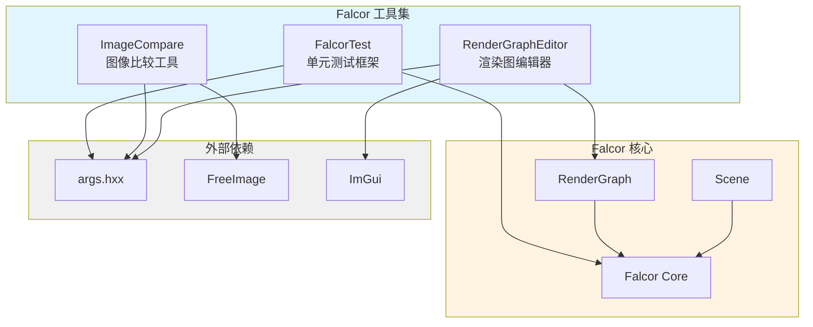

# Falcor 工具集

## 功能概述

Falcor 工具集提供了一系列用于渲染框架开发、测试和调试的命令行工具和图形化应用程序。这些工具支持渲染图编辑、图像比较、自动化测试等核心功能。

## 工具列表

### 1. FalcorTest
自动化单元测试框架，用于验证 Falcor 渲染引擎的核心功能和模块。

**主要功能：**
- GPU 和 CPU 单元测试
- 着色器测试（Slang）
- 渲染管线测试
- 材质和采样测试
- 并行测试执行支持

**详细文档：** [FalcorTest/README.md](./FalcorTest/README.md)

### 2. ImageCompare
图像比较工具，用于验证渲染结果的正确性和一致性。

**主要功能：**
- 多种误差度量算法（MSE、RMSE、MAPE 等）
- 热力图生成
- Alpha 通道比较
- 支持多种图像格式

**详细文档：** [ImageCompare/README.md](./ImageCompare/README.md)

### 3. RenderGraphEditor
渲染图可视化编辑器，提供图形化界面用于创建和编辑渲染管线。

**主要功能：**
- 可视化渲染图编辑
- 实时预览
- Python 脚本导入/导出
- 与 Mogwai 集成

**详细文档：** [RenderGraphEditor/README.md](./RenderGraphEditor/README.md)

## 架构图



## 文件清单

```
Tools/
├── CMakeLists.txt              # 工具集构建配置
├── FalcorTest/                 # 单元测试工具
│   ├── FalcorTest.cpp
│   ├── CMakeLists.txt
│   └── Tests/                  # 测试用例目录
├── ImageCompare/               # 图像比较工具
│   ├── ImageCompare.cpp
│   └── CMakeLists.txt
└── RenderGraphEditor/          # 渲染图编辑器
    ├── RenderGraphEditor.cpp
    ├── RenderGraphEditor.h
    └── CMakeLists.txt
```

## 依赖关系

### 核心依赖
- **Falcor Core**: 所有工具依赖的核心渲染引擎
- **args.hxx**: 命令行参数解析库

### 工具特定依赖
- **FalcorTest**:
  - Testing/UnitTest 框架
  - 各种 Falcor 模块（Scene、Rendering、Utils 等）

- **ImageCompare**:
  - FreeImage 图像处理库

- **RenderGraphEditor**:
  - RenderGraph 模块
  - ImGui 图形界面库
  - RenderGraphUI 组件

## 使用说明

### 构建工具

所有工具通过 CMake 构建系统自动编译：

```bash
cmake --build . --target FalcorTest
cmake --build . --target ImageCompare
cmake --build . --target RenderGraphEditor
```

### 运行工具

每个工具都提供命令行接口，使用 `--help` 查看详细参数：

```bash
FalcorTest --help
ImageCompare --help
RenderGraphEditor --help
```

## 开发指南

### 添加新工具

1. 在 `Tools/` 目录下创建新的子目录
2. 添加源文件和 `CMakeLists.txt`
3. 在 `Tools/CMakeLists.txt` 中添加 `add_subdirectory(NewTool)`
4. 使用 `add_falcor_executable()` 宏创建可执行文件

### 测试用例开发

参考 `FalcorTest/Tests/` 目录下的现有测试用例结构。

## 相关文档

- [Falcor 核心文档](../../Core/README.md)
- [渲染图文档](../../RenderGraph/README.md)
- [场景系统文档](../../Scene/README.md)
