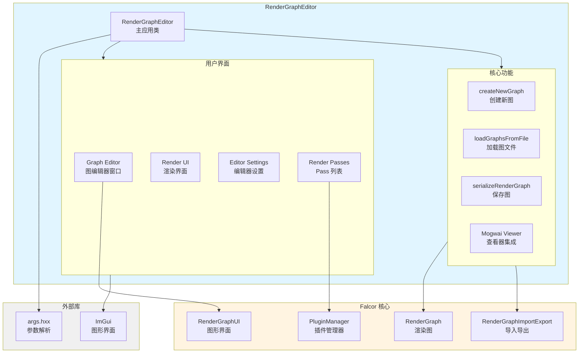

# RenderGraphEditor - 渲染图编辑器

## 功能概述

RenderGraphEditor 是 Falcor 的可视化渲染图编辑器，提供图形化界面用于创建、编辑和调试渲染管线。该工具支持拖放式编辑、实时预览、Python 脚本导入导出，并可与 Mogwai 查看器集成。

## 主要功能

- **可视化编辑**: 图形化界面创建和编辑渲染图
- **节点管理**: 添加、删除、连接渲染 Pass
- **实时预览**: 在编辑器中直接查看渲染结果
- **脚本导入导出**: 支持 Python 脚本格式的渲染图
- **Mogwai 集成**: 可在 Mogwai 查看器中实时预览
- **多图管理**: 支持在一个会话中编辑多个渲染图
- **拖放支持**: 支持拖放 Python 文件加载渲染图
- **插件系统**: 自动加载所有可用的渲染 Pass 插件

## 架构图



## 文件清单

- `RenderGraphEditor.cpp` - 主程序实现
- `RenderGraphEditor.h` - 类定义和接口
- `CMakeLists.txt` - 构建配置

## 依赖关系

### 核心依赖
- **Falcor Core**: 渲染引擎核心
- **RenderGraph**: 渲染图系统
- **RenderGraphUI**: 渲染图图形界面组件
- **RenderGraphImportExport**: 渲染图导入导出功能

### 外部依赖
- **ImGui**: 图形用户界面库
- **args.hxx**: 命令行参数解析

## 关键类与接口

### RenderGraphEditor 类

主应用类，继承自 `SampleApp`。

#### 主要成员

```cpp
class RenderGraphEditor : public SampleApp
{
public:
    struct Options
    {
        std::string graphFile;      // 要编辑的图文件路径
        std::string graphName;      // 要编辑的图名称
        bool runFromMogwai = false; // 是否从 Mogwai 启动
    };

    // 生命周期方法
    void onLoad(RenderContext* pRenderContext) override;
    void onFrameRender(RenderContext* pRenderContext, const ref<Fbo>& pTargetFbo) override;
    void onResize(uint32_t width, uint32_t height) override;
    void onGuiRender(Gui* pGui) override;
    void onDroppedFile(const std::filesystem::path& path) override;

private:
    // 核心功能
    void createNewGraph(const std::string& renderGraphName);
    void loadGraphsFromFile(const std::filesystem::path& path, const std::string& graphName = "");
    void serializeRenderGraph(const std::filesystem::path& path);
    void deserializeRenderGraph(const std::filesystem::path& path);
    void renderLogWindow(Gui::Widgets& widget);

    // 数据成员
    std::vector<ref<RenderGraph>> mpGraphs;           // 渲染图列表
    std::vector<RenderGraphUI> mRenderGraphUIs;       // 图形界面列表
    std::unordered_map<std::string, uint32_t> mGraphNamesToIndex; // 图名到索引映射
    size_t mCurrentGraphIndex;                        // 当前图索引
    ref<Texture> mpDefaultIconTex;                    // 默认 Pass 图标
    bool mViewerRunning = false;                      // Mogwai 查看器是否运行
    size_t mViewerProcess = 0;                        // 查看器进程句柄
};
```

## 使用说明

### 启动编辑器

```bash
# 启动空白编辑器
RenderGraphEditor

# 加载特定图文件
RenderGraphEditor --graph-file path/to/graph.py

# 加载特定图（文件中有多个图时）
RenderGraphEditor --graph-file path/to/graph.py --graph-name MyGraph

# 从 Mogwai 启动（编辑器模式）
RenderGraphEditor --graph-file path/to/graph.py --editor
```

### 命令行参数

| 参数 | 说明 |
|------|------|
| `--graph-file` | 要编辑的渲染图文件路径 |
| `--graph-name` | 要编辑的渲染图名称 |
| `--editor` | 编辑器模式（从 Mogwai 启动） |
| `-h, --help` | 显示帮助信息 |

### 界面布局

编辑器窗口分为四个主要区域：

1. **Graph Editor (中央)**: 渲染图可视化编辑区域
   - 显示渲染图的节点和连接
   - 支持拖拽节点、创建连接
   - 右键菜单添加/删除节点

2. **Render UI (右侧)**: 渲染输出预览
   - 显示当前渲染图的输出
   - 可选择不同的输出通道

3. **Graph Editor Settings (左下)**: 编辑器设置
   - 图管理（新建、加载、保存）
   - 输出设置
   - Mogwai 查看器控制

4. **Render Passes (右下)**: 可用 Pass 列表
   - 显示所有已加载的渲染 Pass
   - 拖拽到图编辑器中添加

### 基本操作

#### 创建新图

1. 点击 "Create New Graph" 按钮
2. 输入图名称
3. 点击 "Create" 确认

#### 添加 Pass

方法 1: 从 Pass 列表拖拽
- 在 "Render Passes" 窗口中找到需要的 Pass
- 拖拽到 "Graph Editor" 窗口

方法 2: 右键菜单
- 在 "Graph Editor" 窗口空白处右键
- 选择 "Add Pass" -> 选择 Pass 类型

#### 连接 Pass

1. 点击源 Pass 的输出端口
2. 拖拽到目标 Pass 的输入端口
3. 释放鼠标完成连接

#### 删除 Pass/连接

- 选中 Pass 或连接
- 按 Delete 键或右键选择 "Delete"

#### 保存图

1. 在 "Graph Editor Settings" 中点击 "Save Graph"
2. 选择保存路径
3. 图将保存为 Python 脚本格式

#### 加载图

方法 1: 命令行参数
```bash
RenderGraphEditor --graph-file path/to/graph.py
```

方法 2: 拖放文件
- 将 `.py` 文件拖放到编辑器窗口

方法 3: 界面操作
- 在 "Graph Editor Settings" 中点击 "Load Graph"
- 选择文件

### Mogwai 集成

RenderGraphEditor 可以与 Mogwai 查看器集成，实现实时预览：

1. 在编辑器中编辑渲染图
2. 点击 "Launch Viewer" 启动 Mogwai
3. 在编辑器中的修改会自动同步到 Mogwai
4. 在 Mogwai 中可以交互式查看渲染结果

**注意**: 查看器运行时，编辑器会自动保存修改到临时文件。

## 渲染图 Python 脚本格式

RenderGraphEditor 使用 Python 脚本格式保存渲染图：

```python
from falcor import *

def render_graph_MyGraph():
    g = RenderGraph("MyGraph")

    # 添加 Pass
    g.addPass(GBufferRaster("GBufferRaster"), "GBufferRaster")
    g.addPass(ToneMapper("ToneMapper"), "ToneMapper")

    # 连接 Pass
    g.addEdge("GBufferRaster.posW", "ToneMapper.src")

    # 标记输出
    g.markOutput("ToneMapper.dst")

    return g

MyGraph = render_graph_MyGraph()
try: m.addGraph(MyGraph)
except NameError: None
```

## 开发指南

### 添加自定义 Pass

1. 实现 `RenderPass` 接口
2. 注册为插件
3. 重新启动编辑器，Pass 会自动出现在列表中

### 扩展编辑器功能

编辑器基于 `SampleApp` 框架，可以通过以下方式扩展：

- 重写 `onGuiRender()` 添加自定义 UI
- 重写 `onFrameRender()` 添加自定义渲染逻辑
- 添加新的菜单项和工具栏

## 快捷键

| 快捷键 | 功能 |
|--------|------|
| `Ctrl+N` | 创建新图 |
| `Ctrl+O` | 打开图文件 |
| `Ctrl+S` | 保存当前图 |
| `Delete` | 删除选中的节点/连接 |
| `F` | 聚焦到选中节点 |
| `Ctrl+Z` | 撤销（如果支持） |
| `Ctrl+Y` | 重做（如果支持） |

## 故障排除

### 问题: 查看器无法启动

**解决方案**:
- 确保 Mogwai 可执行文件在系统路径中
- 检查图文件路径是否正确
- 查看日志窗口的错误信息

### 问题: Pass 列表为空

**解决方案**:
- 确保插件目录正确配置
- 检查插件是否正确编译
- 重新启动编辑器

### 问题: 无法连接 Pass

**解决方案**:
- 检查端口类型是否匹配
- 确保输出端口连接到输入端口
- 查看 Pass 文档了解端口要求

## 相关文档

- [RenderGraph 文档](../../../RenderGraph/README.md)
- [Mogwai 文档](../../../Mogwai/README.md)
- [RenderPass 开发指南](../../../RenderPasses/README.md)
- [ImGui 文档](https://github.com/ocornut/imgui)
