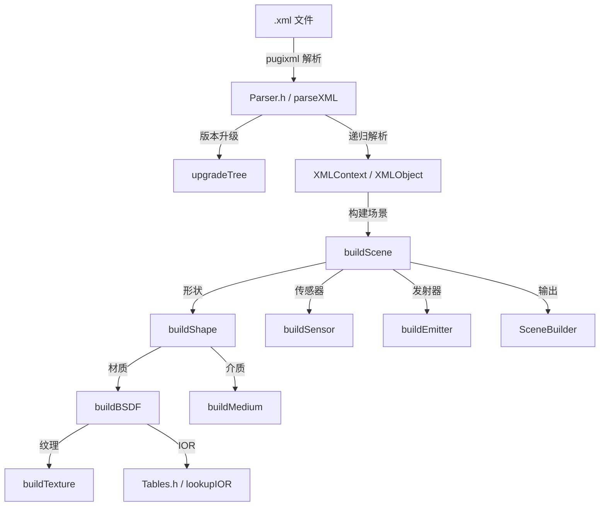

# MitsubaImporter - Mitsuba XML 场景导入器

## 功能概述

MitsubaImporter 是 Falcor 的 Mitsuba 场景格式导入插件，能够解析 Mitsuba 渲染器的 XML 场景描述文件。该插件使用 pugixml 库解析 XML，将 Mitsuba 的场景对象（传感器、发射器、形状、BSDF、纹理、介质等）转换为 Falcor 的等价表示。

Mitsuba 导入器支持 Mitsuba 2.x 格式，并包含从 Mitsuba 1.x 到 2.x 的自动升级逻辑（属性名从 camelCase 转换为 underscore_case 等）。

### 支持的文件格式

`xml`

### 主要功能

- **XML 场景解析**: 完整的 Mitsuba XML 解析器，支持嵌套对象、命名引用、变换节点、属性类型检查等。
- **形状导入**: 支持 `obj`/`ply` 外部网格、`sphere`（球体）、`disk`（圆盘）、`rectangle`（矩形）、`cube`（立方体）等内建形状。
- **BSDF/材质转换**:
  - `diffuse` -> `PBRTDiffuseMaterial`
  - `dielectric` / `roughdielectric` / `thindielectric` -> `StandardMaterial`（含透射）
  - `conductor` / `roughconductor` -> `PBRTConductorMaterial`
  - `plastic` / `roughplastic` -> `StandardMaterial`
  - `twosided` -> 内层材质设为双面
- **纹理支持**: 支持 `bitmap`（图片纹理）和 `checkerboard`（棋盘格程序纹理），包含 UV 变换。
- **传感器/相机**: 支持 `perspective` 和 `thinlens` 相机类型，含焦距、视场角、景深参数。
- **发射器/灯光**: 支持 `envmap`（环境贴图）、`constant`（常量环境光）、`area`（面光源，嵌入形状）等类型。
- **介质**: 支持 `homogeneous` 均匀介质的散射/吸收系数。
- **IOR 查找表**: 内建常见材料的折射率查找表（真空、水、玻璃、钻石等）。
- **版本升级**: 自动将 Mitsuba 1.x 格式升级为 2.x（属性重命名、UV 变换语法更新等）。

## 文件清单

| 文件名 | 类型 | 说明 |
|--------|------|------|
| `MitsubaImporter.h` | 头文件 | 声明 `MitsubaImporter` 类，注册插件元信息 |
| `MitsubaImporter.cpp` | 源文件 | 实现场景构建逻辑：BSDF、形状、传感器、发射器、介质的转换，以及顶层 `importScene` 流程 |
| `Parser.h` | 头文件 | 实现完整的 Mitsuba XML 解析器，包含标签/类型映射表、XML 节点递归解析、变换处理、属性提取、版本升级逻辑 |
| `Resolver.h` | 头文件 | 定义 `Resolver` 类，用于在多个搜索路径中解析相对文件路径 |
| `Tables.h` | 头文件 | 定义 IOR 查找表（`kIORTable`），包含常见材料的折射率值及 `lookupIOR` 查找函数 |
| `CMakeLists.txt` | 构建文件 | CMake 构建配置，链接 pugixml 外部库 |

## 依赖关系

### 外部依赖

- **pugixml**: 轻量级 XML 解析库，用于读取 Mitsuba 场景文件。
- **pybind11**: Python 绑定库（通过 Falcor 框架间接引入）。

### Falcor 内部依赖

- `Scene/Importer.h` - 导入器基类接口
- `Scene/SceneBuilder.h` - 场景构建器
- `Scene/Material/PBRT/PBRTDiffuseMaterial.h` - PBRT 漫反射材质
- `Scene/Material/PBRT/PBRTDielectricMaterial.h` - PBRT 电介质材质
- `Scene/Material/PBRT/PBRTConductorMaterial.h` - PBRT 导体材质
- `Utils/Math/Common.h`, `FalcorMath.h`, `MathHelpers.h` - 数学工具
- `Utils/StringUtils.h` - 字符串处理工具

