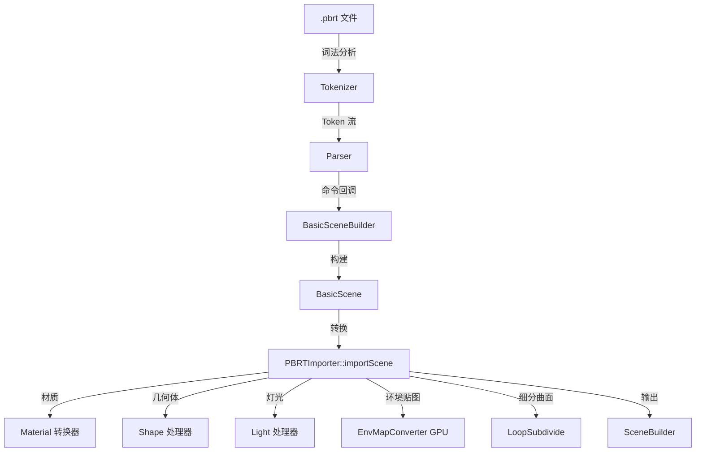

# PBRTImporter - PBRT v4 场景导入器

## 功能概述

PBRTImporter 是 Falcor 的 pbrt-v4 场景格式导入插件，用于加载和转换 [pbrt](https://pbrt.org/) 物理渲染器的场景文件。由于 Falcor 仅支持 pbrt-v4 功能的一个子集，导入器在转换过程中会对不支持的对象类型和属性进行近似处理或忽略，并输出相应的警告信息。

该插件的解析代码源自 pbrt-v4 的官方实现（Apache-2.0 许可），经过简化后集成到 Falcor 中。

### 支持的文件格式

`pbrt`

### 导入流程

1. **解析阶段**: 使用 `Parser` 模块（`Tokenizer` + 命令分发）将 `.pbrt` 文件解析为 Token 流。
2. **场景构建阶段**: `BasicSceneBuilder`（实现 `ParserTarget` 接口）接收解析器的命令回调，构建中间表示 `BasicScene`。
3. **转换阶段**: `PBRTImporter::importScene()` 将 `BasicScene` 中的几何体、材质、灯光、相机、纹理、介质等对象转换为 Falcor 的等价表示，通过 `SceneBuilder` 输出最终场景。

### 主要功能

- **几何体**: 支持 trianglemesh、sphere、disk、cylinder、curve 等形状类型，以及 Loop 细分曲面。
- **材质转换**: 将 pbrt 的材质类型（diffuse、coateddiffuse、conductor、dielectric 等）映射到 Falcor 的 PBRT 系列材质和 StandardMaterial。
- **纹理系统**: 解析 float/spectrum 纹理，支持 imagemap、constant、scale、mix 等类型。
- **灯光**: 支持 infinite（环境光）、distant、point、area 等光源类型。
- **相机**: 支持 perspective 和 orthographic 相机。
- **实例化**: 支持 ObjectBegin/ObjectEnd 定义的实例对象及 ObjectInstance 引用。
- **环境贴图格式转换**: 通过 GPU Compute Pass 将等面积八面体映射转换为经纬度映射。
- **变换栈**: 完整支持 pbrt 的 CTM（当前变换矩阵）栈操作。

## 文件清单

| 文件名 | 类型 | 说明 |
|--------|------|------|
| `PBRTImporter.h` | 头文件 | 声明 `PBRTImporter` 类，注册插件元信息 |
| `PBRTImporter.cpp` | 源文件 | 实现从 `BasicScene` 到 Falcor 场景的转换逻辑，包含所有材质/形状/灯光处理器 |
| `Parser.h` | 头文件 | 定义 `ParserTarget` 抽象接口、`Tokenizer` 词法分析器及解析入口函数 |
| `Parser.cpp` | 源文件 | 实现 pbrt 场景文件的词法分析和语法解析 |
| `Builder.h` | 头文件 | 定义 `BasicSceneBuilder`（`ParserTarget` 实现）和 `BasicScene` 中间场景表示，以及各类场景实体（Shape、Light、Material、Camera 等） |
| `Builder.cpp` | 源文件 | 实现 `BasicSceneBuilder` 的命令处理逻辑和 `BasicScene` 的数据管理 |
| `Parameters.h` | 头文件 | 定义 `ParameterDictionary` 参数字典，支持 float、int、string、point、vector、spectrum 等类型化参数的查询 |
| `Parameters.cpp` | 源文件 | 实现参数字典的查找、类型转换和数组提取功能 |
| `Types.h` | 头文件 | 定义基础类型：`FileLoc`（文件位置）、`RGBColorSpace`、`Spectrum`、`Resolver` 等 |
| `Helpers.h` | 头文件 | 提供带文件位置信息的错误抛出和警告输出辅助函数 |
| `LoopSubdivide.h` | 头文件 | 声明 Loop 细分曲面算法接口 |
| `LoopSubdivide.cpp` | 源文件 | 实现 Loop 细分曲面的顶点/法线/索引计算 |
| `EnvMapConverter.h` | 头文件 | 定义 `EnvMapConverter` 类，通过 GPU Compute Pass 将等面积八面体映射环境贴图转换为经纬度映射 |
| `EnvMapConverter.cs.slang` | Shader | 环境贴图格式转换的 Compute Shader |
| `CMakeLists.txt` | 构建文件 | CMake 构建配置，包含 shader 拷贝指令 |

## 依赖关系

### Falcor 内部依赖

- `Scene/Importer.h` - 导入器基类接口
- `Scene/SceneBuilder.h` - 场景构建器
- `Scene/Material/StandardMaterial.h` - 标准材质
- `Scene/Material/RGLMaterial.h` - RGL 材质
- `Scene/Material/HairMaterial.h` - 毛发材质
- `Scene/Material/PBRT/PBRTDiffuseMaterial.h` - PBRT 漫反射材质
- `Scene/Material/PBRT/PBRTCoatedDiffuseMaterial.h` - PBRT 涂层漫反射材质
- `Core/API/Device.h` - GPU 设备抽象
- `Core/Pass/ComputePass.h` - Compute Pass 框架
- `Utils/Color/Spectrum.h` - 光谱处理
- `Utils/Math/FNVHash.h` - 哈希工具
- `Utils/Settings/Settings.h` - 配置系统

### 第三方代码

- pbrt-v4 的解析器和场景构建器代码（Apache-2.0 许可），经过简化后集成。

