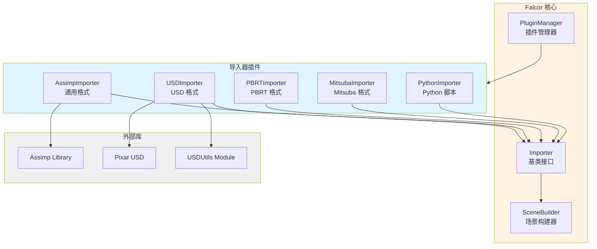

# Falcor 导入器插件

## 功能概述

Falcor 导入器插件集提供了对多种 3D 场景格式的支持，使 Falcor 能够加载和渲染来自不同来源的场景数据。每个导入器都实现了统一的 `Importer` 接口，并作为插件动态加载。

## 导入器列表

### 1. AssimpImporter
基于 Assimp 库的通用模型导入器，支持最广泛的文件格式。

**支持格式**: FBX, glTF, OBJ, DAE, Collada, 3DS, Blend, STL, PLY 等 30+ 种格式

**详细文档**: [AssimpImporter/README.md](./AssimpImporter/README.md)

### 2. USDImporter
Pixar USD (Universal Scene Description) 格式导入器，支持复杂场景层次和动画。

**支持格式**: USD, USDA, USDC, USDZ

**详细文档**: [USDImporter/README.md](./USDImporter/README.md)

### 3. PBRTImporter
PBRT v4 场景格式导入器，支持物理真实感渲染场景。

**支持格式**: PBRT

**详细文档**: [PBRTImporter/README.md](./PBRTImporter/README.md)

### 4. MitsubaImporter
Mitsuba 渲染器场景格式导入器。

**支持格式**: XML (Mitsuba)

**详细文档**: [MitsubaImporter/README.md](./MitsubaImporter/README.md)

### 5. PythonImporter
Python 脚本场景导入器，支持程序化场景生成。

**支持格式**: PYSCENE

**详细文档**: [PythonImporter/README.md](./PythonImporter/README.md)

## 架构图



## 文件清单

```
importers/
├── CMakeLists.txt                      # 导入器构建配置
├── AssimpImporter/                     # Assimp 导入器
│   ├── AssimpImporter.h
│   ├── AssimpImporter.cpp
│   └── CMakeLists.txt
├── USDImporter/                        # USD 导入器
│   ├── USDImporter.h
│   ├── USDImporter.cpp
│   ├── ImporterContext.h
│   ├── ImporterContext.cpp
│   └── CMakeLists.txt
├── PBRTImporter/                       # PBRT 导入器
│   ├── PBRTImporter.h
│   ├── PBRTImporter.cpp
│   ├── Builder.h
│   ├── Builder.cpp
│   ├── Parser.h
│   ├── Parser.cpp
│   ├── Parameters.h
│   ├── Parameters.cpp
│   ├── Types.h
│   ├── Helpers.h
│   ├── LoopSubdivide.h
│   ├── LoopSubdivide.cpp
│   ├── EnvMapConverter.h
│   ├── EnvMapConverter.cs.slang
│   ├── README.md
│   └── CMakeLists.txt
├── MitsubaImporter/                    # Mitsuba 导入器
│   ├── MitsubaImporter.h
│   ├── MitsubaImporter.cpp
│   ├── Parser.h
│   ├── Resolver.h
│   ├── Tables.h
│   ├── README.md
│   └── CMakeLists.txt
└── PythonImporter/                     # Python 导入器
    ├── PythonImporter.h
    ├── PythonImporter.cpp
    └── CMakeLists.txt
```

## 依赖关系

### 核心依赖
- **Falcor Core**: 所有导入器的基础
- **Scene/Importer**: 导入器基类接口
- **Scene/SceneBuilder**: 场景构建器

### 导入器特定依赖

#### AssimpImporter
- Assimp 库（第三方）

#### USDImporter
- Pixar USD 库（第三方）
- USDUtils 模块（Falcor）
- OpenSubdiv（第三方）

#### PBRTImporter
- 无外部依赖（自包含解析器）

#### MitsubaImporter
- 无外部依赖（自包含解析器）

#### PythonImporter
- Python 嵌入式解释器

## 关键接口

### Importer 基类

所有导入器都继承自 `Importer` 基类：

```cpp
class Importer
{
public:
    // 从文件导入场景
    virtual void importScene(
        const std::filesystem::path& path,
        SceneBuilder& builder,
        const std::map<std::string, std::string>& materialToShortName
    ) = 0;

    // 从内存导入场景（可选）
    virtual void importSceneFromMemory(
        const void* buffer,
        size_t byteSize,
        std::string_view extension,
        SceneBuilder& builder,
        const std::map<std::string, std::string>& materialToShortName
    );
};
```

### 插件注册

每个导入器使用 `FALCOR_PLUGIN_CLASS` 宏注册：

```cpp
FALCOR_PLUGIN_CLASS(
    ImporterName,
    "ImporterName",
    PluginInfo({
        "Description",
        {"ext1", "ext2", "ext3"}  // 支持的文件扩展名
    })
);
```

## 使用说明

### 加载场景

```cpp
// 自动选择合适的导入器
ref<Scene> pScene = Scene::create(pDevice, "path/to/scene.usd");

// 或手动使用导入器
SceneBuilder builder(pDevice);
auto importer = USDImporter::create();
importer->importScene("path/to/scene.usd", builder, {});
ref<Scene> pScene = builder.getScene();
```

### 支持的格式对比

| 导入器 | 格式 | 网格 | 材质 | 纹理 | 动画 | 灯光 | 相机 | 层次结构 |
|--------|------|------|------|------|------|------|------|----------|
| AssimpImporter | 30+ | ✓ | ✓ | ✓ | ✓ | ✓ | ✓ | ✓ |
| USDImporter | USD | ✓ | ✓ | ✓ | ✓ | ✓ | ✓ | ✓ |
| PBRTImporter | PBRT | ✓ | ✓ | ✓ | ✗ | ✓ | ✓ | ✓ |
| MitsubaImporter | XML | ✓ | ✓ | ✓ | ✗ | ✓ | ✓ | ✓ |
| PythonImporter | Python | ✓ | ✓ | ✓ | ✓ | ✓ | ✓ | ✓ |

### 格式选择建议

- **通用模型**: 使用 AssimpImporter (FBX, glTF, OBJ)
- **复杂场景**: 使用 USDImporter (USD)
- **学术场景**: 使用 PBRTImporter 或 MitsubaImporter
- **程序化场景**: 使用 PythonImporter
- **动画**: 优先使用 USDImporter 或 AssimpImporter

## 导入器详细说明

### AssimpImporter

**优点**:
- 支持格式最多
- 成熟稳定
- 社区支持好

**缺点**:
- 对某些格式支持不完整
- 材质转换可能有损

**适用场景**:
- 游戏资产导入
- 通用 3D 模型
- 快速原型开发

### USDImporter

**优点**:
- 支持复杂场景层次
- 完整的动画支持
- 工业标准格式

**缺点**:
- 文件较大
- 依赖库较重

**适用场景**:
- 电影级场景
- 复杂动画
- 多层次场景

### PBRTImporter

**优点**:
- 物理准确
- 场景描述清晰
- 学术资源丰富

**缺点**:
- 不支持动画
- 格式较旧

**适用场景**:
- 学术研究
- 渲染算法验证
- PBRT 场景迁移

### MitsubaImporter

**优点**:
- 物理准确
- XML 格式易读

**缺点**:
- 不支持动画
- 使用较少

**适用场景**:
- 学术研究
- Mitsuba 场景迁移

### PythonImporter

**优点**:
- 程序化生成
- 灵活性高
- 易于调试

**缺点**:
- 需要编写脚本
- 性能较低

**适用场景**:
- 程序化场景生成
- 参数化建模
- 测试场景创建

## 开发指南

### 添加新导入器

1. 创建新的子目录
2. 实现 `Importer` 接口
3. 使用 `FALCOR_PLUGIN_CLASS` 注册
4. 在 `CMakeLists.txt` 中添加子目录
5. 实现 `importScene()` 方法

### 导入器模板

```cpp
#pragma once
#include "Scene/Importer.h"

namespace Falcor
{
class MyImporter : public Importer
{
public:
    FALCOR_PLUGIN_CLASS(
        MyImporter,
        "MyImporter",
        PluginInfo({"My format importer", {"myext"}})
    );

    static std::unique_ptr<Importer> create();

    void importScene(
        const std::filesystem::path& path,
        SceneBuilder& builder,
        const std::map<std::string, std::string>& materialToShortName
    ) override;
};
}
```

### 使用 SceneBuilder

```cpp
void MyImporter::importScene(
    const std::filesystem::path& path,
    SceneBuilder& builder,
    const std::map<std::string, std::string>& materialToShortName)
{
    // 1. 加载场景数据
    auto sceneData = loadMyFormat(path);

    // 2. 添加材质
    for (auto& mat : sceneData.materials)
    {
        auto pMaterial = createMaterial(mat);
        builder.addMaterial(pMaterial);
    }

    // 3. 添加网格
    for (auto& mesh : sceneData.meshes)
    {
        auto meshSpec = createMeshSpec(mesh);
        auto meshID = builder.addTriangleMesh(meshSpec);
    }

    // 4. 添加场景节点
    for (auto& node : sceneData.nodes)
    {
        auto nodeID = builder.addNode(node.name, node.transform);
        builder.addMeshInstance(nodeID, meshID);
    }

    // 5. 添加灯光和相机
    // ...
}
```

## 性能考虑

### 导入速度
- **最快**: PythonImporter (小场景)
- **中等**: AssimpImporter, MitsubaImporter
- **较慢**: USDImporter, PBRTImporter (大场景)

### 内存使用
- **最小**: PBRTImporter, MitsubaImporter
- **中等**: AssimpImporter
- **较大**: USDImporter (复杂场景)

### 优化建议
1. 使用多线程加载（如果支持）
2. 延迟加载纹理
3. 缓存重复资源
4. 使用流式加载（大场景）

## 故障排除

### 问题: 导入器未找到

**解决方案**:
- 确保插件已编译
- 检查插件目录配置
- 验证文件扩展名正确

### 问题: 材质丢失

**解决方案**:
- 检查纹理路径
- 验证材质格式支持
- 查看导入器日志

### 问题: 场景层次错误

**解决方案**:
- 检查源文件场景结构
- 验证坐标系统转换
- 使用调试模式查看节点树

## 相关文档

- [Scene 系统文档](../../Scene/README.md)
- [SceneBuilder 文档](../../Scene/SceneBuilder/README.md)
- [USDUtils 文档](../../Modules/USDUtils/README.md)
- [Assimp 文档](https://assimp-docs.readthedocs.io/)
- [USD 文档](https://graphics.pixar.com/usd/docs/index.html)
- [PBRT 文档](https://pbrt.org/)
