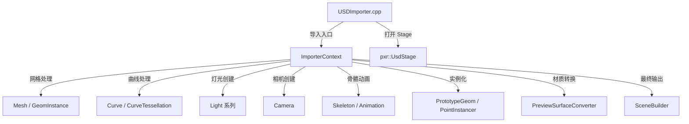

# USDImporter - USD 场景导入器

## 功能概述

USDImporter 是 Falcor 的 Universal Scene Description (USD) 场景导入插件，支持 Pixar 开发的 USD 生态系统中的场景文件。该插件依赖 NVIDIA 提供的 USD 发行版 (`nv-usd`)，仅在 `FALCOR_ENABLE_USD` 和 `FALCOR_HAS_NV_USD` 均启用时可用。它能够导入复杂的分层场景，包括几何体、材质、灯光、相机、骨骼动画、曲线以及实例化对象。

### 支持的文件格式

`usd`, `usda`, `usdc`, `usdz`

### 主要功能

- **完整的 USD Prim 遍历**: 深度遍历 USD Stage 的 Prim 层级，逐类型处理不同的 USD 图元。
- **几何体导入**: 支持 `UsdGeomMesh`（三角网格）和 `UsdGeomBasisCurves`（曲线），包括时间采样的顶点动画。
- **灯光系统**: 支持 `DistantLight`、`RectLight`、`SphereLight`、`DiskLight`、`DomeLight`（环境贴图）等 USD 光源类型。
- **相机导入**: 解析 `UsdGeomCamera`，包括默认相机的自动创建。
- **材质转换**: 通过 `PreviewSurfaceConverter` 将 UsdPreviewSurface 材质转换为 Falcor 材质。
- **实例化支持**: 支持 USD 原型实例 (Prototype Instance) 和点实例 (Point Instancer)，有效处理大规模重复几何体。
- **骨骼动画**: 通过 `UsdSkelRoot` / `UsdSkelCache` 解析骨骼绑定和蒙皮动画。
- **变换与单位**: 自动处理场景单位转换（metersPerUnit）和 Up 轴方向校正（Y-up / Z-up）。
- **渲染元数据**: 从 USD customLayerData 中提取 Omniverse 渲染设置（光圈、ISO、快门速度、弹射次数等）。
- **Variant 覆盖**: 支持基于 Settings 的 USD Variant 选择覆盖。

## 文件清单

| 文件名 | 类型 | 说明 |
|--------|------|------|
| `USDImporter.h` | 头文件 | 声明 `USDImporter` 类，注册插件元信息和支持的文件扩展名 |
| `USDImporter.cpp` | 源文件 | 实现 USD Stage 的打开、Prim 遍历、渲染元数据解析等顶层导入流程 |
| `ImporterContext.h` | 头文件 | 定义 `ImporterContext` 结构及相关数据类型（`Mesh`、`Curve`、`Skeleton`、`PrototypeGeom` 等），承载导入过程中的全部状态 |
| `ImporterContext.cpp` | 源文件 | 实现 `ImporterContext` 的各项功能：网格/曲线处理、灯光/相机创建、骨骼动画、实例化、变换堆栈管理及最终化流程 |
| `CMakeLists.txt` | 构建文件 | CMake 构建配置，条件编译检查，链接 nv-usd 和 USDUtils 库 |

## 依赖关系

### 外部依赖

- **nv-usd**: NVIDIA USD 发行版，提供核心的 USD 库（`pxr/usd/...`）。
- **USDUtils**: Falcor 内部的 USD 工具模块，包含辅助函数和 `PreviewSurfaceConverter`。
- **pybind11**: Python 绑定库（用于 USD 的 Python 运行时支持）。

### Falcor 内部依赖

- `Scene/Importer.h` - 导入器基类接口
- `Scene/SceneBuilder.h` - 场景构建器
- `Scene/SceneIDs.h` - 场景对象 ID 类型定义
- `Scene/Animation/Animation.h` - 动画系统
- `Scene/Curves/CurveTessellation.h` - 曲线细分
- `Utils/Timing/TimeReport.h` - 性能计时
- `Utils/Settings/Settings.h` - 配置系统
- `Utils/Math/` - 数学工具（向量、矩阵）
- `Core/Platform/OS.h` - 平台抽象

