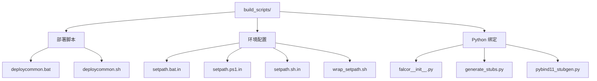

# build_scripts/ — 构建与部署脚本

## 功能概述

`build_scripts/` 目录包含 Falcor 框架的构建后部署脚本、环境配置脚本以及 Python 绑定相关工具。主要职责包括：

1. **部署脚本** — 将外部依赖的 DLL/SO 文件复制到构建输出目录
2. **环境路径脚本** — 生成设置 PATH 和 PYTHONPATH 的平台特定脚本
3. **Python Stub 生成** — 为 Falcor 的 pybind11 绑定生成类型提示存根文件

## 文件清单

| 文件 | 说明 |
|------|------|
| `deploycommon.bat` | Windows 部署脚本 — 将 Slang、DLSS、外部依赖 DLL 等文件复制到构建输出目录。接收参数：项目目录、输出目录、构建配置、Slang 路径、DLSS 路径 |
| `deploycommon.sh` | Linux 部署脚本 — 与 `.bat` 版本功能相同，将 `.so` 文件复制到输出目录 |
| `falcor__init__.py` | Falcor Python 包初始化文件 — 处理 Windows 上 Python 3.8+ 的 DLL 搜索路径设置，并导入 `falcor_ext` 扩展模块 |
| `generate_stubs.py` | Python 类型存根生成器 — 调用 `pybind11_stubgen` 为 `falcor` Python 模块生成 `.pyi` 类型提示文件，并手动添加子模块别名 |
| `pybind11_stubgen.py` | pybind11 存根生成工具的本地副本 |
| `setpath.bat.in` | Windows 环境路径配置模板 — CMake 配置后生成 `setpath.bat`，设置 `PATH` 和 `PYTHONPATH` |
| `setpath.ps1.in` | PowerShell 环境路径配置模板 |
| `setpath.sh.in` | Linux/macOS 环境路径配置模板 |
| `wrap_setpath.sh` | setpath.sh 包装脚本 — 先 source 环境变量再执行传入的命令 |

