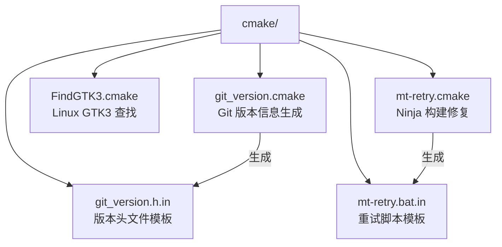

# cmake/ — CMake 构建模块

## 功能概述

`cmake/` 目录包含 Falcor 框架的自定义 CMake 模块，提供构建系统所需的辅助功能：Git 版本信息嵌入、平台相关的构建问题修复以及第三方库查找模块。

## 文件清单

| 文件 | 说明 |
|------|------|
| `git_version.cmake` | Git 版本信息生成模块 — 在构建时提取 Git 提交哈希、分支名和脏状态，生成 `git_version.h` 头文件供 C++ 代码引用。使用 SHA256 哈希缓存机制避免不必要的重新生成 |
| `git_version.h.in` | `git_version.h` 的 CMake 配置模板文件，包含 `@GIT_COMMIT@`、`@GIT_BRANCH@`、`@GIT_DIRTY@` 等占位变量 |
| `FindGTK3.cmake` | GTK+ 3 查找模块 — 仅 Linux 平台使用，定位 GTK3 头文件和库路径（Falcor 在 Linux 上使用 GTK3 实现原生对话框） |
| `mt-retry.cmake` | Windows Ninja 构建 mt.exe 重试修复 — 解决 Ninja 构建时 `mt.exe`（清单嵌入工具）因杀毒软件文件锁定而失败的问题，通过生成重试包装脚本实现 |
| `mt-retry.bat.in` | `mt-retry.cmake` 所用的 Windows 批处理重试脚本模板 |

