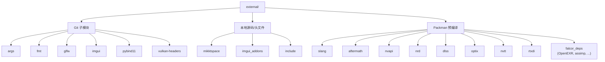

# external/ — 外部依赖索引

## 功能概述

`external/` 目录集中管理 Falcor 渲染框架的所有第三方依赖库。依赖来源分为三类：

1. **Git 子模块** — 以源码形式直接包含在仓库中（args、fmt、glfw、imgui、pybind11、vulkan-headers）
2. **本地源码** — 少量独立源文件直接编入静态库（mikktspace）
3. **Packman 预编译包** — 通过 NVIDIA Packman 包管理器下载的预编译二进制依赖（OpenEXR、assimp、Slang、DLSS 等）

所有依赖的 CMake 导入目标均在 `CMakeLists.txt` 中统一定义，同时支持 Windows 和 Linux 平台。

## 文件/目录清单

| 名称 | 类型 | 说明 |
|------|------|------|
| `CMakeLists.txt` | 文件 | 依赖总控 CMake 脚本，定义所有第三方库的导入目标 |
| `args/` | Git 子模块 | 轻量级 C++ 命令行参数解析库（header-only） |
| `fmt/` | Git 子模块 | 高性能格式化输出库（类似 Python format） |
| `glfw/` | Git 子模块 | 跨平台窗口管理与输入处理库 |
| `imgui/` | Git 子模块 | Dear ImGui 即时模式 GUI 库核心文件 |
| `imgui_addons/` | 本地目录 | ImGui 扩展插件（自定义控件等） |
| `mikktspace/` | 本地源码 | MikkTSpace 切线空间计算库（mikktspace.c/h） |
| `pybind11/` | Git 子模块 | C++/Python 绑定库，用于 Falcor Python 接口 |
| `vulkan-headers/` | Git 子模块 | Vulkan API 头文件 |
| `include/` | 本地目录 | Header-only 第三方库集合 |
| `packman/` | Packman 目录 | Packman 下载的预编译二进制依赖存放位置 |

## include/ 头文件库明细

| 子目录 | 说明 |
|--------|------|
| `backward/` | C++ 堆栈追踪库 |
| `BS_thread_pool/` | 轻量线程池库 |
| `dds_header/` | DDS 纹理格式头定义 |
| `fast_float/` | 高速浮点数解析库 |
| `fstd/` | 文件系统工具头文件 |
| `hypothesis/` | 测试辅助库 |
| `illuminants/` | CIE 标准光源光谱数据 |
| `lz4_stream/` | LZ4 流式压缩封装 |
| `nlohmann/` | nlohmann/json — C++ JSON 库 |
| `pybind11_json/` | pybind11 与 nlohmann/json 互转桥接 |
| `sigs/` | 信号/槽 (signal-slot) 库 |
| `xyzcurves/` | CIE XYZ 色彩匹配函数数据 |

## Packman 预编译依赖一览

以下库通过 Packman 管理，由 `CMakeLists.txt` 中的 `PACKMAN_DIR` 路径引用：

| 库名 | 类型 | 用途 |
|------|------|------|
| **falcor_deps (vcpkg)** | 预编译包 | OpenEXR、OpenVDB、assimp、FreeImage、pugixml、hdf5、lz4、zlib、tbb、opensubdiv |
| **slang / slang-gfx** | 预编译包 | Slang 着色语言编译器及 GFX 抽象层 |
| **aftermath** | 可选 | NVIDIA GPU 崩溃调试 SDK |
| **nvapi** | 可选 | NVIDIA GPU 控制 API |
| **pix** | 可选 | Windows PIX GPU 调试事件 |
| **nanovdb** | 预编译包 | NanoVDB 稀疏体素数据结构 |
| **nv-usd** | 可选 | NVIDIA Universal Scene Description |
| **mdl-sdk** | 可选 | NVIDIA MDL 材质定义语言 SDK |
| **dxcompiler** | 预编译包 | DirectX Shader Compiler |
| **nrd** | 可选 | NVIDIA Real-time Denoisers |
| **dlss** | 可选 | NVIDIA DLSS 超分辨率 |
| **optix** | 可选 | NVIDIA OptiX 光线追踪引擎 |
| **nvtt** | 预编译包 | NVIDIA Texture Tools 纹理压缩 |
| **agility-sdk** | 可选 | D3D12 Agility SDK |
| **rtxdi** | 预编译包 | RTXDI 实时直接光照重要性采样 |

