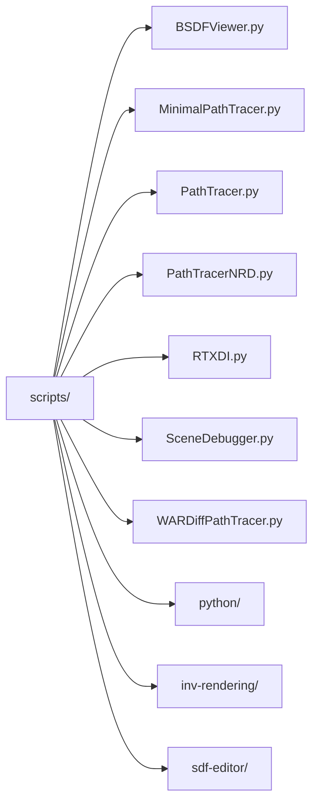

# scripts/ — 渲染脚本

## 功能概述

`scripts/` 目录包含 Falcor 框架的 Python 渲染图（Render Graph）配置脚本和高级应用脚本。每个 `.py` 文件定义一个完整的渲染管线，通过 Falcor Python API 创建渲染通道（Pass）、连接数据流并标记输出。这些脚本可由 Mogwai 渲染器直接加载执行。

子目录中还包含更复杂的研究性脚本，如可微渲染（inv-rendering）、SDF 编辑器和通用 Python 工具。

## 文件/目录清单

### 顶层渲染图脚本

| 文件 | 说明 |
|------|------|
| `BSDFViewer.py` | BSDF 材质查看器 — 构建 BSDFViewer + AccumulatePass 管线，用于可视化单个材质的 BSDF |
| `MinimalPathTracer.py` | 最小路径追踪器 — VBufferRT -> MinimalPathTracer -> AccumulatePass -> ToneMapper，支持 3 次弹射 |
| `PathTracer.py` | 标准路径追踪器 — VBufferRT -> PathTracer -> AccumulatePass -> ToneMapper，使用分层采样 |
| `PathTracerNRD.py` | 路径追踪 + NRD 降噪 — GBufferRT -> PathTracer -> NRD（扩散/镜面/Delta 分离降噪）-> 色调映射 |
| `RTXDI.py` | RTXDI 实时直接光照 — VBufferRT -> RTXDIPass -> AccumulatePass -> ToneMapper |
| `SceneDebugger.py` | 场景调试器 — 单通道 SceneDebugger，用于可视化场景几何/属性信息 |
| `WARDiffPathTracer.py` | WAR 可微路径追踪器 — 支持前向/反向微分模式，输出原始图像和微分色彩映射 |

### 子目录

| 目录 | 说明 |
|------|------|
| `python/` | 通用 Python 工具脚本集合 |
| `inv-rendering/` | 逆向渲染 / 可微渲染研究脚本 |
| `sdf-editor/` | SDF（有符号距离场）编辑器脚本 |

### python/ 子目录

| 文件/目录 | 说明 |
|-----------|------|
| `balls/` | 小球场景相关测试脚本 |
| `gaussian2d/` | 2D 高斯分布可视化 |
| `TinyBC/` | 微型块压缩纹理工具 |
| `ui/` | Python UI 辅助脚本 |
| `test_pytorch.py` | PyTorch 集成测试 |
| `test_replace_material.py` | 材质替换测试 |

### inv-rendering/ 子目录

| 文件 | 说明 |
|------|------|
| `common.py` | 可微渲染公共工具 |
| `loss.py` | 损失函数定义 |
| `material_utils.py` | 材质优化工具函数 |
| `mesh_utils.py` | 网格优化工具函数 |
| `transform_utils.py` | 变换优化工具函数 |
| `largesteps_optimizer.py` | 大步长优化器实现 |
| `bsdf_optimization/` | BSDF 材质参数优化示例 |
| `material_optimization/` | 材质纹理优化示例 |
| `shape_optimization/` | 几何形状优化示例 |

### sdf-editor/ 子目录

| 文件 | 说明 |
|------|------|
| `SDFEditor.py` | SDF 编辑器主脚本 |
| `SDFEditorStartScene.pyscene` | 编辑器初始场景定义 |
| `single_sphere.sdf` | 单球 SDF 测试文件 |
| `test_primitives.sdf` | 基本体 SDF 测试文件 |

