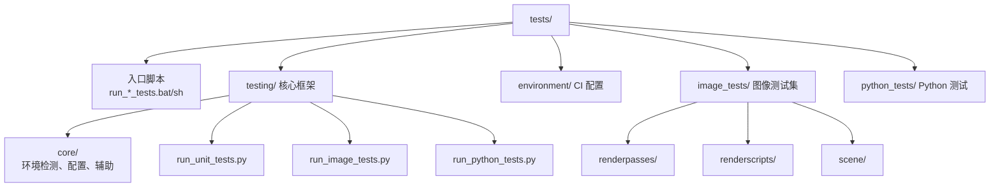

# tests/ — 测试基础设施

## 功能概述

`tests/` 目录包含 Falcor 框架的完整测试基础设施，支持三种测试类型：

1. **单元测试** — 通过 FalcorTest 可执行文件运行的 C++ 单元测试
2. **图像测试** — 渲染输出与参考图像的对比回归测试，支持并行执行
3. **Python 测试** — 通过 Python 脚本驱动的功能测试

测试系统支持多种构建配置，可在本地开发环境和 CI/CD 流水线（GitLab Windows/Linux）中运行。

## 文件/目录清单

### 顶层入口脚本

| 文件 | 说明 |
|------|------|
| `build_falcor.bat` | Windows 构建入口脚本 |
| `run_unit_tests.bat` | Windows 单元测试入口 |
| `run_unit_tests.sh` | Linux 单元测试入口 |
| `run_image_tests.bat` | Windows 图像测试入口 |
| `run_image_tests.sh` | Linux 图像测试入口 |
| `run_python_tests.bat` | Windows Python 测试入口 |
| `run_python_tests.sh` | Linux Python 测试入口 |
| `view_image_tests.bat` | Windows 图像测试结果查看器 |

### testing/ — 测试核心框架

| 文件/目录 | 说明 |
|-----------|------|
| `build_falcor.py` | Falcor 构建自动化脚本 |
| `run_unit_tests.py` | 单元测试前端 — 调用 FalcorTest 可执行文件，支持 1200 秒超时 |
| `run_image_tests.py` | 图像测试前端 — 支持并行渲染、哈希缓存、XML 报告生成和结果对比 |
| `run_python_tests.py` | Python 测试前端 |
| `view_image_tests.py` | 图像测试结果 HTML 查看器生成 |
| `core/` | 测试框架核心库 |
| `libs/` | 测试依赖库 |
| `viewer/` | 测试结果查看器 |

### testing/core/ — 核心测试库

| 文件 | 说明 |
|------|------|
| `__init__.py` | 包初始化 |
| `config.py` | 测试配置管理 |
| `environment.py` | 构建环境检测（自动定位最新构建配置） |
| `helpers.py` | 测试辅助函数 |
| `termcolor.py` | 终端彩色输出支持 |

### environment/ — CI 环境配置

| 文件 | 说明 |
|------|------|
| `default.json` | 默认测试环境配置 |
| `gitlab_linux.json` | GitLab Linux CI 环境配置 |
| `gitlab_windows.json` | GitLab Windows CI 环境配置 |

### image_tests/ — 图像测试集

| 目录/文件 | 说明 |
|-----------|------|
| `helpers.py` | 图像测试辅助函数 |
| `renderpasses/` | 渲染通道图像测试 |
| `renderscripts/` | 渲染脚本图像测试 |
| `scene/` | 场景加载图像测试 |

### python_tests/ — Python 功能测试

| 文件/目录 | 说明 |
|-----------|------|
| `helpers.py` | Python 测试辅助函数 |
| `test_dummy.py` | 占位测试（验证测试框架本身可用） |
| `core/` | 核心功能 Python 测试 |

