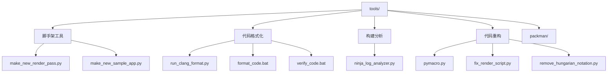

# tools/ — 开发工具

## 功能概述

`tools/` 目录提供 Falcor 框架的开发辅助工具，涵盖代码格式化、项目脚手架生成、构建分析和代码重构等功能。同时包含 NVIDIA Packman 包管理器的完整运行环境。

## 文件/目录清单

### Python 工具脚本

| 文件 | 说明 |
|------|------|
| `make_new_render_pass.py` | 渲染通道脚手架生成器 — 基于 `RenderPassTemplate` 模板自动创建新渲染通道项目（源文件 + CMake 配置） |
| `make_new_sample_app.py` | 示例应用脚手架生成器 — 自动创建新的 Falcor 示例应用项目 |
| `run_clang_format.py` | Clang-Format 批量执行器 — 对项目源码运行 clang-format 代码格式化 |
| `pymacro.py` | Python 宏扩展工具 — 解析 C++ 源码中的 `PYMACRO` 标记，用 Python 解释器生成代码替换 |
| `ninja_log_analyzer.py` | Ninja 构建日志分析器 — 解析 `.ninja_log` 文件，统计各编译目标耗时，辅助优化构建速度 |
| `fix_render_script.py` | 渲染脚本迁移工具 — 将旧版渲染脚本中的 Python 枚举引用（如 `EnumName.Value`）替换为字符串形式 |
| `remove_hungarian_notation.py` | 匈牙利命名法移除工具 — 批量移除代码中的匈牙利前缀（如 `pBuffer` -> `buffer`） |

### 批处理脚本

| 文件 | 说明 |
|------|------|
| `make_new_render_pass.bat` | Windows 入口 — 调用 `make_new_render_pass.py` |
| `make_new_sample_app.bat` | Windows 入口 — 调用 `make_new_sample_app.py` |
| `format_code.bat` | Windows 代码格式化入口 |
| `format_code.sh` | Linux 代码格式化入口 |
| `verify_code.bat` | 代码格式验证（CI 使用） |
| `pymacro.bat` | Windows 入口 — 调用 `pymacro.py` |

### Packman 包管理器

| 文件/目录 | 说明 |
|-----------|------|
| `packman/` | NVIDIA Packman 完整运行环境 |
| `packman/packman` | Packman 主执行脚本（Linux） |
| `packman/packman.cmd` | Packman 主执行脚本（Windows） |
| `packman/bootstrap/` | Packman 引导程序 |
| `packman/config.packman.xml` | Packman 配置文件 |
| `packman/packmanconf.py` | Packman Python 配置 |
| `packman/python.bat` | Packman 内置 Python 入口（Windows） |
| `packman/python.sh` | Packman 内置 Python 入口（Linux） |

